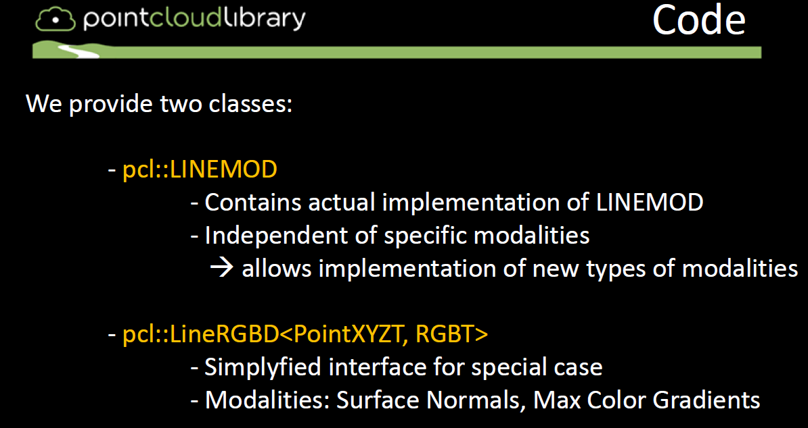
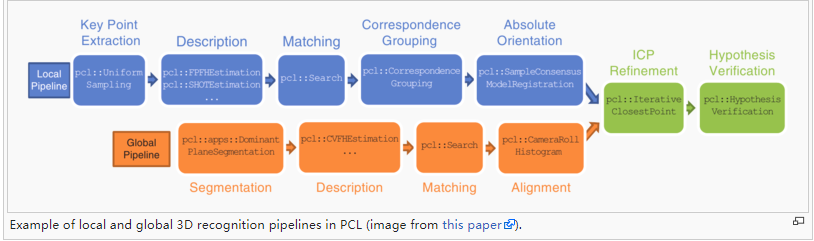
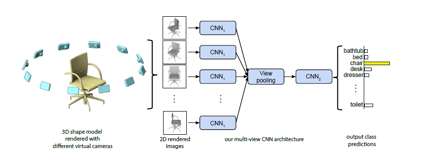
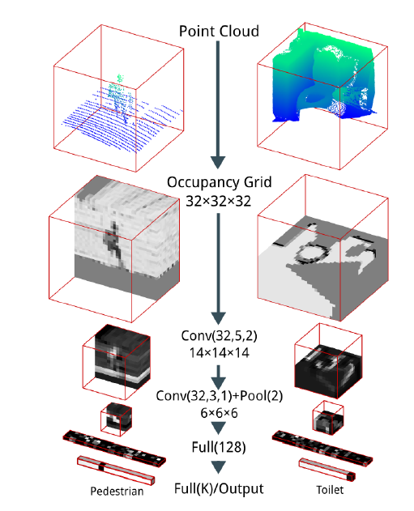
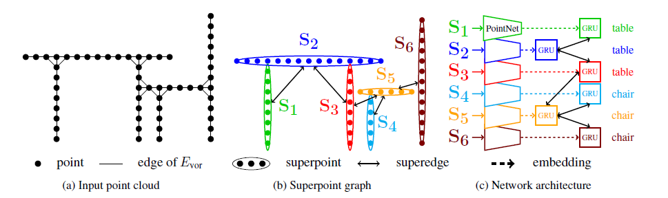

**物体检测与位姿估计**

针对刚性物体识别与位姿估计的方法主要分为三类：

* 基于模板匹配
* 基于三维局部特征
* 基于学习

<!--more-->

下面来细讲：

[资料整理](<https://github.com/littlebearsama/ObjectDetection>)

## 0.相关

1. 网站：[Detection and 6D Pose Estimation](<http://rkouskou.gitlab.io/research/6D_Object.html>)里面收录了很多文章和方法

2. 没趣啊知乎：[meiqua知乎](<https://zhuanlan.zhihu.com/p/35638736>)

3. 石头哥的目标检测(深度学习)笔记 [stone](<https://github.com/mensaochun/AwesomeDeepLearning/tree/master/ObjectDetection/summary>)

4. 综述：

   2017 在“Recovering 6D Object Pose: Multi-modal Analyses on Challenges”中：
   2018 在“BOP: Benchmark for 6D Object Pose Estimation”中：
   对各种方法进行了估计还有测试。
   2019 在“RGB-D image-based Object Detection: from Traditional Methods to Deep Learning Techniques”中：从传统识别方法到深度学习技术

## 1.基于模板匹配(template matching)

基于模板匹配的6D目标位姿估计方法的研究始于20世纪90年代的单目图像。

**以不同视点下目标对象的整体外观作为模型模板**，

### A.2D

基于线条特征[^3]、边缘轮廓[^4]、冲击图形和曲线[^5]进行模型与输入的匹配。

可用的开源项目：

1. [shape_based_matching](<https://github.com/meiqua/shape_based_matching>)
2. [edge_based_matching](<https://sourceforge.net/p/vision-for-vs/svn/102/tree/branches/edge_based_matching/>)
3. [ShapeMatch](<https://github.com/dmccskylove/ShapeMatch>)
4. [LINE2D](<https://github.com/imbinwang/LINE2D>)
5. [OpenSSE](<https://github.com/zddhub/opensse>)

### B.2.5D

在增加了深度信息后，使得6D目标位姿估计对背景杂波具有更强的鲁棒性。针对机器人应用提出了快速、鲁棒的RGB-D特性，

如VFH[6]和CVFH[7]。stoisser等[8,9]提出了以图像梯度离散化方向和表面法线为特征的linemod方法。相似度得分在预先计算的响应图上快速计算出来，他们表明它比现有的方法在杂乱的背景下更健壮，也更快。

开源项目linemod(opencv和PCL中均有接口)：

1. [6DPose](<https://github.com/meiqua/6DPose>)
2. PCL提供两个类LINEMOD和lineRGBD

## 2.基于三维局部特征(3D local features)

在基于三维局部特征的方法中，六自由度位姿是根据**局部特征的对应关系**或**Hough投票中恢复**出来的。

早期提出了二维图像中提取的线条特征[^10]、边缘特征[^11]等多种局部特征。为了进行更稳健的估计，还提出了利用深度信息的局部描述符，如自旋图像[^12]和SHOT[^13]。

点对特性(PPF)[^14]是迄今为止最为成功和著名的三维局部描述符，并且已经提出了许多扩展版本。例如，选择边界或线[^15]点，计算分割点云[^16]上的PPF，改进点采样和投票[^17]。然而，与基于模板的方法相比，在6D位姿空间中进行模式搜索速度较慢。

（论文**BOP: Benchmark for 6D Object Pose Estimation** 中对15种方法进行了评估，得出结论是PPF表现最好，优于模板匹配方法（templates matching），基于学习（learning-based）的方法和基于3D local features的方法）

### 1.基于点云三维局部特征的方法3D local features

一般点云物体识别的流程是：

1. 提取关键点（keypoints）。比如iss关键点，sift关键点。它们的数据形式是三维向量XYZ+其他信息
2. 利用关键点keypoints作为种子计算特征描述子descriptors。比如3DSC描述子，LSP描述子。它们的数据形式是多维向量比如PFH的长度是125，SI的长度是225。
3. 匹配：实际上是通过特征描述子（descriptors）进行对应点（correspondence）估计。如SAC-IA算法。
4. 匹配后再通过一些点云的配准（registration）方法比如迭代最近点（ICP）进行精确配准。
5. 假设验证

使用PCL中的方法：

[3D_object_recognition_(pipeline)](<http://robotica.unileon.es/index.php/PCL/OpenNI_tutorial_5:_3D_object_recognition_(pipeline)>)

### 2.PPF vote-based pose estimation.（基于投票的位姿估计）

典型方法：PPF 

OPENCV和PCL中均有接口

hough transform霍夫变换

hough random forests霍夫随机森林

## 3.基于学习(learning-based)   

在基于学习的方法中，出现了很多利用**机器学习**技术提取识别特征，训练识别前景/背景、对象类和三维对象姿态的分类器。例如，学习模板匹配[^18]或投票[^19]的权重，学习潜在类分布[^20]和学习霍夫森林进行坐标回归[^21]。近年来，CNN被引入学习三维物体姿态[^22]的流形。提出了基于卷积自动编码器[^23]和自监督增强自动编码器[^24]的流形学习方法。Kehl等人提出了类似ssd的CNN架构，用于估计对象的二维位置、类和三维位姿。利用基于CNN的检测器检测三维控制点或包围盒角的投影二维点，而不是估计三维位姿类[^25,26,27]。虽然最近的基于CNN的方法与其他两种方法相比，对背景杂波和局部遮挡的鲁棒性更高，但是它们的训练需要大量的带注释的训练样本，并且在GPU上花费更长的时间。

### 0.基于机器学习：

1. 2012 6D pose estimation of textureless shiny objects using random ferns for bin-picking(随机蕨)
2. 2014 Latent-Class Hough Forests for 3D Object Detection and Pose Estimation of Rigid Objects（LCFH）
3. 2016 (有源码) 基于霍夫森林 Recovering 6D Object Pose and Predicting Next-Best-View in the Crowd
4. 2016 Deep learning of local RGB-D patches for 3D object detection and 6D pose estimation
5. 2016 Recovering 6D Object Pose and Predicting Next-Best-View in the Crowd （pixel difference+random forest）
6. 2017 (必读)Pose Guided RGBD Feature Learning for 3D Object Pose Estimation
7. 2017 Feature Mapping for Learning Fast and Accurate 3D Pose Inference
8. 2017 On Pre-Trained Image Features and Synthetic Images for Deep Learning
9. 2017 RGB-D Object Recognition and Grasp Detection

10. [Eric Brachmann](https://hci.iwr.uni-heidelberg.de/vislearn/research/scene-understanding/pose-estimation/)

### 1.基于深度学习：

a.基于2D投影的深度学习网络
多视图处理神经网络在处理3D图像的分割和分类任务中的中心思想是：用多张不同角度2D图像的表面特征，直接处理相应的2D图片信息从而进行3D物体识别和探测，这样就可以直接利用二维图像上成熟的CNN技术。

代表方法：MVCNN，Snapnet，DeePr3SS

缺点：容易受到物体之间互相遮挡损失一些表面信息，投影变换过程

b.基于三维数据立体栅格化
把原始点云转换为立体网格（vexel）然后采用改进的三维卷积神经网络进行处理。

代表方法：3D-CNN，VAE，VoxNet

缺点：需要转化为体素模型，设置不同的立体网格分辨率能不同程度的保留原始场景的细节信息，这个转换需要消耗大量的计算资源和时间，而且难以处理较复杂结构的大场景对象物体。

c.基于点的神经网络框架（point-based技术）

1. 直接处理输入的点云数据，通过构建网络模型提取场景点云的三维空间结构特征。
2. 有效处理大规模非结构化并且无序的点云数据，从中提取出各类地物目标信息
3. 通过大量标记点云数据样本的训练得到具有更高精度的语义分割模型

代表方法：PointNet，PointNet++，PointCNN，PointSIFT，Superpoint Graph

### 2.3D-Machine-Learning

[3D-Machine-Learning](<https://github.com/timzhang642/3D-Machine-Learning>)

- [Datasets](https://github.com/timzhang642/3D-Machine-Learning#datasets)
- [3D Pose Estimation](https://github.com/timzhang642/3D-Machine-Learning#pose_estimation)
- [Courses](https://github.com/timzhang642/3D-Machine-Learning#courses)
- [Single Object Classification](https://github.com/timzhang642/3D-Machine-Learning#single_classification)
- [Multiple Objects Detection](https://github.com/timzhang642/3D-Machine-Learning#multiple_detection)
- [Scene/Object Semantic Segmentation](https://github.com/timzhang642/3D-Machine-Learning#segmentation)
- [3D Geometry Synthesis/Reconstruction](https://github.com/timzhang642/3D-Machine-Learning#3d_synthesis)
- [Texture/Material Analysis and Synthesis](https://github.com/timzhang642/3D-Machine-Learning#material_synthesis)
- [Style Learning and Transfer](https://github.com/timzhang642/3D-Machine-Learning#style_transfer)
- [Scene Synthesis/Reconstruction](https://github.com/timzhang642/3D-Machine-Learning#scene_synthesis)
- [Scene Understanding](https://github.com/timzhang642/3D-Machine-Learning#scene_understanding)

### 3.A Tutorial on 3D Deep Learning

[A Tutorial on 3D Deep Learning](<http://3ddl.stanford.edu/>)

### 4.3D Convolutional Neural Networks — A Reading List

[3D Convolutional Neural Networks — A Reading List](<http://davidstutz.de/3d-convolutional-neural-networks-a-reading-list/>)

（完）
