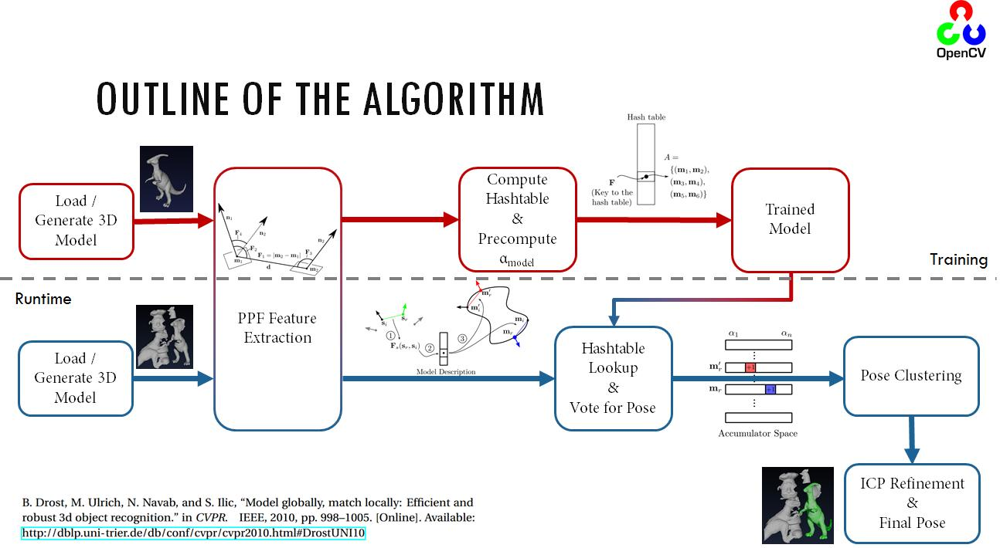

1.PPF在三维物体识别与位姿估计算法中表现优异，本文是论文“Model Globally, Match Locally: Efficient and Robust 3D Object Recognition”的解读

2.PPF是halcon中[surface_matching](https://docs.opencv.org/3.0-beta/modules/surface_matching/doc/surface_matching.html)算子实现原理

3.PPFoutline



<!--more-->


## 流程

### 1.计算全局模型描述

1. 计算模型中所有点两两组合，计算由两个点法构成的四维特征向量。
2. 由这些四维特征构成哈希表，稀疏的特征向量为键（key），点法为值（value）。

如下图所示：


>1. 两对点法之间组成的特征
>
>   可以简化成`F=(F1,F2,F3,F4)`。
>
>2. 该特征是非对称的，即m1和m2之间交换会有不同的特征向量F，主要是F2和F3元素交换。
>
>3. 将特征向量中每个元素分别按照角度和距离步长采样。（另外一种表述：用这些特征值划分到特定的区间中，于是将稀疏的特征，变成了由特定区间组成的向量。）

### 2.用Hash查询进行对应估计

1. 计算场景点云中的所有点之间的点法特征。
2. 用场景的特征在hash表中查询所有相似的模型描述子，对应的点法为可能的对应点法（此过程时间复杂度为O(1)）。

>1. 将场景的特征值也像刚刚描述的那样，划分到特定区间，然后用划分出来的特征向量来查询相似的点法。从而获得所有可能的点法对。

### 3.霍夫投票获得可能的位姿

1. 假设场景点云中有一点在我们要检测的物体上，那么对应模型点云中也有一点，将这两个点及其法线对齐后，对象可以围绕法线旋转，使模型与场景对齐。于是有从模型空间到场景空间的刚体运动可以通过，**对齐参数**：来表示。由于可以由相似特征查询到相似的点对，

   那么有：

   对于每一项匹配上的，都可以计算出旋转角。例如，对于每个模型表面上可能的位姿的，通过使用公式(2)计算使得到的对应映射计算的旋转角，如下图（图3）所示。

   

   此时，局部坐标有三个自由度(一个是旋转角度，两个是模型表面上的点)，而一般的三维刚性运动有六个自由度。**所以下面进行对其参数的投票**。

2. 然后，用计算出来的，局部坐标系下的对齐参数进行投票。图4概述了投票过程。

   

   >
   >
   >

   给定一个固定的参考点，**我们想要找到最优的局部坐标，使得场景中的物体点的数量最大化。这是使用投票方案，这是类似于广义霍夫变换和非常有效的，因为局部坐标只有三个自由度。**`一旦找到最优局部坐标，就可以恢复物体的全局姿态。!!!!!!`

   

   **A.累加器**

   对于投票方案，我们创建一个二维累加器阵列。行数等于模型采样点的个数。列数对应旋转角度的样本步骤的个数。这个累加器阵列表示一个固定参考点的局部坐标的离散空间。**霍夫空间中累加值最大的（mr，α）为最优对齐参数**

   **B.那么实际上是怎么投票的呢？**

   参考点与其他在场景中的所有其他点，组成一对。然后在模型的曲面上搜索“距离和法线方向”与相似的。

   对所有点进行处理后（与所有配对，然后去模型描述中进行搜索，搜索到的坐标在累加器中累加），**累加器阵列中的峰值对应于`最优局部坐标`**，从而计算出整体刚体运动。考虑到稳定的原因，使用所有获得相对最大峰值**一定数量选票**的峰值。投票数目大于某个值，才使用该坐标。

   **C.有效的投票循环**（改进投票）

   为了得到一个高效的目标检测算法，我们现在将展示如何有效地实现上述投票方案。

   为了加速公式(2)中每个点对的求解的速度。我们将分为两部分，，这样和分别依赖于模型和场景上的点对。这样我们可以将旋转矩阵分解为，令来获得

   

   位于由x轴和y轴的非负部分定义的半平面上， 对于模型或场景中的每个点对，t是唯一的。因此，**可以为离线阶段的每个模型点对预先计算，并存储在模型描述符中。**每个场景点对只需要计算一次，最终要求的角是两个值的简单差值。--->这样，在线阶段就不用去求模型相关的参数了。

### 4.位姿聚类

如果参考点位于要检测的物体的表面上，则上述的投票方案识别出物体的姿态。

（**即在场景点云中物体点上的一个参考点就能通过ppf特征+hough投票来找到模型上对应点，以及旋转角α，即对齐参数。通过对齐参数就知道物体姿态**）

因此需要多个参考点来确保其中一个位于搜索的对象上。如前一节所示，每个参考点返回一组可能的对象姿态，这些姿态对应于其累加器数组中的峰值。由于场景的采样率、模型的采样率和旋转在局部坐标系中的采样率不同，所获得的姿态只能近似于实际的真实情况。

现在我们引入一个**额外的步骤，它可以过滤掉不正确的pose**，并提高最终结果的准确性。

#### 操作

**将检索到的姿态进行集群（clustered）**，使一个cluster中的所有姿态在平移和旋转方面的差异不超过预定义的阈值。一个集群的得分是包含的姿态的得分之和（即该cluster内所有姿态的投票数之和），一个姿态的得分是它在投票方案中获得的投票数。

在找到得分最高的组后，通过对组中包含的位姿进行平均，计算出得到的位姿，**由于对象的多个实例（instance）可能出现在场景中，因此mothod可以返回多个cluster**。位姿聚类通过去除分数较低的孤立位姿提高了算法的稳定性，平均步长提高了最终位姿的精度。

## 算法效果与细节

特征向量采样细节：

1. 设置特征空间采样的步长，这个步长与**模型直径**相关，=。省缺情况下，设置抽样率为0.05。
2. 取 = 30 为法线方向。这允许法线方向之间的差异有12°的容忍值。12°*30=360°
3. 对模型和场景点云进行抽样，这样使得所有点之间有一个的最小距离，将排在前1/5的点在子采样场景中的点作为参考点（查询点）。
4. 对点云进行重采样后，通过在每个点附近拟合一个平面，重新计算法线。这一步确保法线与采样级别相对应，避免了细节问题如表面褶皱。
5. 除特殊情况外，所有实验均采用相同的参数和相同的方法对场景和模型进行采样。

结果：

## 源码

[surface_matching](https://docs.opencv.org/3.0-beta/modules/surface_matching/doc/surface_matching.html)

```C++
// Author: Tolga Birdal <tbirdal AT gmail.com>

#include "opencv2/surface_matching.hpp"
#include <iostream>
#include "opencv2/surface_matching/ppf_helpers.hpp"
#include "opencv2/core/utility.hpp"

using namespace std;
using namespace cv;
using namespace ppf_match_3d;

static void help(const string& errorMessage)
{
    cout << "Program init error : "<< errorMessage << endl;
    cout << "\nUsage : ppf_matching [input model file] [input scene file]"<< endl;
    cout << "\nPlease start again with new parameters"<< endl;
}

int main(int argc, char** argv)
{
    // welcome message
    cout << "****************************************************" << endl;
    cout << "* Surface Matching demonstration : demonstrates the use of surface matching"
             " using point pair features." << endl;
    cout << "* The sample loads a model and a scene, where the model lies in a different"
             " pose than the training.\n* It then trains the model and searches for it in the"
             " input scene. The detected poses are further refined by ICP\n* and printed to the "
             " standard output." << endl;
    cout << "****************************************************" << endl;
    
    if (argc < 3)
    {
        help("Not enough input arguments");
        exit(1);
    }
    
#if (defined __x86_64__ || defined _M_X64)
    cout << "Running on 64 bits" << endl;
#else
    cout << "Running on 32 bits" << endl;
#endif
    
#ifdef _OPENMP
    cout << "Running with OpenMP" << endl;
#else
    cout << "Running without OpenMP and without TBB" << endl;
#endif
    
    string modelFileName = (string)argv[1];
    string sceneFileName = (string)argv[2];
    
    Mat pc = loadPLYSimple(modelFileName.c_str(), 1);
    
    // Now train the model
    cout << "Training..." << endl;
    int64 tick1 = cv::getTickCount();
    ppf_match_3d::PPF3DDetector detector(0.025, 0.05);
    detector.trainModel(pc);
    int64 tick2 = cv::getTickCount();
    cout << endl << "Training complete in "
         << (double)(tick2-tick1)/ cv::getTickFrequency()
         << " sec" << endl << "Loading model..." << endl;
         
    // Read the scene
    Mat pcTest = loadPLYSimple(sceneFileName.c_str(), 1);
    
    // Match the model to the scene and get the pose
    cout << endl << "Starting matching..." << endl;
    vector<Pose3DPtr> results;
    tick1 = cv::getTickCount();
    detector.match(pcTest, results, 1.0/40.0, 0.05);
    tick2 = cv::getTickCount();
    cout << endl << "PPF Elapsed Time " <<
         (tick2-tick1)/cv::getTickFrequency() << " sec" << endl;
         
    // Get only first N results
    int N = 2;
    vector<Pose3DPtr> resultsSub(results.begin(),results.begin()+N);
    
    // Create an instance of ICP
    ICP icp(100, 0.005f, 2.5f, 8);
    int64 t1 = cv::getTickCount();
    
    // Register for all selected poses
    cout << endl << "Performing ICP on " << N << " poses..." << endl;
    icp.registerModelToScene(pc, pcTest, resultsSub);
    int64 t2 = cv::getTickCount();
    
    cout << endl << "ICP Elapsed Time " <<
         (t2-t1)/cv::getTickFrequency() << " sec" << endl;
         
    cout << "Poses: " << endl;
    // debug first five poses
    for (size_t i=0; i<resultsSub.size(); i++)
    {
        Pose3DPtr result = resultsSub[i];
        cout << "Pose Result " << i << endl;
        result->printPose();
        if (i==0)
        {
            Mat pct = transformPCPose(pc, result->pose);
            writePLY(pct, "para6700PCTrans.ply");
        }
    }
    
    return 0;
    
}
```


