论文：Going Further with Point Pair Features

**linemod作者改进2010的[Drost-PPF](https://littlebearsama.github.io/2019/07/28/PPF/2010HoughvotePPF/#more)，使得改进PPF在2016年的“state of the art”。**在下面数据集中，本文方法只使用了深度数据，而`[12][5][21]`使用了彩色数据，还是在13种类别中，在8个类别里面获得了最高分。

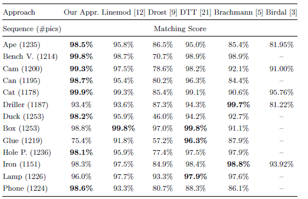

<!--more-->

## Hintersttoisser 改进PPF

原来PPF的问题：

1. 背景的杂乱情况下产生虚假的选票，从而掩盖了正确选票的效果。

2. 传感器噪声会干扰量化（特征计算）

本文提出了：

1. 更好的下采样策略
2. 对预处理和后处理步骤做了小小的修改

## 具体改进

### 1.对输入的场景点云和模型进行的预处理

[Drost-PPF](https://littlebearsama.github.io/2019/07/28/PPF/2010HoughvotePPF/#more)

对三维模型和输入数据进行预处理：

---------------------------------------------------------------

**原版：**

**Drost-PPF对“目标物体”还有“输入场景“”的点云进行了下采样。**

这样做有两个好处：

1. 加速后来的计算速度

2. 并避免考虑太多“模棱两可的”点对:**相互接近的点趋向于有相似的法线，并产生许多没有区别的PPFs**。因此，Drost-PPF对这些点进行子采样，使两个3D点之间至少有一个选定的最小距离。

**改进：**

然而，当临近点的法线实际上不同时，**这可能导致有用信息的丢失**。因此，**如果法线之间的夹角大于30度，即使它们之间的距离小于最小距离，我们也要保持点对**，因为这个点对可能是有区别的。

### 2.对点对进行智能采样

**原版：**

在Drost-PPF中进行了下采样，每个场景点和所有其他场景点进行配对计算特征。这样算法复杂度是任然是二次的。

为了减少运行时间，drost-ppf中建议只使用“每隔m个场景点取一个点”，m经常在实际情况中被设为5即每5个点取1个点。这样稍微改善了运行时间，但是算法还是二次时间复杂度。

以及由于我们从早就经过了下采样的点云中移除了信息，所以影响了匹配的表现。

----------------------

**改进：**

中心思想：两点之间的距离大于物体大小，就知道这两点不可能属于同一个物体，根本就不必考虑场景内所有的点。于是可以d_obj做一个包围球，**每个查询点只对球内的点进行特征计算，忽略所有与查询点之间距大于d_obj的任何点。**

但是出现了问题：

对于某些物体来说，球面区域是一个非常糟糕的近似。特别是**对于狭长的被拉长的物体**，如果以平行于其最长维数的观察方向观察，从半径为d_obj的球体上采样，将在**背景杂波**上产生许多点。

在这些情况下，我们希望使用更小的采样体积，其中与所有其他场景点相比，场景点位于对象上的比例更大。然而，我们没有任何关于物体姿态的先验信息，而且这piar的第一个场景点可以位于物体上的任何位置。要定义一个比半径为dobj的球还小的体积，而不丢弃位于目标物体上的特定对象配置下的场景点对是不可能的。

因此，我们**选择连续使用两个不同半径的投票球:**

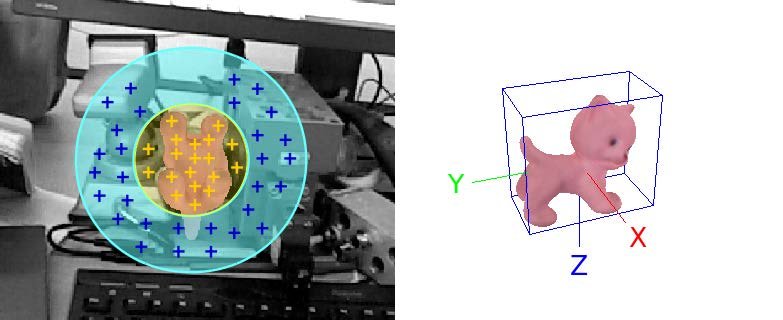

1. 一个半径为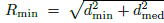的小球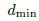是物体包围盒“最小”的边长，而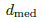是物体包围盒的“中间大小”的边长。（黄色）
2. 一个半径为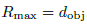（蓝色）

#### 第一步：

我们首先用“小球接受的pairs选票”填充累加器。我们从累加器中**提取峰值**，**“每个”**峰值对应一个关于物体三维姿态的假设，以及模型和场景点之间的对应关系，如Drost-PPF。

#### **第二步：**

然后，我们继续**用大球接受但被小球拒绝的pairs选票填充累加器**。我们像之前一样继续，提取峰值，生成姿态和点对应的假设。

这样，在图2所示的位姿下，我们可以在第一遍得到背景杂波污染较小的峰值，在第二遍得到其他构型的峰值。

---------

**使用体素网格提高查询近邻点效率：**

为了有效地查找被“半径为d的球”所接受的pairs(PPFs)，

我们使用一个“空间查找表”：对于给定的场景，我们**用体素网格划分场景点**。每个维度的体素数量都与场景点相适应，并且可以在x、y和z维度中更精确。

1. **这个网格中的每个体素都有d大小，并存储其中场景点的索引。**

2. 对每个场景点都是这样，我们还存储了它所属的体素索引。

   构建这个体素网格是一个O (n)的操作（遍历一遍所有点）。

为了提取给定的一个点的所有其他最大距离为d的场景点（d范围内的近邻点），**我们首先查找场景参考点所属的体素**，并提取存储在该体素和**所有相邻体素**中的**所有场景点索引**。我们检查找到的体素内的每一个场景点到当前查询场景点的距离是否小于或等于d。

因此，该方法的复杂度为O(nk)，与Drost-的二次复杂度相比，k通常至少比n小一个数量级Drost-PPF，同时**保证考虑所有相关的点对**。

### 3.考虑投票时传感器的噪声

>  下面有linemod的影子啊，将特征和相似度计算”扩散到周围“来抑制噪声。

**1.扩散特征到特征空间中的邻域：**

为了快速访问，PPFs被离散化。然而，传感器噪声会改变离散化bin，使某些PPFs无法正确匹配。通过**在模型预处理过程中**扩展查找表的内容。克服了这一问题，我们并**没有**将第一个模型点和旋转角度**只存储在离散化PPF向量索引的bin中**，而是将它们**存储在可以被相邻离散化PPFs所索引的(80)邻域bin中**。注：(有3^4 = 81 - 1个相邻箱体)。

**2.投票时，将投票投给相邻的旋转角度：**

在对点法线周围的量子化旋转角进行投票时，我们也遇到了类似的问题。为了克服这个问题，我们使用了与上面相同的策略，**不仅投票给原始的量化旋转角，而且投票给它的相邻的旋转角度。**

> 简单来说：将点对扩散到相邻的离散的PPF的bin中，以及将投票投到相邻的角度中

----------

**3.问题：**（引入额外的投票）

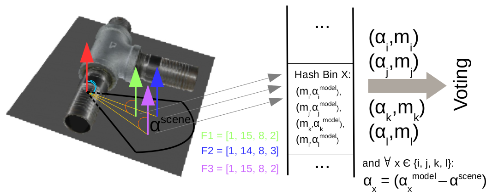

> 第一个场景点(红色)和其他三个场景点(绿色、蓝色和紫色),构建了三个PPF。由于离散性和扩散性（ discretization and spreading），三个PPF都对应同一个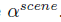。此外，F1和F3的特征离散化和F2的扩展可能会导致这三个特征都映射到同一个hash bin X，从而投票给相同的模型参考点和旋转角度组合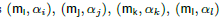好几次了，这就人为地增加了对这些模型点和旋转角度的特定组合的投票，并降低了性能，特别是在本图所示的投票来自背景的情况下。

然而，如图3所示（**红+绿，红+紫，红+蓝**），扩展也有一个缺点：由于特征+旋转空间的离散化（特征量化到bin中）和扩展（往相邻的特征bin中加入当前点对+往隔壁离散角度投票），**很可能由相近的场景点组成的对具有相同的量化旋转角度，并映射到相同的look-up table bin.。**因此，他们将在累加器空间中为相同的bin投票，从而在投票中**引入偏差**。

**4.0解决：**

避免多重投票的直接方法是:

使用三维**二进制数组**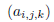为每个场景点来“标记”（flag），第一维的点用i表示，第二维的点用j表示，第三维的点用k表示。如果**第i个模型点 ，第j个模型点分别作为第一和第二点来投票**，以及第三维是早就投票了的“绕旋转轴的第k量化角度”。通过这个三维数组登记了下来，这样就避免了重复。

对于场景的每个查询点，我们都要建一个数组，这样一个数组会非常大，因为它的大小是模型点数量的平方。（n个查询点与其他查询点的组合，有n^2大小的三维数组）

**4.1解决：**(使用量化PPF特征作为flag数组)

我们使用由点对生成的**量化PPFs的作为索引的四维数组b**,而不是由一对模型点和对应的旋转来索引“flag数组”。

**b数组中的每个元素：**b的每个元素都是初始化为0的32位整型数，每个位对应一个离散化的“场景旋转角度”。(是多少度就将相应位置1)，每次投票就，将计算出来的的对应位置1，这样就防止了相同的量化PPFs+旋转的多次投票。

注意，我们在这里使用场景绕法线旋转，因为它只依赖于场景点对。因此，对于存储在查找表的一个bin中的所有元素都是一样的，这允许我们利用它在b中执行标记b。

这个解决方案比上面讨论的直接方法更有效，因为由于PPFs的量化，实际上可能的条目数更少。**b对于所有对象的大小都是常数，并且与PPFs的所有可能量化的数量成线性关系**。

在我们的实现中，当模型点的数量超过650时，直接方法要花费更多的时间

> 22 * 22 * 22 * 40 =650×650

### 4.生成对象姿态和后处理

“Generating Object Pose and Postprocessing”

#### a.旧的位姿聚类方法

为了从累加器中提取物体的位姿，**Drost - ppf使用贪婪的clustering方法。他们从累加池中提取峰值**，每个峰值对应一个物体位姿的hypothesis。对峰值的处理顺序按它们的投票数排，投票数多的先处理，并将它们分配给最接近的cluster(如果足够接近的话)，或者创建另一个cluster。

我们发现这种方法并不总是可靠的，特别是在有噪声传感器和背景杂波的情况下。这些结果导致了虚假投票，而**累加器空间中的投票数并不一定是hypothesis质量的可靠指标**。

#### b.新的位姿聚类方法

因此，**提出一个不同的cluster策略**，通过使用一个**投票球**对投票过程中产生的姿态hypotheses进行自底向上clustering。**我们允许"假设"(hypotheses)加入几个clusters，只要它们的位姿与cluster中心的一个相似。**

我们还跟踪与每个hypotheses相关的模型点，并且只允许一个hypotheses在没有其他具有相同模型点的hypotheses之前投票给该cluster的情况下投票给该cluster。因此，我们避免了模糊和重复的几何结构，如平面引入偏差。

对于少数几个权重最大的clusters，我们使用**投影ICP[11]对估计的位姿进行了细化**。在实践中，我们考虑两个投票球中的每一个球的的前四组clusters。

#### c.如何拒绝在实际中没有对应物体的cluster？

**我们根据相应的3D位姿渲染对象**，计数有多少像素深度接近的渲染的像素深度，远离相机是有多少像素是被遮挡的，又有多少|更接近,因此呈现不一致。距离我们较近的像素数量与总像素数量相比过大，则拒绝该cluster。

**实际上，这个阈值被设置为10%**。我们也丢弃那些被遮挡太严重的对象。

最后一次检查，我们计算场景中具有显著深度或正常变化的区域，并将它们与被拍摄对象的轮廓相比较：如果轮廓没有被depth或normals的变化足够覆盖，我们将**丢弃匹配项**。在实践中，我们使用与遮挡检查相同的阈值。

最后，I**我们对所有剩余的cluster进行排序**，根据它们与场景点的匹配程度，只返回最佳簇的姿态，或者在多实例检测的情况下，返回整个簇的列表

### 5.对数据集测试结果

#### A.数据集1

>Hinterstoisser, S., Lepetit, V., Ilic, S., Holzer, S., Bradski, G., Konolige, K., Navab,
>N.: Model Based Training, Detection and Pose Estimation of Texture-Less 3D
>Objects in Heavily Cluttered Scenes. In: Asian Conference on Computer Vision
>(2012)

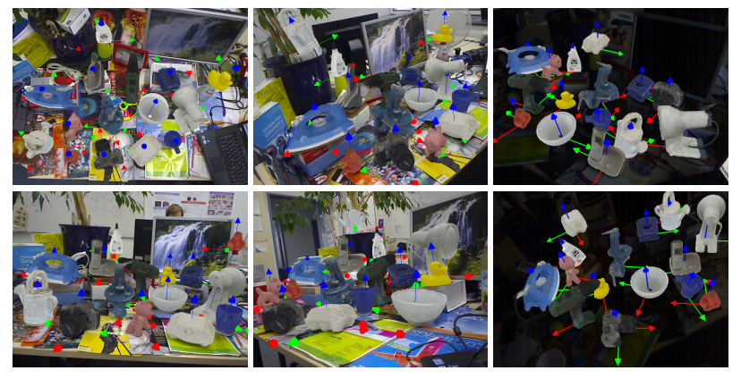

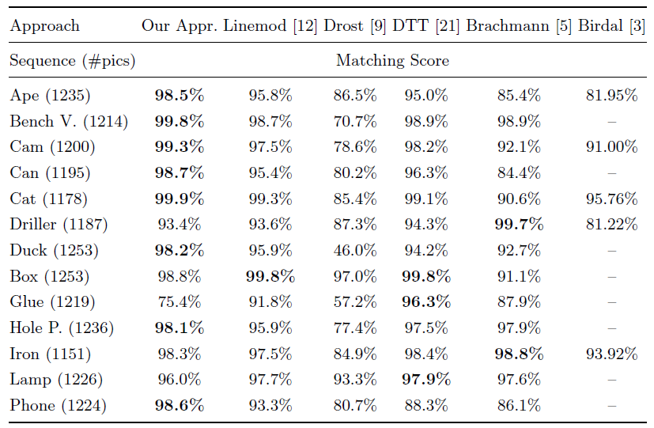

#### B.数据集2

>Krull, A., Brachmann, E., Michel, F., Yang, M.Y., Gumhold, S., Rother, C.: Learn-
>ing Analysis-by-Synthesis for 6D Pose Estimation in RGB-D Images. In: Interna-
>tional Conference on Computer Vision (2015)

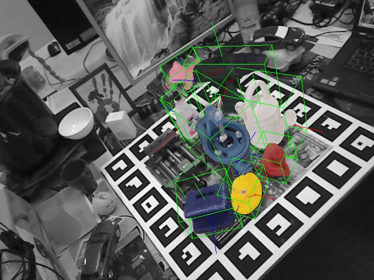

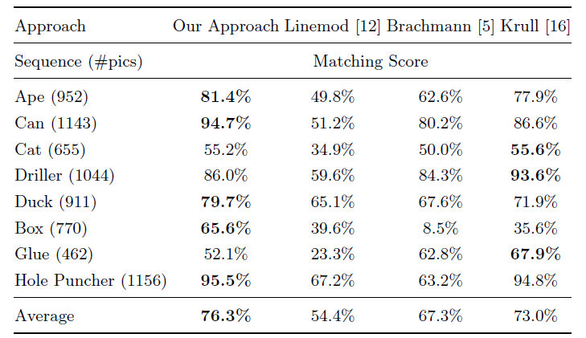

--------

SLAM++中使用了GPU版的PPF

Salas-Moreno, R., Newcombe, R., Strasdat, H., Kelly, P., Davison, A.: SLAM++:
Simultaneous Localisation and Mapping at the Level of Objects. In: Conference on
Computer Vision and Pattern Recognition (2013)