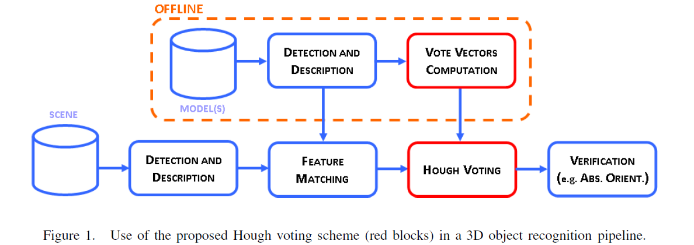
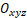
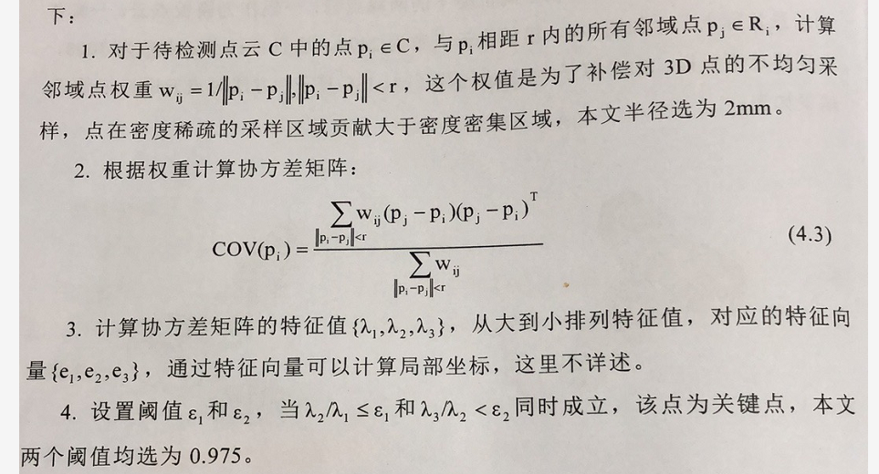
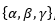
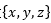
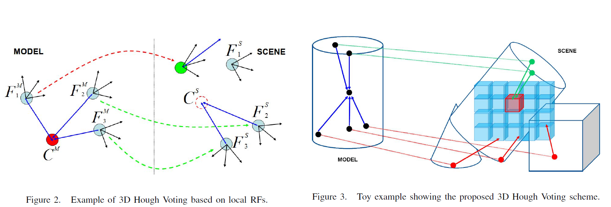
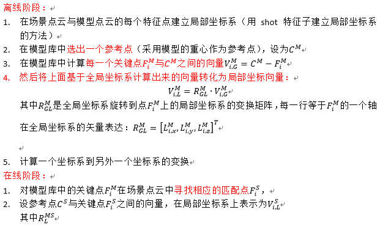

本文是柯师兄的论文“基于双目视觉的散乱堆放工件拾取系统”

## 流程：

<!--more-->

## 法线和曲率计算：

[normal-estimation](https://littlebearsama.github.io/2019/07/26/PCL/regiongrowing/)

## 基于区域生长法对工件堆点云的分割

点云分割方法有很多种：比如欧式聚类法，区域生长法

文中用的是[区域生长法](https://littlebearsama.github.io/2019/07/07/pcl_tutorial/regiongrowing/#more)

## 基于ISS算法的工件关键点提取

关键点：下采样点，ISS，Harris，SIFT

关键点：可以稳定描述，并有较强区分性的点作为关键点。

1. 下采样的方法最快，获取点云的数量可由栅格决定（栅格下采样）

2. ISS算法方法次之，但关键点能稳定提取

3. Harris和SIFT速度比较慢，特别是Harris算子，提取的关键点数较少。

ISS(Instrinsic Shape Signatures)：

在点云中每个点建立一个独立坐标系，z轴是曲面在该点的法线方向，通过某种方法确定x轴和y轴，通过三个轴线上的特征向量建立具有区分性形状描述的特征点。

**对计算出来的协方差矩阵的三个特征值做比较，两个比值分别小于两个阈值，则认为该点是特征点。**

## 基于SHOT算法的关键点特征描述

从模型库和场景点云中提取出来的关键点，必须通过配对才能就估计场景中的工件的位姿，配对需要提取关键点高度区分的特征描述，当两点描述几乎一致，这两点配对成功。

描述子：FPFH，SHOT

**两者的描述能力都较强，Shot的计算速度比FPFH快十倍。**

## Hough粗位姿估计

粗定位的方法：

1. **SAC-IA**  :“Aligning Point Cloud Views using Persistent Feature Histograms”

2. **RANSAC**: “Pose Estimation using Local Structure-Specific Shape and Appearance Context”

3. **Hough（用时较短）**:“Object Recognition in 3D Scenes with Occlusions and Clutter by Hough Voting”

**霍夫变换可以进行多目标识别，在霍夫参数空间中，如果有多个极值存在，则表明场景有多个目标。**

### 霍夫变换HT

霍夫变换原本是一种流行的计算机图形处理技术，通常用于直线检测，后来被改进用于圆和椭圆的检测。它的原理关键是使用投票的方法对参数空间进行投票。将参数空间分成若干个区间，每个区间设置一个箱子，当在图像空间中检测某些特征，由这些特征估算出的参数，并在参数空间中相应的箱子投票加一，如此遍历所有特征，得到参数空间中票数最高的箱子，其对应的区间即为所求参数。

将旋转平移作为参数空间，旋转有三个变量,平移也有三个变量,一共有六个参数，意味着参数空间计算量巨大而且占用大量内存。

#### 步骤：

每个特征点与其相对于模型质心的相对位置相关联，使得每个对应的场景特征可以在三维Hough空间中进行投票，为当前场景中可能存在的质心位置积累证据。

## ICP精确位姿估计和匹配度计算

略