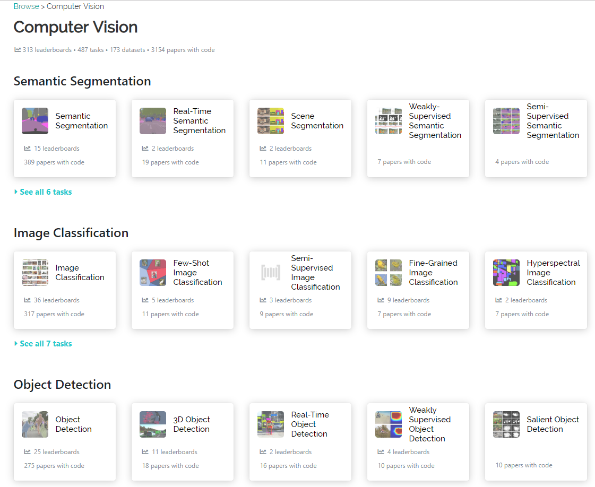

**CV学习资源（三维与二维）**

<!--more-->

# study-source-CVer-

**CV-学习资源**

## 1.paper switch code 和 cv state-of-the-art
https://paperswithcode.com/sota

## 2.人脸识别
https://github.com/ChanChiChoi/awesome-Face_Recognition

## 3.CV2019
* https://github.com/amusi/CVPR2019-Code
* https://github.com/extreme-assistant/cvpr2019

## 4.3D深度学习

### **1.3D-Machine-Learning**

[3D-Machine-Learning](<https://github.com/timzhang642/3D-Machine-Learning>)

- [Datasets](https://github.com/timzhang642/3D-Machine-Learning#datasets)
- [3D Pose Estimation](https://github.com/timzhang642/3D-Machine-Learning#pose_estimation)
- [Courses](https://github.com/timzhang642/3D-Machine-Learning#courses)
- [Single Object Classification](https://github.com/timzhang642/3D-Machine-Learning#single_classification)
- [Multiple Objects Detection](https://github.com/timzhang642/3D-Machine-Learning#multiple_detection)
- [Scene/Object Semantic Segmentation](https://github.com/timzhang642/3D-Machine-Learning#segmentation)
- [3D Geometry Synthesis/Reconstruction](https://github.com/timzhang642/3D-Machine-Learning#3d_synthesis)
- [Texture/Material Analysis and Synthesis](https://github.com/timzhang642/3D-Machine-Learning#material_synthesis)
- [Style Learning and Transfer](https://github.com/timzhang642/3D-Machine-Learning#style_transfer)
- [Scene Synthesis/Reconstruction](https://github.com/timzhang642/3D-Machine-Learning#scene_synthesis)
- [Scene Understanding](https://github.com/timzhang642/3D-Machine-Learning#scene_understanding)

###  2.A Tutorial on 3D Deep Learning

[A Tutorial on 3D Deep Learning](<http://3ddl.stanford.edu/>)

### 3.3D Convolutional Neural Networks — A Reading List

[3D Convolutional Neural Networks — A Reading List](<http://davidstutz.de/3d-convolutional-neural-networks-a-reading-list/>)

## 5.移动机器人

### 1.MRPT

1. github:[The MRPT project](<https://github.com/MRPT/mrpt>) 
2. tutorial:<https://www.mrpt.org/tutorials/>