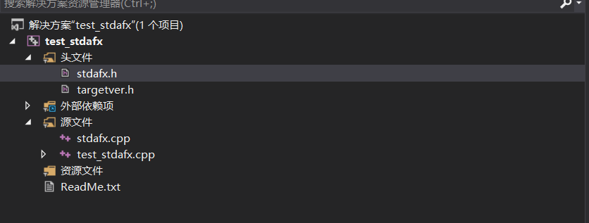
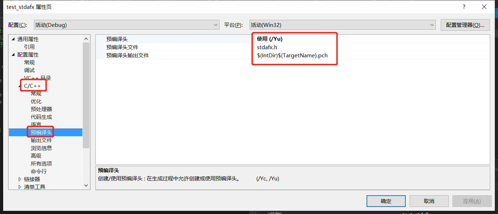
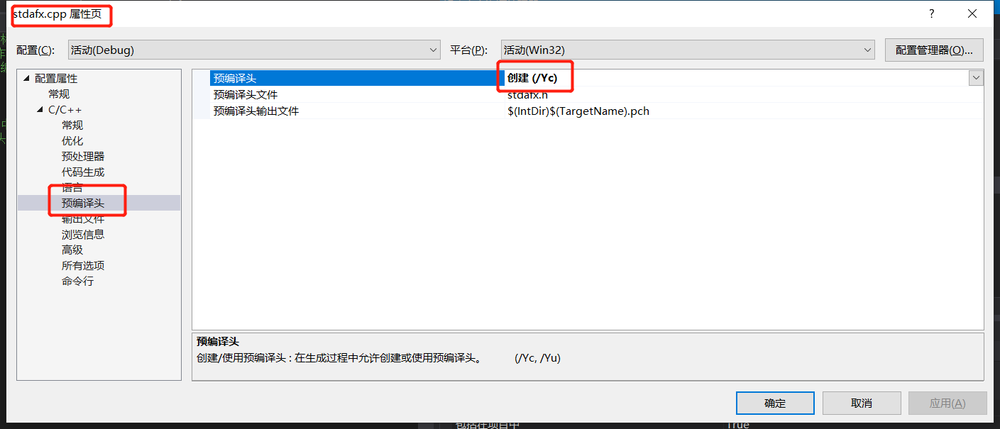

[TOC]

<!--more-->

# 1. 预编译头（提高编译速度）

[参考](https://blog.csdn.net/ly416/article/details/24735441?utm_medium=distribute.pc_relevant.none-task-blog-BlogCommendFromMachineLearnPai2-2.nonecase&depth_1-utm_source=distribute.pc_relevant.none-task-blog-BlogCommendFromMachineLearnPai2-2.nonecase)

\#include “stdafx.h”

1. 首先#include语句的作用是将对应名称的头文件的所有内容粘贴到include所在的文件中。如果头文件内容很多就会非常耗时。
2. 所以如果重复include多个头文件，会造成多次代码的粘贴，对于头文件中有类声明等，会造成重定义。
3. 预编译头就是把一个工程中的那一部分代码预先编译好放在一个文件里(通常是以.pch为扩展名的)，这个文件就称为预编译头文件。
4. 预先编译好的代码可以是任何的C/C++代码——–甚至是inline的函数，但是必须是稳定的，在工程开发的过程中不会被经常改变。**如果这些代码被修改，则需要重新编译生成预编译头文件。**
5. Stdafx.h文件需要配合一个StdAfx.cpp文件来使用
6. 使用了预编译头技术后，编译速度大大提高了。可以到你的工程目录下的Debug 或 Release 目录中看一看，里面有一个体积极为硕大的 .pch 文件，那就是“编译之后的预编译头”。
7. 如果你使用了预编译头技术，就必须在所有的 cpp 中包含预编译头。MFC 工程中为你建立了一个默认的预编译头 stdafx.h，如果你愿意，也可以在自己的工程中使用其它文件名作为你的预编译头，如果你觉得有必要。

## 使用预编译头







1. 在属性表中 设置C/C++----->预编译头---->使用（/Yu）---->预编译头文件stdafx.h
2. 右键stdafx.cpp文件属性--->预编译头---->创建（/Yc）
3. 在每个cpp文件中加入预编译头文件stdafx.h

# 2. #pragma once 与 ifndef

[参考1](https://blog.csdn.net/jandunlab/article/details/17185253)

[参考2](https://blog.csdn.net/songsong2017/article/details/97100325?utm_medium=distribute.pc_relevant.none-task-blog-BlogCommendFromMachineLearnPai2-2.nonecase&depth_1-utm_source=distribute.pc_relevant.none-task-blog-BlogCommendFromMachineLearnPai2-2.nonecase)

**目的：**为了避免同一个文件被include多次

**同一个文件被include多次的危害：**

（1）防止重复定义的错误；

（2）如果这个头文件变化，那么所有include这个文件的源文件都需要重新编译，即使没有去使用里面的任何内容

**避免措施：**

  （1）头文件加#pragma once

  （2）头文件加#ifndef 宏名  #define 宏名  #endif

```C++
    方式一：
    #ifndef __SOMEFILE_H__
    #define __SOMEFILE_H__
    ... ... // 一些声明语句
    #endif
    方式二：
    #pragma once
    ... ... // 一些声明语句
```

**两者区别：**

1.   **#ifndef的方式依赖于宏名字不能冲突**，这不光可以保证同一个文件不会被包含多次，也能保证内容完全相同的两个文件不会被不小心同时包含。当然，缺点就是如果不同头文件的宏名不小心“撞车”，可能就会导致头文件明明存在，**不同文件相同宏名会使得编译器出现找不到声明的状况。**
2.   \#pragma once则由编译器提供保证：同一个文件不会被包含多次。注意这里所说的“同一个文件”是指**物理上的一个文件**，而不是指内容相同的两个文件。带来的好处是，你不必再费劲想个宏名了，当然也就不会出现宏名碰撞引发的奇怪问题。***对应的缺点就是如果某个头文件有多份拷贝，本方法不能保证他们不被重复包含***。当然，相比宏名碰撞引发的“找不到声明”的问题，重复包含更容易被发现并修正。


# 3. VS由于无法找到 dll，无法继续执行代码

[C++在VS下创建、调用dll](https://www.cnblogs.com/houkai/archive/2013/06/05/3119513.html)

[如何在C++程序中调用dll文件](https://www.cnblogs.com/ScarecrowMark/p/11249303.html)

[windows下C++项目引用其他项目](https://blog.csdn.net/yuhai738639/article/details/79023258)

1. 显式链接

显式链接是应用程序在执行过程中随时可以加载DLL文件，也可以随时卸载DLL文件，这是隐式链接所无法作到的，所以显式链接具有更好的灵活性，对于解释性语言更为合适。

新建项目，不需要特殊配置，添加cpp文件

2. 隐式链接

隐式链接采用静态加载的方式，比较简单，需要.h、.lib、.dll三件套。新建“控制台应用程序”或“空项目”。配置如下:

项目->属性->配置属性->VC++ 目录-> 在“包含目录”里添加头文件testdll.h所在的目录

项目->属性->配置属性->VC++ 目录-> 在“库目录”里添加头文件testdll.lib所在的目录

项目->属性->配置属性->链接器->输入-> 在“附加依赖项”里添加“testdll.lib”（若有多个 lib 则以空格隔开）

现在可以编译通过了，但是程序运行就报错，还需要将testdll.dll复制到当前项目生成的可执行文件所在的目录。

 

# 4. 内联的虚成员函数

[参考](https://blog.csdn.net/lonelysky/article/details/52090109)

内联虚成员函数：inline virtual void fun(int a);？

**函数的inline属性是在编译时确定的， 然而，virtual的性质是在运行时确定的，这两个不能同时存在，只能有一个选择，文件中的inline关键字只是对编译器的建议，编译器是否采纳是编译器的事情。**


# 5.__declspec( dllexport )的作用

[参考](https://blog.csdn.net/love__live1/article/details/82699479)

 在工程开发中，我们往往需要将某个工程做成dll动态链接库的形式释放出去；但在工程初期，为方便调试，一般生成的是exe文件；在确认功能开发完毕后，再将其封装成dll文件进行释放。那么，当我们想要将原先是生成exe文件的vs工程，转换为生成dll文件的话；需执行的步骤如下（以vs2013为例）：

1. 将工程的配置类型配置为dll

   ```
   项目->属性->配置属性->常规->配置类型->动态库(.dll)
   ```

2. **将要释放的接口函数以如下格式进行声明**

   ```
   _declspec(dllexport) 函数首;
   ```
   
   
   
   list.h

```C++
struct ListNode
{
    int       m_nValue;
    ListNode* m_pNext;
};

__declspec( dllexport ) ListNode* CreateListNode(int value);
```

list.cpp

```C++
#include<iostream>
#include "include/List.h"

using namespace std;

// 创建链表节点
ListNode* CreateListNode(int value) {
    ListNode* pNode = new ListNode();
    pNode->m_nValue = value;
    pNode->m_pNext = nullptr;

    return pNode;
}
```

**__declspec( dllexport )的作用为不用导入库文件，就可以在外部直接调用其后的函数功能。**

例如：加入建一个test.cpp文件，导入list.h后可以直接调用其函数

调用如下

```C++
#include <stdio.h>
#include <windows.h>

void main(void)
{
    typedef int(*MyFunDll)(void);

    HMODULE hdll = LoadLibrary("Win32Project1.dll");   //加载dll文件
    if (hdll != NULL)
    {
        MyFunDll MyFunCall = (MyFunDll)GetProcAddress(hdll, "main");//检索要调用函数的地址
        if (MyFunCall != NULL)
        {
            MyFunCall();							    //调用接口函数
        }
    }

    FreeLibrary(hdll);								    //释放dll文件
}

```

通过LoadLibrary()函数对dll文件进行加载；再通过GetProcAddress()函数去获取要调用的接口函数的地址（上例中用MyFunCall去存储接口函数的地址）；再调用该接口函数(MyFunCall)；最后通过FreeLibrary()函数对dll文件进行释放。所以，如果要用于加载其他的dll文件，上例中需改动的地方有：

* 加载的dll文件名(上例中的"Win32Project1.dll")；
* 要检索的接口函数名(上例中的"main")；
* 调用的接口函数的格式(如上例中的MyFunCall()，函数的参数信息应保持与要调用的接口函数"main"一致)。
  