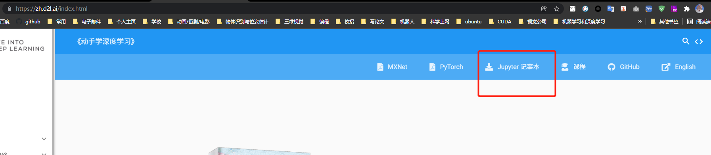
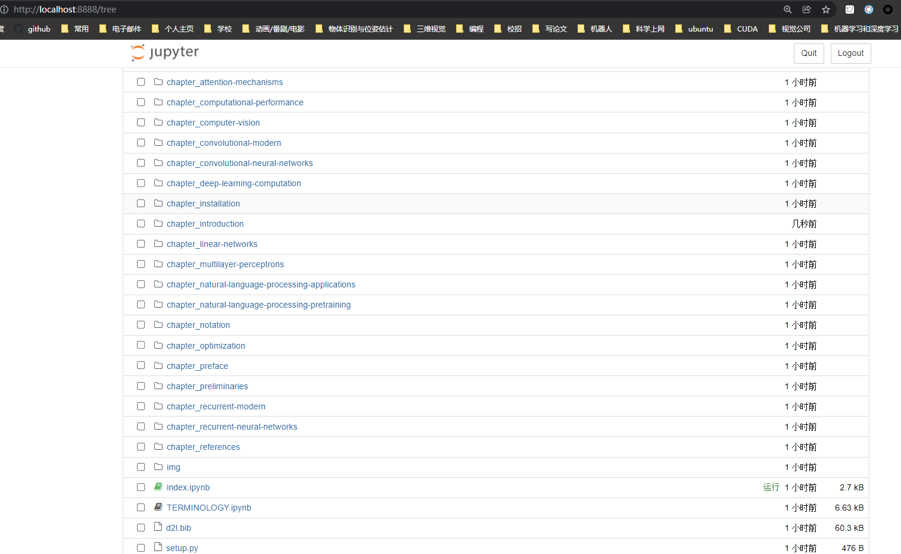
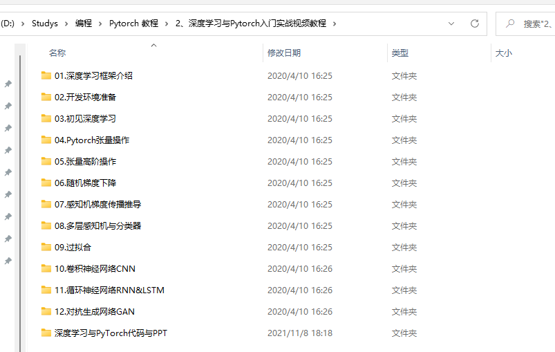

Anaconda 与Pytorch 使用

<!--more-->

# 深度学习学习教程

1. 动手学深度学习https://zh.d2l.ai/index.html

   

   下载jupyter notebook，解压，可以在网页作为编辑器执行与修改笔记

   pip install notebook

   进入笔记目录命令行运行

   jupyter notebook	

2. 学习pytorch

   

# anaconda

## 教程

1. 安装opencv

   https://www.cnblogs.com/jisongxie/p/10248550.html

   > pip install opencv-python

2. 安装open3D和opencv

   https://blog.csdn.net/zhmexinxin/article/details/105299300

   
   
3. 

## 命令相关

### 创建环境

https://www.jianshu.com/p/ee08ca2c1160

#### 建立Pytorch Anaconda虚拟环境

conda create --name deeplearning python=3.6 anaconda

- 其中加入最后一项anaconda命令建立虚拟环境时，会同时安装例如Notebook、Numpy、Scipy、Matplotlib、Pandas等数据分析包，用户也可以不加，选择后续安装。

#### 启动Pytorch Anaconda虚拟环境

```undefined
activate pytorch deeplearning
```

#### 安装Pytorch

指令参考：https://pytorch.org/

```swift

conda install pytorch torchvision torchaudio cudatoolkit=10.2 -c pytorch
```

测试：

```yswift
import torch
import torchvision
print(torch.__version__)
```

### 命令集

```
1. conda --version #检查Anaconda的版本
2. conda update conda #升级Anaconda的版本
3. conda create --name study python=3.6 #这里在虚拟环境中我们使用的python=3.6 在Anaconda Prompt(Anaconda3)中创建一个虚拟环境study
4. conda activate study #激活名为study的虚拟环境
5. conda info --envs #查看conda下的所有虚拟环境
6. conda list #查看当前选中的虚拟环境当前已经安装插件
7. conda search numpy #搜索查找numpy
8. conda install numpy  #安装numpy
9. 输入python，进入python虚拟环境
10. conda create -n BBB --clone AAA #在本地的conda里已经有一个AAA的环境，我想创建一个新环境跟它一模一样的叫BBB
11. 如果是跨计算机，很自然地，我们可以把原来电脑上目标conda环境的目录复制到新电脑上，然后再用：
conda create -n BBB --clone ~/path
就直接一步安装了所有的包，完成了环境的移植。
原来的电脑上的环境的地址可以用
conda info -e 查询到。
移植过来的环境只是安装了你原来环境里用conda install等命令直接安装的包，你用pip之类装的东西没有移植过来，需要你重新安装。
```

## 遇到的问题

### 1. Conda cannot proceed due to an error in your proxy configuration.

>conda search numpy

ProxyError: Conda cannot proceed due to an error in your proxy configuration.
Check for typos and other configuration errors in any '.netrc' file in your home directory,
any environment variables ending in '_PROXY', and any other system-wide proxy
configuration settings.

启动代理然后关闭代理解决了。

### 2.Solving environment: failed with initial frozen solve. Retrying with flexible solve

https://www.freesion.com/article/9578434495/

### 3.python启动时Failed calling sys.__interactivehook__错误原因及解决方法

https://blog.csdn.net/hongxingabc/article/details/102610442

