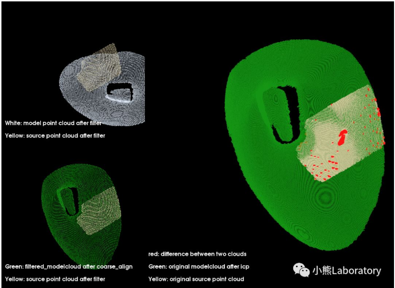
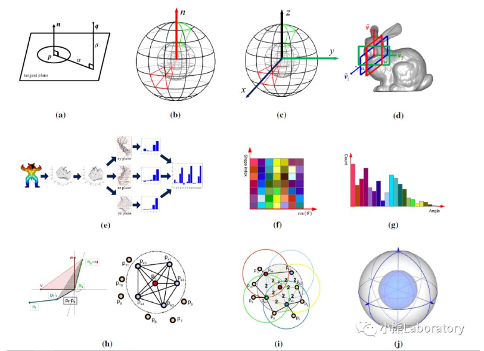
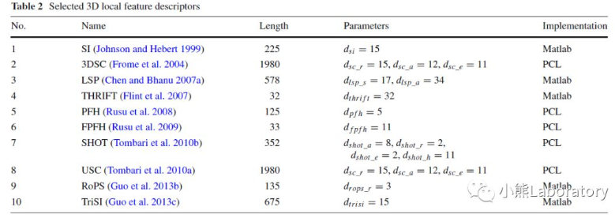
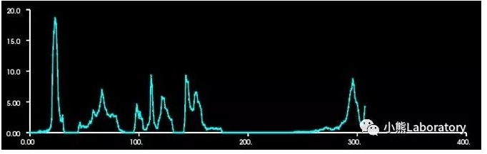

图：使用手持式扫描仪收集的数据，利用采样点与其FPFH特征描述的SAC-IA配准（粗配准）

<!--more-->

**介绍：**

在三维物体识别（3D object recognition），三维形状检测（3D shape retrieval），三维曲面配准（3D surface registration）的过程中局部特征作可以作为两个三维物体（曲面）共同部分的桥梁，将两个不完全相同的点云（曲面）通过共同部分连接在一起。

基于**局部特征**的算法通常涉及两个主要阶段:

**关键点检测**和**特征描述**。
1.在关键点检测阶段，首先识别具有丰富信息内容的关键点及其相关尺度的确定

2.而在特征描述阶段，提取关键点（一般是关键点，有的情况采样点作为关键点也适用）周围的几何信息存储在高维向量，即为***feature descriptor***。

之后的工作：像曲面配准的一种方法就是利用descriptors进行粗配准，通过特征描述符来计算对应源曲面的关键点与感兴趣曲面关键点之间的对应关系来获得位姿变换**T**。


**下面介绍特征描述符**

​    我们构造了大量的三维局部特征描述符来编码局部曲面的信息。在这些方法中，许多算法使用直方图来表示局部表面的不同特征。具体地说，它们通过将几何或拓扑测量值(如点编号)按照特定领域(如点坐标、几何属性)累积成直方图来描述局部表面。我们将这些算法分为基于描述符的“空间分布直方图”和“几何属性直方图”。

1.Spatial Distribution Histogram based Descriptors

1. Spin Image (SI)

2. 3D Shape Context (3DSC)

3. Unique Shape Context (USC)

4. Rotational Projection Statistics (RoPS)

5. Tri-Spin-Image (TriSI)

   

2.Geometric Attribute Histogram based Descriptors

1. Local Surface Patch (LSP)
2. THRIFT
3. Point Feature Histogram (PFH)
4. Fast Point Feature Histogram (FPFH) 
5. Signature of Histogram of Orientations (SHOT)



**A.***“**A Comprehensive Performance Evaluation of 3D Local Feature***

**Descriptors** *”*

论文中比较了10种常用的局部特征描述符在三维物体中的应用。

对这几种局部特征描述子进行了全面的性能评估。



文章中

1. 使用了Precision-recall curve来评估descriptors的描述性（Descriptiveness）。
2. 使用添加三种不同noise，gaussian noise，shot noise和decimation；使用多种的网格分辨率；对Keypoint Localization Error；添加Occlusion and Clutter等来检测descriptors的鲁棒性（Rubustness）。
3. 通过多源收集的数据来测试descriptors的Scalability。
4. Combination with 3D Keypoint Detectors。
5. 通过计算每个场景中生成1000个descriptors（每个descriptors考虑102～105个点）所用的时间。评估Efficiency。

由于组合实在太多了，如果想改进描述子，了解各个因素对descriptors的性能影响的话，查看详细结果请看论文。如果只是用的话，可以只了解下列结果就可以了。

论文总结：

- 对于对时间条件苛刻且点的数据量少的应用程序(例如实时系统)，**FPFH**是最佳选择。这是因为**FPFH**描述符具有合理的描述性、计算效率(对于特性生成和匹配)和轻量级(对于特性存储)。它在特征匹配精度和计算效率之间提供了良好的平衡。
- 对于对时间条件苛刻且点的数据量大多的应用程序，**SHOT**在描述性和计算效率方面都有很好的表现。
- 对于存储空间苛刻的应用程序（例如嵌入式设备），**FPFH**是最好的选择。这是因为它对特征存储的内存要求很低。**Rops**也可以被考虑，因为它以稍高的存储需求为代价实现了更好的描述性能。对于需要高配准准确率(或识别率)的场景，与其他描述符相比，**RoPS**具有更高的鉴别能力，因此强烈推荐使用。
- 如果数据集的特征(如噪声水平、分辨率)未知，则**RoPS**是最佳选择，因为它在所有类型的数据集上都能持续产生良好的结果。**RoPS**描述符在不同数据集之间实现了非常稳定的性能。
- 结合三维关键点检测方法(相对于**均匀采样**或**随机选取关键点**)，可以显著提高所选描述符的特征匹配性能。当**ISS-BR（关键点）**与这些选择的描述符组合时，始终获得最佳性能。
- 由于scalability和descriptiveness综合，**TriSI**是大型数据集上应用程序的最佳选择。
- **请注意，尽管这些描述符在高分辨率数据集(使用昂贵的扫描仪收集)中表现良好，但在低成本低分辨率传感器(如Kinect和Dense Stereo)的数据下，****它们的性能都相当弱****。因此，研究方向应是设计适合低分辨率和高噪声数据的描述符，或设计高分辨率和低成本RGBD相机。****哈哈。。。**


**B.****PCL中的PFH和FPFH**


**C.直方图可视化**

**一个直方图可视化模块（pclhistogramvisualizer）的二维图；**



**D.描述符之间匹配**

在计算了点云中的每个关键点的本地描述符之后，我们必须匹配它们，找到与存储在对象数据库（模型点云）中的对应项。为此，**可以使用k-d树之类的搜索结构来执行最近邻居搜索**，检索描述符之间的欧式距离(还可以选择强制最大距离值作为阈值)。场景中的每个描述符都应该与数据库中每个模型的描述符相匹配。

[链接](http://robotica.unileon.es/index.php/PCL/OpenNI_tutorial_5:_3D_object_recognition_(pipeline)#Matching)

```c++
#include <pcl/io/pcd_io.h>
#include <pcl/features/normal_3d.h>
#include <pcl/features/shot.h>

#include <iostream>

int
main(int argc, char** argv)
{
	// Object for storing the SHOT descriptors for the scene.
	pcl::PointCloud<pcl::SHOT352>::Ptr sceneDescriptors(new pcl::PointCloud<pcl::SHOT352>());
	// Object for storing the SHOT descriptors for the model.
	pcl::PointCloud<pcl::SHOT352>::Ptr modelDescriptors(new pcl::PointCloud<pcl::SHOT352>());

	// Read the already computed descriptors from disk.
	if (pcl::io::loadPCDFile<pcl::SHOT352>(argv[1], *sceneDescriptors) != 0)
	{
		return -1;
	}
	if (pcl::io::loadPCDFile<pcl::SHOT352>(argv[2], *modelDescriptors) != 0)
	{
		return -1;
	}

	// A kd-tree object that uses the FLANN library for fast search of nearest neighbors.
	pcl::KdTreeFLANN<pcl::SHOT352> matching;
	matching.setInputCloud(modelDescriptors);
	// A Correspondence object stores the indices of the query and the match,
	// and the distance/weight.
	pcl::CorrespondencesPtr correspondences(new pcl::Correspondences());

	// Check every descriptor computed for the scene.
	for (size_t i = 0; i < sceneDescriptors->size(); ++i)
	{
		std::vector<int> neighbors(1);
		std::vector<float> squaredDistances(1);
		// Ignore NaNs.
		if (pcl_isfinite(sceneDescriptors->at(i).descriptor[0]))
		{
			// Find the nearest neighbor (in descriptor space)...
			int neighborCount = matching.nearestKSearch(sceneDescriptors->at(i), 1, neighbors, squaredDistances);
			// ...and add a new correspondence if the distance is less than a threshold
			// (SHOT distances are between 0 and 1, other descriptors use different metrics).
			if (neighborCount == 1 && squaredDistances[0] < 0.25f)
			{
				pcl::Correspondence correspondence(neighbors[0], static_cast<int>(i), squaredDistances[0]);
				correspondences->push_back(correspondence);
			}
		}
	}
	std::cout << "Found " << correspondences->size() << " correspondences." << std::endl;
}
```


