配置PCL+QT+CUDA

<!--more-->

回复：从源码开始编译pcl 获得文档

参考博客

**1.http://pointclouds.org/documentation/tutorials/compiling_pcl_windows.php#compiling-pcl-windows**

**2.** **https://blog.csdn.net/artista/article/details/50897833**

可以忽略网址

**步骤**

**环境：**

**Vs2013 win10**

**安装了pcl-all-in-one1.8****版本的预编译包（主要用到里面的编译好的第三方库，那么就不用自己来编译第三方库了）**

 

 

1．  第一步：安装cuda最新版本（v9.1）

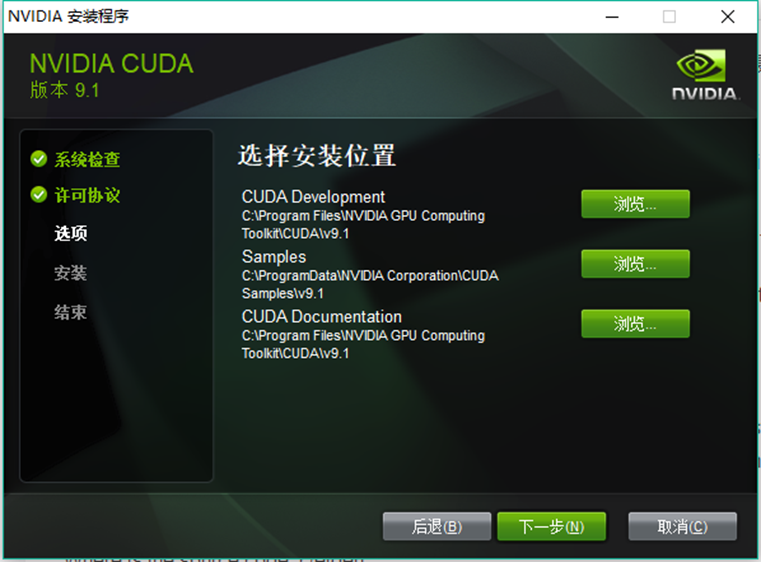

一步一步安装就好了

2．  第二步：下载pcl-master   https://github.com/PointCloudLibrary/pcl

3．  第三步：以管理员身份运行cmake（不知是否必要）

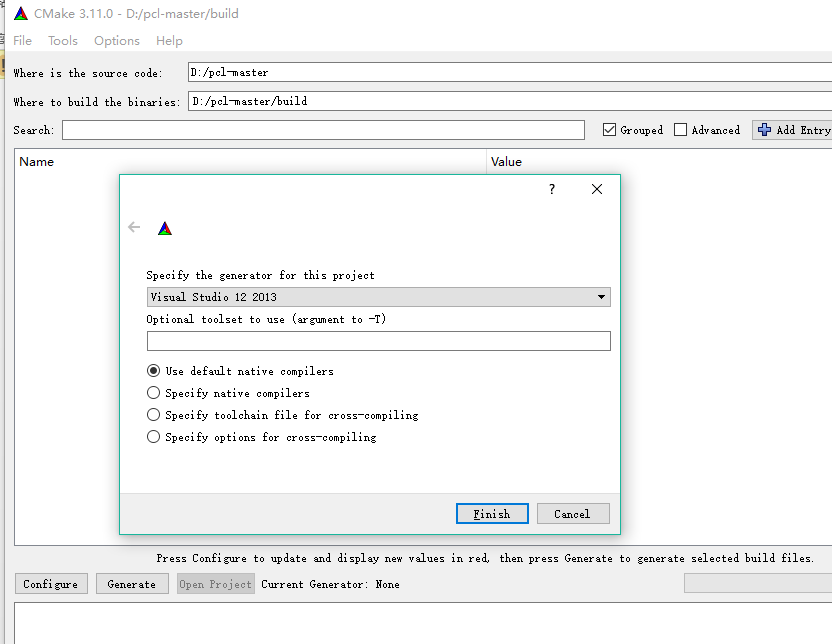

4.第四步：设置一些cmake找不到的变量

1.EIGEN_INCLUDE_DIR D:/pcl/3rdParty/Eigen/eigen3

Configure

2.Boost_INCLUDE_DIR D:/pcl/3rdParty/Boost/include/boost-1_59

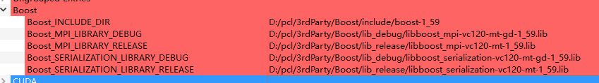

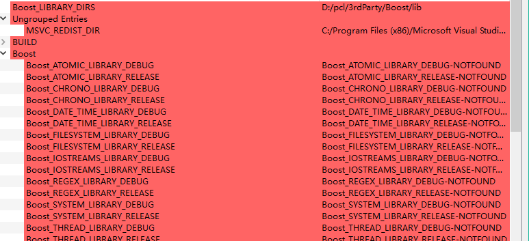

CONFIGURE 

5.

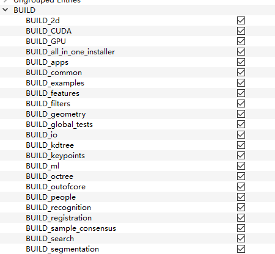

全部勾选上

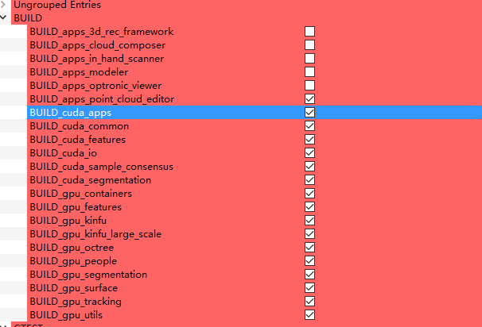

出现错误

CMake Error at C:/ProgramFiles/CMake/share/cmake-3.11/Modules/FindBoost.cmake:2044 (message):
Unable to find the requested Boost libraries.

Boost version: 1.59.0

Boost include path: D:/pcl/3rdParty/Boost/include/boost-1_59

Could not find the following static Boost libraries:

boost_filesystem
boost_thread
boost_date_time
boost_iostreams
boost_chrono
boost_system

Some (but not all) of the required Boost libraries were found. You may
need to install these additional Boost libraries. Alternatively, set
BOOST_LIBRARYDIR to the directory containing Boost libraries or BOOST_ROOT
to the location of Boost.
Call Stack (most recent call first):
cmake/pcl_find_boost.cmake:41 (find_package)
CMakeLists.txt:419 (include)

!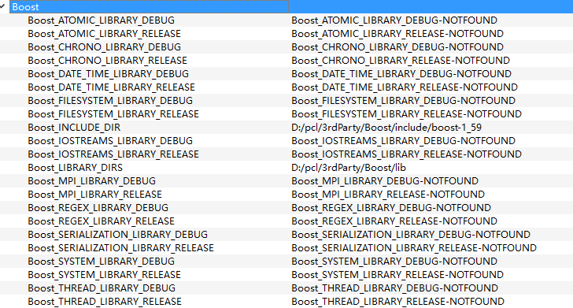

手动将boost库一个一个添加进去

因为预编译的第三方库没有分好类

我手动分类又添加了两个路径

 

CMake Error at C:/ProgramFiles/CMake/share/cmake-3.11/Modules/FindPackageHandleStandardArgs.cmake:137(message):
Could NOT find Gtest (missing: GTEST_INCLUDE_DIR GTEST_SRC_DIR)
Call Stack (most recent call first):
C:/ProgramFiles/CMake/share/cmake-3.11/Modules/FindPackageHandleStandardArgs.cmake:378(_FPHSA_FAILURE_MESSAGE)
cmake/Modules/FindGtest.cmake:35 (find_package_handle_standard_args)
test/CMakeLists.txt:11 (find_package)

取消掉globaltest

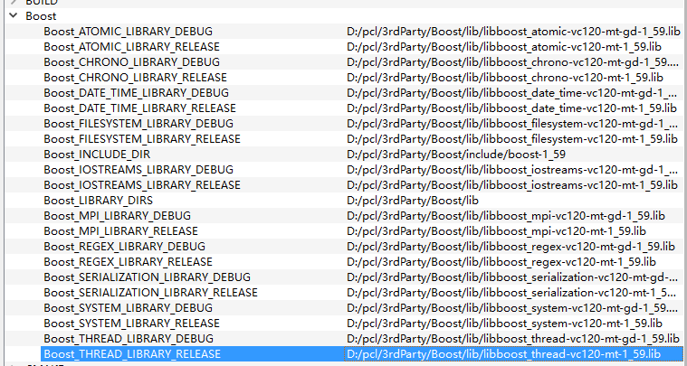

Cmake成功 

**打开vs2013工程再编译一下**

 

**Debug x64**

1.All-build 重新生成

除了（example_nurbs_viewer_surface失败其他都成功了）

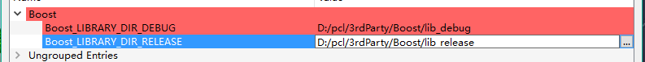

就不管那个了，因为主要用到gpu和cuda

2.INSTALL重新生成

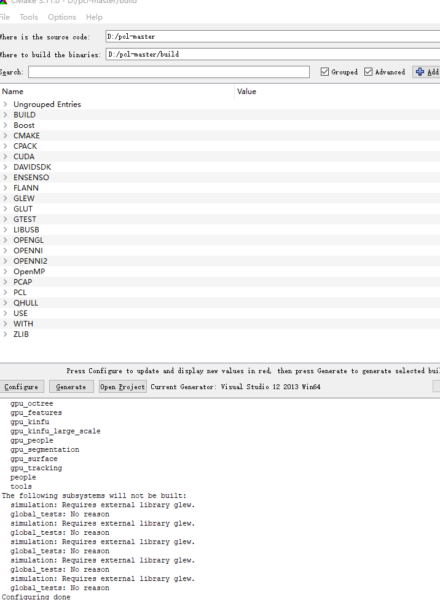

**-----------------**

**Releasex64** **进行同样的操作**

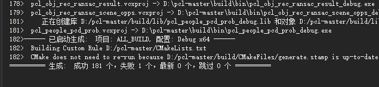

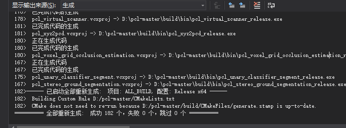

**-----------------------------------------------------------****解析------------------------------------------------------------**

**1.Cmake****中CMAKE_INSTALL_PREFIX   C:/Program Files/PCL**

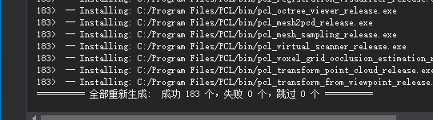

放了编译出来的库（当前环境下（vs2013）可以用的东西（动态库，可执行文件，静态库））

动态库放在了bin里面

静态库放在了lib里面

**2.whereto build the binaries****：D:/pcl-master/build**

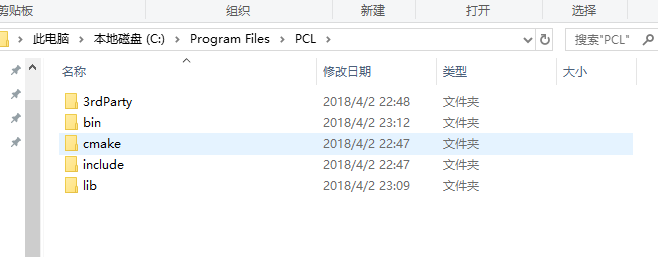

存放的是cmake出来的文件（工程文件）即：**构建样例工程及源码的文件**

​																					（完）