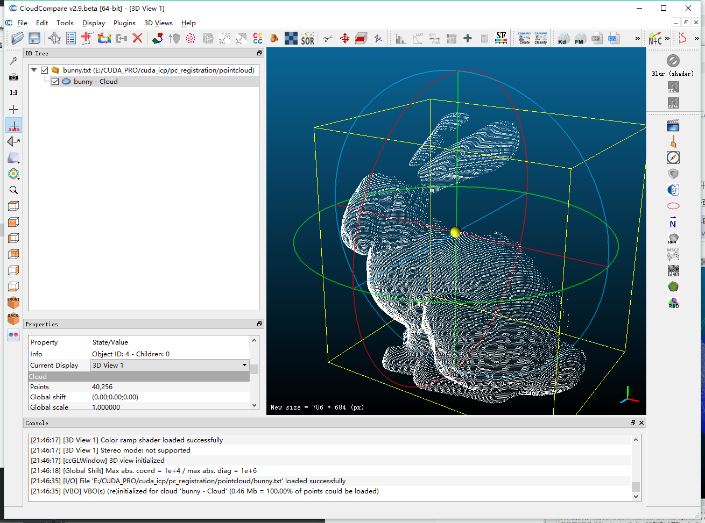
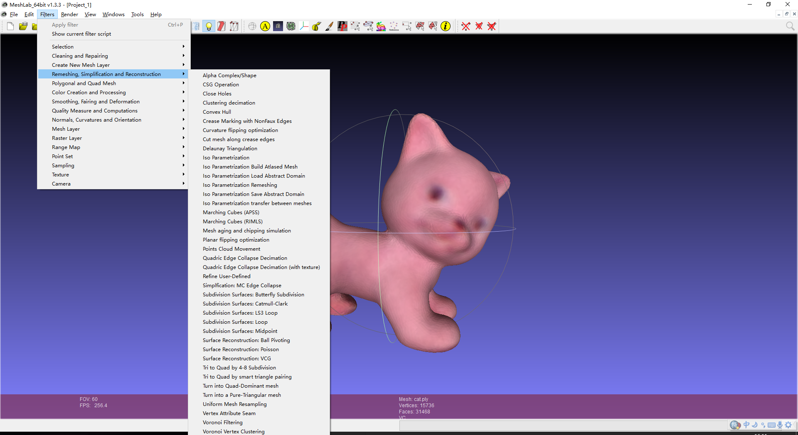

如何开始学习PCL点云库

<!--more-->

写下博主学习点云的过程中的心得（后面链接提供参考资料）

### **建议：**

- 首先推荐不要自己编译源码，建议安装all-in-one能够满足大部分人的需求。
- 其次先实现基本功能再配置QT，可能qvtk插件会有点麻烦
- [配置教程](<https://littlebearsama.github.io/2019/05/24/pcl_tutorial/config-PCL-qt-cuda/#more>)
- 如有需要再安装cuda

### **资源：**

1. 学习资源

   a.**最好就是直接看官网文档**

   1. http://pointclouds.org/documentation/
   2. <http://docs.pointclouds.org/trunk/>

   b.微信公众号：点云PCL

   c.微信公众号：泡泡机器人SLAM，里面做slam关于点云的也是比较多的。

   d.书《点云库PCL从入门到精通》

   

2. 遇到问题

   a.首先想着自己解决，在pcl邮件记录里面有很多别人遇到过的问题，可以先找一下有没有相似的再问别人。pcl-mailing-list：http://www.pcl-users.org/

   b.加两个比较活跃的PCL点云库群：

   点云库PCL旗舰群512254255、         

   dianyunPCL微信公众号群327490147

   群里面有很多活跃的人，有问题问大神。

   

3. 数据集

   a.[Stanford PCD Data](<http://graphics.stanford.edu/data/>)里面有许多测试用的点云，典型的兔子bunny。

   b.kitti，用于点云配准的遥感激光（车载或机载的）点云数据集。

   c.[**室内物体rgbd数据集**](http://rgbd-dataset.cs.washington.edu/)

   d.[**SIXD Challenge 2017**数据集](<http://cmp.felk.cvut.cz/sixd/challenge_2017/>)

   e.点云深度学习数据集：[3D-Machine-Learning](<https://github.com/timzhang642/3D-Machine-Learning>)

   * [ShapeNet](https://shapenet.org/);

   * [ShapeNetSem](https://shapenet.org/);

   * [ModelNet](http://modelnet.cs.princeton.edu/);

   * 对应的imageNet中每一类的图像[PASCAL3D+](http://cvgl.stanford.edu/projects/pascal3d.html);

   * 大型三维仿真数据集[ABC dataset](https://cs.nyu.edu/~zhongshi/publication/abc-dataset/);

   * 佐治亚理工[大型几何模型数据集](https://www.cc.gatech.edu/projects/large_models/)

   

4. 用得最多的处理点云的必备软件（好用又开源）

   a.cloudcompare非常好用，可以进行点云查看，配准，剪裁，格式转换等

   

   b.meshlab，可以对网格点云等进行处理，集成了大部分重建，分割等算法

   

### **一些知识点：**

1. **两种数据结构：kdtree和octree**

   [**kdtree：**](<http://docs.pointclouds.org/trunk/group__kdtree.html>)

   [kdtree原理](https://leileiluoluo.com/posts/kdtree-algorithm-and-implementation.html)

   [KD Tree的原理及Python实现](https://zhuanlan.zhihu.com/p/45346117)

   kd是k维的意思，在点云中k=3。

   [**octree：**](<http://docs.pointclouds.org/trunk/group__octree.html>)

   kdtree和octree都是两种计算机数据结构。可以简单理解为建立这些数据结构是为了方便我们进行三维空间检索。

   kdtree用**来组织表示k维空间**中点的集合，

   1.PCL中kdtree库提供了kdtree数据结构。基于FLANN（快速近邻算法）进行快速近邻查询即帮助你找到最近的几个点。有了近邻点的信息可以计算特征描述子（feature descriptor）用于描述该点的特征，建立kdtree可以简单理解为通过kdtree帮助你找到每个点的邻居，具体描述请看文档。

   2.PCL中octree可以理解为：通过循环递归划分空间为八个子立方体来进行空间细分，octree的编码知道每个点云所在的octree空间，递归的次数越多就使得划分的空间越细。同样的，octree也可以像kdtree一样进行FLANN，邻域检索，邻域的特征提取，计算描述符等。另外还有一些相应的空间处理算法比如：压缩，空间变化检测。

   **通过空间变化检测来提取两个点云的差异非常好用。**

   kdtree和octree具体内容会有相关的详细文档，放在百度云。

   

2. **随机采样一致性算法RANSAC**

   RANSAC是一种随机参数估计算法。RANSAC从样本中随机抽选出一个样本子集，使用最小方差估计算法对这个自己计算模型参数。

   PCL中利用RANSAC实现了随机采样一致性及其范化估计算法。

   用不同的估计算法和不同的几何模型结合来估算点云中隐藏的具体几何模型的系数。

   实例：用平面模型对常见的室内点云进行平面分割提取，比如墙，地板，桌面等，或者用圆柱体分割出一个圆柱体的杯子。

   

3. **关键点与特征描述符**

   在另外的文章会给出

   

4. **点云精确配准**

   在另外的文章会给出

   

5. **点云分割**

   

   

   点云分割是根据空间，几何和纹理等特征对点云进行划分。

   点云分割可以划分为下面几种：

   **a.基于模型分割**

   **b.平面滤波**

   **c.法线估计**

   **d.区域成长法**

   **e.欧式聚类**

   

6. **曲面处理与重建**

pcl里面有很多曲面重建的算法，也可以通过先前提到的meshlab软件先进行可行性验证，再去编写代码。

我举一些曲面处理与曲面重建的算法出来，给大家参考一下。

- 使用双边滤波（Bilateral Filtering）进行上采样

- 使用移动最小二乘法（Moving Least Squares）进行上采样

- 使用Poisson算法进行表面重建

  曲面重建还有多的其他算法，具体可以参照pcl官网的例程或者查看pcl的类定义来获取具体信息。

---------

未完待续

