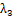

计算点云表面法线

[reference](http://robotica.unileon.es/index.php/PCL/OpenNI_tutorial_2:_Cloud_processing_(basic)#Normal_estimation)

**平面的法向量是垂直于它的单位向量，而在曲面一个点上的法向量被定义为垂直于与曲面相切的平面的向量。**

<!--more-->

## 1.数学原理：

### 主成份分析法（PCA）

[PCA和SVD区别和联系](https://blog.csdn.net/wangjian1204/article/details/50642732)

检测点法向量的计算主要有根据“曲面网格”的求解方法和根据“周围邻域点的分布”求解方法。

法向量所在的轴线上是邻域分布最分散的方向，设距离检测点的半径为r的邻域内N个点，所以有邻域点**p_j**与查询点**p_i**之间的协方差矩阵为


**计算C的特征值和特征向量，特征值按降序排列，对应的特征向量为，**

值最大，代表邻域点主要集中在其对应的特征向量上，其值最小，代表邻域点在对应的特征向量上分布最分散，故特征向量代表法向量。（特征值最小的分类为法向量方向）

曲率计算如下：


 

> pcl函数：  pcl::NormalEstimationOMP<PointType, NormalType> norm_est;

但是你只需要知道它是**用最近邻(最接近我们计算法线的点)来求出切平面和法向量**。

## 2.在PCL中：

1. 自定义搜索半径，以查询点为中心，考虑设定半径为球体内的点

2. 以该点为中心;计算将使用所有位于其中的相邻点
3. 设定视点(默认情况下，输出法线是无方向的;假设**所有的矢量都必须指向摄像机**——否则它们就属于传感器无法看到的表面——它们都可以相应地**重新定向**)。

## 3.计算与显示法线代码

1.无序点云

```C++
#include <pcl/io/pcd_io.h>
#include <pcl/features/normal_3d.h>
#include <boost/thread/thread.hpp>
#include <pcl/visualization/pcl_visualizer.h>

int
main(int argc, char** argv)
{
	// Object for storing the point cloud.
	pcl::PointCloud<pcl::PointXYZ>::Ptr cloud(new pcl::PointCloud<pcl::PointXYZ>);
	// Object for storing the normals.
	pcl::PointCloud<pcl::Normal>::Ptr normals(new pcl::PointCloud<pcl::Normal>);

	// Read a PCD file from disk.
	if (pcl::io::loadPCDFile<pcl::PointXYZ>(argv[1], *cloud) != 0)
	{
		return -1;
	}

	// Object for normal estimation.
	pcl::NormalEstimation<pcl::PointXYZ, pcl::Normal> normalEstimation;
	normalEstimation.setInputCloud(cloud);
	// For every point, use all neighbors in a radius of 3cm.
	normalEstimation.setRadiusSearch(0.03);
	// A kd-tree is a data structure that makes searches efficient. More about it later.
	// The normal estimation object will use it to find nearest neighbors.
	pcl::search::KdTree<pcl::PointXYZ>::Ptr kdtree(new pcl::search::KdTree<pcl::PointXYZ>);
	normalEstimation.setSearchMethod(kdtree);

	// Calculate the normals.
	normalEstimation.compute(*normals);

	// Visualize them.
	boost::shared_ptr<pcl::visualization::PCLVisualizer> viewer(new pcl::visualization::PCLVisualizer("Normals"));
	viewer->addPointCloud<pcl::PointXYZ>(cloud, "cloud");
	// Display one normal out of 20, as a line of length 3cm.
    //每20个法线显示一个法线，长度为3CM
	viewer->addPointCloudNormals<pcl::PointXYZ, pcl::Normal>(cloud, normals, 20, 0.03, "normals");
	while (!viewer->wasStopped())
	{
		viewer->spinOnce(100);
		boost::this_thread::sleep(boost::posix_time::microseconds(100000));
	}
}
```

2.有序点云使用积分图像来计算法线（Integral images）

```C++
#include <pcl/io/pcd_io.h>
#include <pcl/features/integral_image_normal.h>
#include <boost/thread/thread.hpp>
#include <pcl/visualization/pcl_visualizer.h>

int
main(int argc, char** argv)
{
	// Object for storing the point cloud.
	pcl::PointCloud<pcl::PointXYZ>::Ptr cloud(new pcl::PointCloud<pcl::PointXYZ>);
	// Object for storing the normals.
	pcl::PointCloud<pcl::Normal>::Ptr normals(new pcl::PointCloud<pcl::Normal>);

	// Read a PCD file from disk.
	if (pcl::io::loadPCDFile<pcl::PointXYZ>(argv[1], *cloud) != 0)
	{
		return -1;
	}

	// Object for normal estimation.
	pcl::IntegralImageNormalEstimation<pcl::PointXYZ, pcl::Normal> normalEstimation;
	normalEstimation.setInputCloud(cloud);
	// Other estimation methods: COVARIANCE_MATRIX, AVERAGE_DEPTH_CHANGE, SIMPLE_3D_GRADIENT.
	// They determine the smoothness of the result, and the running time.
	normalEstimation.setNormalEstimationMethod(normalEstimation.AVERAGE_3D_GRADIENT);
	// Depth threshold for computing object borders based on depth changes, in meters.
	normalEstimation.setMaxDepthChangeFactor(0.02f);
	// Factor that influences the size of the area used to smooth the normals.
	normalEstimation.setNormalSmoothingSize(10.0f);

	// Calculate the normals.
	normalEstimation.compute(*normals);

	// Visualize them.
	boost::shared_ptr<pcl::visualization::PCLVisualizer> viewer(new pcl::visualization::PCLVisualizer("Normals"));
	viewer->addPointCloud<pcl::PointXYZ>(cloud, "cloud");
	// Display one normal out of 20, as a line of length 3cm.
	viewer->addPointCloudNormals<pcl::PointXYZ, pcl::Normal>(cloud, normals, 20, 0.03, "normals");
	while (!viewer->wasStopped())
	{
		viewer->spinOnce(100);
		boost::this_thread::sleep(boost::posix_time::microseconds(100000));
	}
}
```

