目的：本文简要介绍pcl源码自带例程里的项目的主要功能。

编译PCL源码之后，有一些PCL.sln里面包含所有自带的apps、samples和tools，下面来一一介绍，本文使用的是pcl1.8.1版本的pcl源码。

<!--more-->

# A.apps

## 1.3d_rec_framework

三维重建框架

### pineline

* global_nn_classifier
* global_nn_recognizer_crh
* global_nn_recognizer_cvfh
* local_recognizer

### tools

* openni_frame_source

### apps

* global_classification
* local_recognition_mian_dataset

## 2.cloud_composer

点云编辑器：处理，可视化，投影模型，变换点云，计算特征。

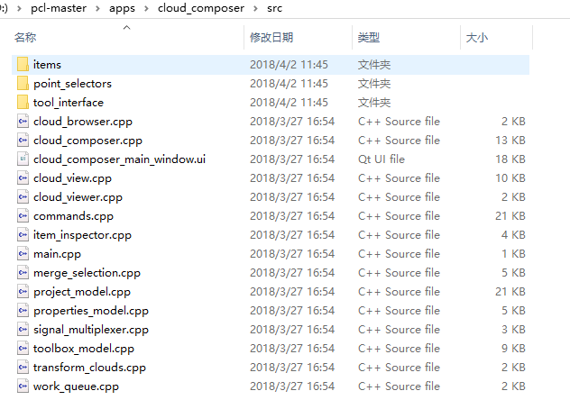

点云编辑器的工具

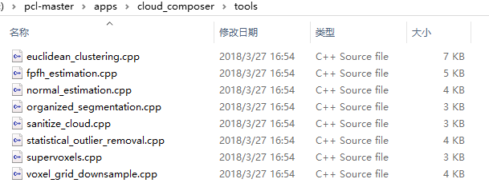

## 3.in_hand_scanner

正如其名：手持扫描仪项目，里面有icp有，可视化置信度，有输入数据处理。

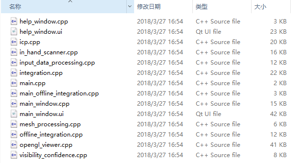

## 4.modeler

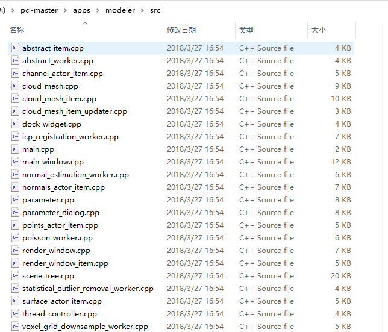

## 5.optronic_viewer

可视化工具：openni+qt

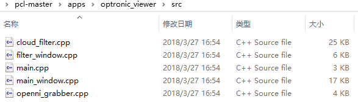

## 6.point_cloud_editor

点云编辑器：估计和composer差不多

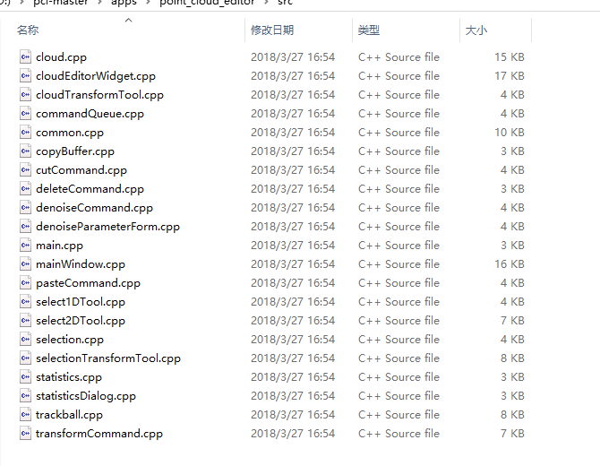

## 7.face_detection

点云人脸识别

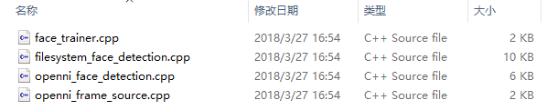

## 8.manual_registration

pcl_manual_registration

配准加UI界面

## 9.pcd_video_player

pcd_video_player

pcd播放器加UI界面

## 10.openni

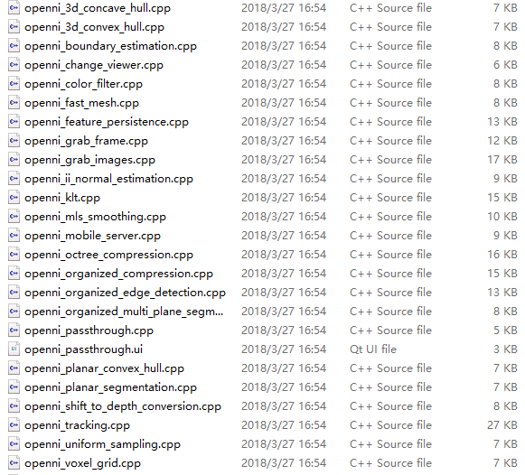

1. 凸包边缘计算
2. 边缘估计
3. 改变视角
4. 基于颜色滤波
5. 快速网格化
6. 特征。。。
7. 抓取帧
8. 抓取图像
9. ii法线估计
10. klt
11. 移动最小二乘法平滑
12. octree压缩
13. 有序压缩
14. 有序(点云边缘检测)
15. 多平面分割
16. 直通滤波
17. 平面边缘检测
18. 平面分割
19. **shift_to_depth_conversion**
20. 相机跟踪
21. 统一滤波
22. 网格滤波

## 11.others

1. convolve.cpp

2. dinast_grabber_example

4. multiscale_feature_persistence_example

5. surfel_smoothing_test

   曲面平滑

### NI(关键点和描述符)

1. ni_agast

   agast关键点

2. ni_brisk

   brisk特征描述符

3. ni_susan

   susan特征点检测

4. ni_trajkovic

   trajkovic关键点

### 识别匹配

1. ni_linemod

   linemod模板匹配

2. ppf_object_recognition

   ppf特征来实现物体检测

3. nn_classification_example

   近邻分类

1. pyramid_surface_matching

   金字塔表面匹配

2. render_views_tesselated_sphere

   模型多视图渲染生成点云

3. statistical_multiscale_interest_region_extraction_example

   统计学的多尺度感兴趣区域提取

4. test_search

5. pcl_feature_matching

   特征匹配
### 分割
1. organized_segmentation_demo
有序点云分割
2. pcd_organized_edge_detection
    有序点云边缘检测
3. grabcut_2d
    图像分割grabcut算法
4. pcd_organized_multi_plane_segmentation
    有序点云多平面分割
5. pcd_select_object_plane
6. dominant_plane_segmentation
7. stereo_ground_segmentation
    深度相机地面分割

# B.Examples

## 1.common

1. pcl_example_check_if_point_is_valid

   查看该点是不是违法

2. pcl_example_copy_point_cloud

   复制点云

3. pcl_example_get_max_min_coordinates

   获取最大最小的坐标点

4. pcl_example_organized_point_cloud

   有序点云

5. pcl_example_scope_time

   

## 2.features

pcl features 成员（各式各样的描述子）

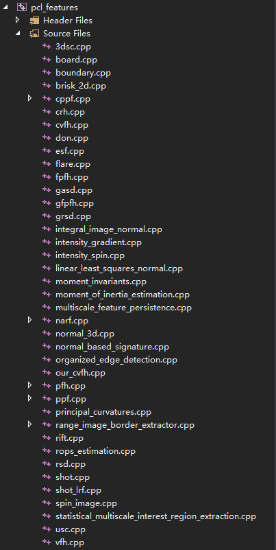

例程：

1. pcl_example_difference_of_normals

   法线之间的夹角

2. pcl_example_fast_point_feature_histograms

   快速点特征直方图

3. pcl_example_normal_estimation

   法线估计

4. pcl_example_point_feature_histograms

   点特征直方图

5. pcl_example_principal_curvatures_estimation

   曲率估计

6. pcl_example_rift_estimation

   rift描述子计算

7. pcl_example_shape_contexts

   

8. pcl_example_spin_images

## 3.filters

pcl filters 成员（各式各样的滤波器）

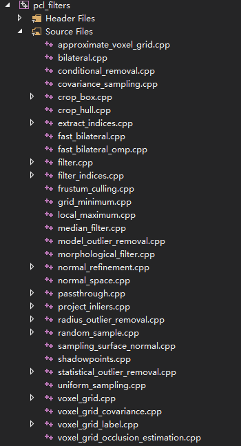

例程：

pcl_example_extract_indices

提取索引

pcl_example_remove_nan_from_point_cloud

移除点云中的空点nan点

## 4.geometry

example_half_edge_mesh

## 5.keypoints

例程：

1. pcl_example_get_keypoints_indices
2. pcl_example_sift_keypoint_estimation
3. pcl_example_sift_normal_keypoint_estimation
4. pcl_example_sift_z_keypoint_estimation

## 6.outofcore

例程：

1. pcl_example_outofcore
2. pcl_example_outofcore_with_lod

### tools

1. pcl_outofcore_print
2. pcl_outofcore_process
3. pcl_outofcore_viewer

## 7.segmentation

例程：

1. pcl_example_cpc_segmentation

   cpc分割

2. pcl_example_extract_clusters_normals

3. pcl_example_lccp_segmentation

   lccp分割

4. pcl_example_region_growing

   区域生长法

5. pcl_example_supervoxels

   超体素分割

## 8.stereo

例程：

1. pcl_example_stereo_baseline

## 9.surface

例程：

1. pcl_example_nurbs_fitting_closed_curve
2. pcl_example_nurbs_fitting_closed_curve3d
3. pcl_example_nurbs_fitting_curve2d.
4. pcl_example_nurbs_fitting_surface
5. pcl_example_nurbs_viewer_surface
6. pcl_test_nurbs_fitting_surface

# C.CUDA

## 1.Apps

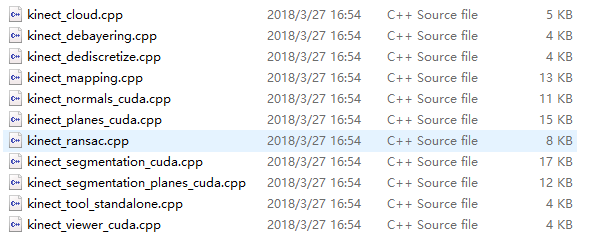

# D.IO

## tools

1. pcl_convert_pcd_ascii_binary
2. pcl_converter
3. pcl_hdl_grabber
4. pcl_pcd_convert_NaN_nan
5. pcl_pcd_introduce_nan

## ply

1. pcl_ply2obj
2. pcl_ply2ply
3. pcl_ply2raw
4. pcl_plyheader

# E.tools

## 其他

1. pcl_add_gaussian_noise

   添加高斯噪声

2. pcl_transform_point_cloud

   点云刚体变换

3. pcl_pcd_change_viewpoint

4. pcl_transform_from_viewpoint

5. pcl_boundary_estimation

   边缘估计

6. pcl_cluster_extraction

   聚类提取

7. pcl_compute_cloud_error

   计算点点云误差

8. pcl_compute_hausdorff 

   计算hausdorff距离

9. pcl_compute_hull

   计算凸包

10. pcl_concatenate_points_pcd

   连接两个PCD文件

11. pcl_crop_to_hull

    crop到hull

12. pcl_demean_cloud

13. pcl_generate

14. pcl_outlier_removal

    点云外点去除

15. pcl_elch

    ELCH优化方法

## Linemod

1. pcl_linemod_detection

   linemod模板检测

2. pcl_match_linemod_template

   linemod模板匹配

3. pcl_train_linemod_template

## 滤波器

1. pcl_fast_bilateral_filter

2. pcl_passthrough_filter

3. pcl_uniform_sampling

4. pcl_progressive_morphological_filter

5. pcl_radius_filter

6. pcl_morph

   [3D点云地图地面去除Progressive Morphological Filter](https://blog.csdn.net/sru_alo/article/details/84678910)

7. pcl_voxel_grid

8. pcl_voxel_grid_occlusion_estimation

## 点云分割

1. pcl_plane_projection

   采样一致性获得平面

2. pcl_crf_segmentation

   CRF分割

3. pcl_sac_segmentation_plane

   平面分割

4. pcl_train_unary_classifier

5. pcl_unary_classifier_segment

   
## 关键点与特征
3. pcl_normal_estimation

   法线估计

4. pcl_extract_feature

   提取特征

5. pcl_fpfh_estimation

   FPFH特征描述子计算

6. pcl_spin_estimation

   spin描述子计算

7. pcl_vfh_estimation

   vfh描述子计算

8. pcl_grid_min

9. pcl_local_max

## 配准

1. pcl_icp

2. pcl_icp2d

3. pcl_ndt2d

4. pcl_ndt3d

5. pcl_lum

   lum配准

## 物体重建：

1. pcl_obj_rec_ransac_accepted_hypotheses
2. pcl_obj_rec_ransac_hash_table
3. pcl_obj_rec_ransac_model_opps
4. pcl_obj_rec_ransac_orr_octree
5. pcl_obj_rec_ransac_orr_octree_zprojection
6. pcl_obj_rec_ransac_result
7. pcl_obj_rec_ransac_scene_opps

## 表面重建

1. pcl_poisson_reconstruction

   泊松重建

2. pcl_marching_cubes_reconstruction

   移动最小二乘法重建
   
3. pcl_gp3_surface

   贪心三角化
   
   
   
4. pcl_mesh_sampling

   网格下采样

5. pcl_mls_smoothing

   移动最小二乘法曲面平滑

## 可视化：

1. pcl_octree_viewer

   八叉树可视化

2. pcl_registration_visualizer

   配准可视化

## 格式转换
1.pcl_vtk2obj
2.pcl_vtk2pcd
3.pcl_vtk2ply
4.pcl_xyz2pcd
5.pcl_ply2pcd
6.pcl_ply2vtk
7.pcl_png2pcd
8.pcl_pcd2ply
9.pcl_pcd2png
10.pcl_pcd2vtk
11.pcl_tiff2pcd
12.pcl_pclzf2pcd
13.pcl_obj2pcd
14.pcl_obj2ply
15.pcl_obj2vtk
16.pcl_mesh2pcl
17.pcl_organized_pcd_to_png