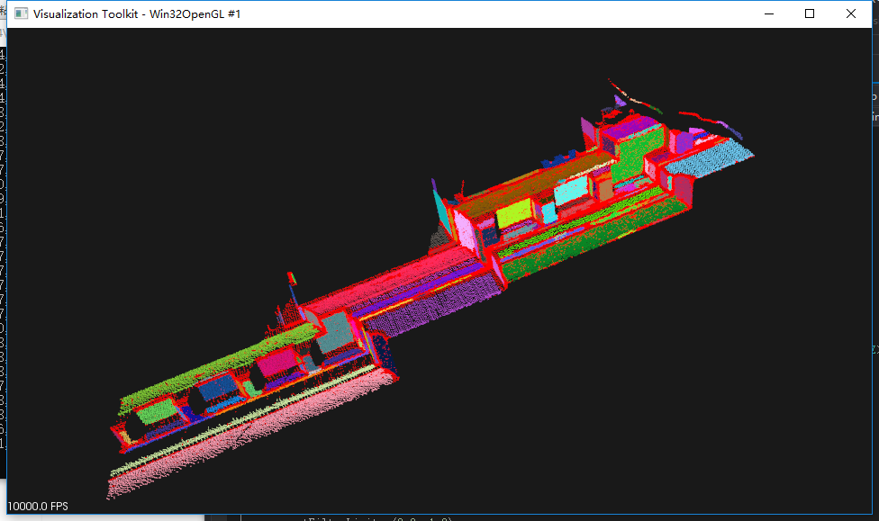

<!--more-->

## 1.原理：

区域生长法：

通过**曲率**和**法向量的夹角**作为阈值来分割点云，同一区域内的点云趋于同一平面上，曲率不大，对比于欧式聚类分割法，**区域生长法可以分割出曲率不连续（即曲率变换较大）但点云连续的区域**。

步骤：

PCL中的类pcl::RegionGrowing用来实现点云的区域生长分割。区域生长分割是基于点云法线的分割算法，算法的主要思路如下：

1. 点云中有未标记点，按照点的曲率值对点进行排序，找到最小曲率值点，并把它添加到种子点集；

2. 对于每个种子点，算法都会发现周边的所有近邻点。

   1）计算每个近邻点与当前种子点的法线角度差(reg.setSmoothnessThreshold)，如果差值小于设置的阈值，则该近邻点被重点考虑，进行第二步测试；

   2）该近邻点通过了法线角度差检验，如果它的**曲率小于我们设定的阈值(reg.setCurvatureThreshold)，这个点就被添加到种子点集，即属于当前平面。**

3. 通过两次检验的点，被从原始点云去除。

4. 设置最小点簇的点数min（reg.setMinClusterSize），最大点簇为max（reg.setMaxClusterSize）。

5. 重复1-3步，算法会生成点数在min和max的所有平面，并对不同平面标记不同颜色加以区分。

6. 直到算法在剩余点中生成的点簇不能满足min，算法停止工作。

   

## 2.在PCL中：

```C++
#include <iostream>
#include <vector>
#include <pcl/point_types.h>
#include <pcl/io/pcd_io.h>
#include <pcl/search/search.h>
#include <pcl/search/kdtree.h>
#include <pcl/features/normal_3d.h>
#include <pcl/visualization/cloud_viewer.h>
#include <pcl/filters/passthrough.h>
#include <pcl/segmentation/region_growing.h>

int
main (int argc, char** argv)
{
  pcl::PointCloud<pcl::PointXYZ>::Ptr cloud (new pcl::PointCloud<pcl::PointXYZ>);
  if ( pcl::io::loadPCDFile <pcl::PointXYZ> ("region_growing_tutorial.pcd", *cloud) == -1)
  {
    std::cout << "Cloud reading failed." << std::endl;
    return (-1);
  }

  pcl::search::Search<pcl::PointXYZ>::Ptr tree = boost::shared_ptr<pcl::search::Search<pcl::PointXYZ> > (new pcl::search::KdTree<pcl::PointXYZ>);
  pcl::PointCloud <pcl::Normal>::Ptr normals (new pcl::PointCloud <pcl::Normal>);
  pcl::NormalEstimation<pcl::PointXYZ, pcl::Normal> normal_estimator;
  normal_estimator.setSearchMethod (tree);
  normal_estimator.setInputCloud (cloud);
  normal_estimator.setKSearch (50);
  normal_estimator.compute (*normals);

  pcl::IndicesPtr indices (new std::vector <int>);
  pcl::PassThrough<pcl::PointXYZ> pass;
  pass.setInputCloud (cloud);
  pass.setFilterFieldName ("z");
  pass.setFilterLimits (0.0, 1.0);
  pass.filter (*indices);

  pcl::RegionGrowing<pcl::PointXYZ, pcl::Normal> reg;
  reg.setMinClusterSize (50);
  reg.setMaxClusterSize (1000000);
  reg.setSearchMethod (tree);
  reg.setNumberOfNeighbours (30);
  reg.setInputCloud (cloud);
  //reg.setIndices (indices);
  reg.setInputNormals (normals);
  reg.setSmoothnessThreshold (3.0 / 180.0 * M_PI);
  reg.setCurvatureThreshold (1.0);

  std::vector <pcl::PointIndices> clusters;
  reg.extract (clusters);

  std::cout << "Number of clusters is equal to " << clusters.size () << std::endl;
  std::cout << "First cluster has " << clusters[0].indices.size () << " points." << endl;
  std::cout << "These are the indices of the points of the initial" <<
    std::endl << "cloud that belong to the first cluster:" << std::endl;
  int counter = 0;
  while (counter < clusters[0].indices.size ())
  {
    std::cout << clusters[0].indices[counter] << ", ";
    counter++;
    if (counter % 10 == 0)
      std::cout << std::endl;
  }
  std::cout << std::endl;

  pcl::PointCloud <pcl::PointXYZRGB>::Ptr colored_cloud = reg.getColoredCloud ();
  pcl::visualization::CloudViewer viewer ("Cluster viewer");
  viewer.showCloud(colored_cloud);
  while (!viewer.wasStopped ())
  {
  }

  return (0);
}
```


