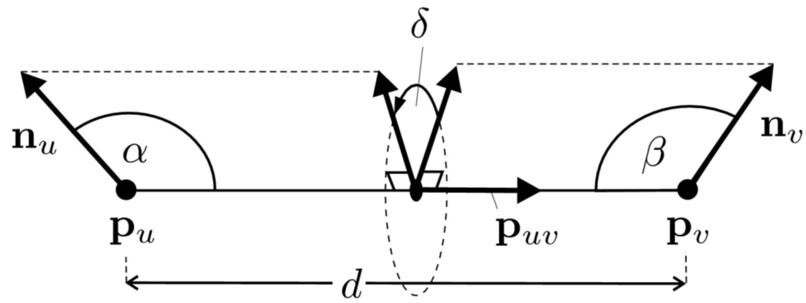

随机采样一致性（RANSAC）------ 模型参数估计；

最大似然估计（MLESAC）------ 模型参数估计；

采样一致性初始对齐算法（SAC-IA）------ 粗对齐；

<!--more-->

处理外点的最常用的两种方案：

1. 随机采样一致性（random sample consensus）
2. M估计(M-Estimation)-----误差分布不是正态分布时,最小二乘估计不是最优估计，M-估计中可以找到优于最小二乘法的估计

# 一、RANSAC

在计算机视觉领域广泛应用各种不同的**采样一致性参数估计算法**，用于排除错误的样本，样本不同，对应的应用则也不同，例如**剔除错误的匹配点对，分割出处在模型上的点集等。**

### PCL中的“模型参数”估计方法

PCL中以随机采样一致性算法（RANSAC）为核心，同时实现了五种类似于**随机采样一致性参数估计算法**。

* 随机采样一致性估计（RANSAC）
* 最大似然估计（MLESAC）
* 最小中值方差估计（LMEDS）

#### 1.随机采样一致性估计（RANSAC）

两个缺点：

* 当模型具有明显的物理意义时，阈值比较容易设定，但若模型比较抽象是，阈值不易确定。

* RANSAC迭代次数是运行期决定的，不能与之迭代的确切次数

* 只能从一个特定数据集中估计一个模型，当来年改革或者更多个模型存在是，RANSAC不能找到别的模型。

步骤：

1. 从样本中抽选出一个（最小）样本子集作为假设的内点（例如，如果根据数据拟合一条二维直线，则选择两个点）。
2. 根据假设的内点拟合一个模型（例如，根据两个点拟合直线）。实际上是，使用**最小方差估计算法**对这个子集计算模型参数。
3. 计算所有样本与该模型的偏差，再使用预先设定好的阈值t与偏差比较，当偏差小于阈值是，该样本点属于模型内样本点（inliers），否则为外样本点。
4. 记录下当前inliers的个数，然后重复这一过程（选子集->估计模型参数->记录inliers个数）。每一次重复，都记录当前最佳（inliers个数最多，best_nlinliers）的模型参数。
5. 每次迭代的末尾，根据**期望的误差率、best_nlinliers、总样本个数，当前迭代次数，计算一个迭代结束评判因子，根据此决定是否结束迭代**，结束迭代后，最佳模型参数就是最终的模型参数估计值。

#### 2.最大似然估计（MLESAC）

LMedS理论上也可以提出outliers的影响，并得到全局最优的参数估计，并且克服了RANSAC的两个缺点。但是当outliers在样本中比例达到或超过50%时，LMeds就无能为力。

1. 从样本中抽选出一个样本子集，使用**最小方差估计算法**对子集计算模型参数
2. 计算所有样本与该模型的偏差，与RANSAC不同的是，LMedS记录的是所有样本中，**偏差值居中的那个样本的偏差[称为Med偏差]**，以及本次计算得到的模型参数。
3. 因此，LMedS不用预先设定阈值来剔除outliers。
4. 重复前面的过程N次，**从N个Med偏差中挑选最小的一个**，其对应的模型参数就是最终的模型参数估计值。

注：迭代次数N是由样本子集中样本的个数、期望的模型误差、实现与聚集的样本中outliers的比例所决定的

# 二、SAC-IA

不同于“采样一致性**模型参数估计**”，这里讲的是“采样一致性**初始对齐**”，主要是用采样一致性算法**剔除错误点对（错误的对应估计）**。

任务：对于已有的对应关系集合中，确定能够用于正确计算刚体变换矩阵的对应点对子集。

对于初始变换矩阵粗略估计，**贪婪的配准方法工作量很大**，它使用了点云数据旋转不变的特性，但计算复杂度较高，因为在合并的步骤需要查看所有可能的对应关系。此外，因为这是一个贪婪算法，所以**有可能得到局部最优解**。

因此我们采用采样一致性方法，试图保持相同的对应关系的几何关系而不必尝试了解有限个对应关系的所有组合。相反，我们从候选对应关系中进行大量的采样并通过以下步骤对它们中的每一个进行排名。

### SAC-IA流程

1. 从P中选择s个样本点，同时确定他们的配对距离大于用户设定的最小值dmin（相当于下采样，保证样本点之间是稀疏的）。
2. 对于每个样本点，在Q中找到满足直方图和样本点直方图相似的点（可能是一个或多个）存进一个列表中。从这些点中**随机选取"一些"代表采样点的对应关系**；
3. (通过SVD???)计算“通过采样点定义的刚体变换”和“其对应变换”，计算点云的度量错误来**评价转换的质量。**
4. 我们计划通过**查看非常大量的对应关系，快速找到一个很好的变换**。
5. 重复这三个步骤（在P中去取样本点->），直至取得存储了最佳度量错误，并使用暴力配准部分数据。**最后使用一个LM算法进行非线性局部优化**。

# 三、RandomSample Matching 

### 用于机器人抓取的随机采样一致性匹配方法

应用论文：Efficient Bin-Picking and Grasp Planning Based on Depth Data

**感觉方法有点扯淡，不如使用line2d看看就好**。

要点：对应点匹配后用随机采样一致性算法，剔除错误对应关系。

### 物体定位流程：

•通过深度相机（3d扫描仪）获取点云数据

•通过**点云分割算法**把单个物体点云数据分割出来

•通过模型与分割出来的（扫描数据）**对齐匹配(配准)**来**估计姿态**（变换）

•通过**精确对齐**来完善

### RANSAM算法（ Random Sample Matching ）描述：

1. 计算特征点（关键点），这个点是通过计算每个三维网格来得到的；通过计算模型点云与相机点云得到特征点点集合P、Q：
   * P: 模型特征点和它的法向
   * Q: 扫描特征点和它的法向
   * 怎么选取一个点集里面的两个点？把这两个点称为an oriented point pair（有向点对）或dipole（偶极子）

2. 特征描述：

这个特征具有旋转平移不变形的

3. 构建特征表：（找出两个数据的带有特征的关键点集）

•那么我们可以构建两张关于这个特征的表

•一张是由扫描得出来的数据的表

•一张是有CAD模型的来的表

4. 特征匹配：得到两个带法向的对应点

我们通过一张表中的一个有向点对（偶极子），去搜寻匹配另外一张表中的相应的有向点对（偶极子），如果两个点对相似或相等，那么就说这两个偶极子是对应的，

5. 计算变换矩阵：

   通过这两个带法向的对应点（通过特定框架）解算变换矩阵，就可以找到一个将模型偶极变换到扫描的偶极子上的**姿态假设**。

6. 找到最好的变换矩阵：(自己加的)

   查看非常大量的对应关系，快速找到一个很好的变换。

### ICP精确配准

刚刚的操作是一个预对齐，还要通过一个ICP algorithm 去 refine the pose estimate.

### 改进特征：

•再考虑到扫描条件不好的表面时候，比如塑料件还有金属表面，由于光学条件，我们用扫描仪扫出来的点云会有部分的点扫描不出来。

•以及由于扫描仪的成像系统结构原理的原因，有的部分也会扫不出来，像图b一样

Problem：请看图b

1. 由于扫描数据不好，会算出错误的"特征点"

2. 边缘处的点**计算法线会出现错误**

3. 由于扫出来的只有平面会导致**dipoles匹配错误**(特征匹配错误)

改进：

1. 改进的特征点集

Using 2d Image Analysis to Enhance the LocalizationPerformance（改进后通过2D图像的边界来代表特征点云）

2. 新的特征：tripole（不带法线）

通过添加第三点和利用点云的三个随机顶点构建一个随机三角形(tripole)，可以使用三个顶点的距离来计算三个不变特征。使用这个，可以建立两个三维关系表，算法现在可以处理没有法线的点集。

优点就是：只使用边缘数据，减少了计算时间，增强了描述场景中的robust性

----

注：百度中的RANSAC算法简介：

1. RANSAC算法(**Random Sample Consensus**)的基本假设是

- 样本中包含正确数据(inliers，可以被模型描述的数据)，
- 也包含异常数据(outliers，偏离正常范围很远、无法适应数学模型的数据)，即数据集中含有噪声。这些异常数据可能是由于错误的测量、错误的假设、错误的计算等产生的。
- 同时RANSAC也假设，给定一组正确的数据，存在可以计算出符合这些数据的模型参数的方法。

2. RANSAC基本思想描述如下：

①考虑一个最小抽样集的势为n的模型(n为初始化模型参数所需的最小样本数)和一个样本集P，集合P的样本数#(P)>n，**从P中随机抽取包含n个样本的P的子集S初始化模型M**；**(P中随机采样出子集S，利用S初始化模型M)**

②余集SC=P\S中与模型M的误差小于某一设定阈值t的样本集以及S构成S*。S*认为是内点集，它们构成S的一致集(Consensus Set)；**(将余集中的点尝试加入内点集S，计算加入点与模型M之间的误差，小于误差则加入)**

③若#(S*)≥N，认为得到正确的模型参数，并利用集S*(内点inliers)采用最小二乘等方法重新计算新的模型`M*`；重新随机抽取新的S，重复以上过程。**(当S中的点已经够了，即认为估算出本次抽样计算出的模型`M*`；进行counts次抽样后得到counts个`M*`)**

④在完成一定的抽样次数后，若未找到一致集则算法失败，否则选取抽样后得到的最大一致集判断内外点，算法结束。**(在达到设定的抽样次数后，选取一致性最大的模型M max，然后判断P中的点是内点还是外点（要剔除的点）)**

3. 算法优化策略

①如果在选取子集S时可以根据某些已知的样本特性等采用特定的选取方案或有约束的随机选取来代替原来的完全随机选取；

②当通过一致集`S*`计算出模型`M*`后，可以将P中所有与模型`M*`的误差小于t的样本加入`S*`，然后重新计算`M*`。