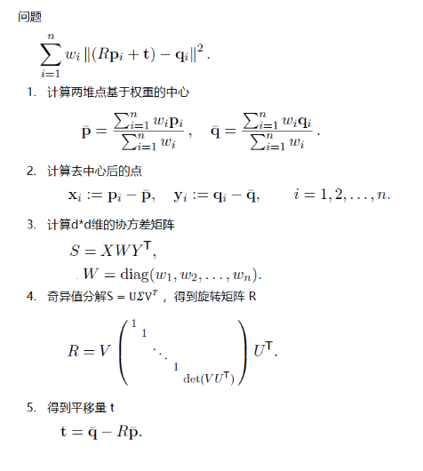
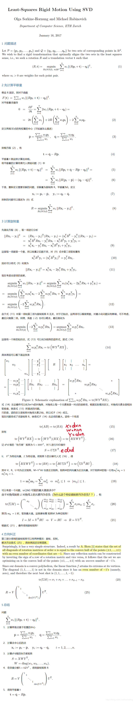

**计算刚体变换矩阵**

问题：已知有对应点对(correspondence; point pairs)P、Q集合，求解PQ之间的刚体变换矩阵

<!--more-->

参考1: [求解刚体旋转平移关系--配准](https://zhuanlan.zhihu.com/p/35901184)

参考2: [SVD Least-Squares Rigid Motion Using SVD 3D3D算变换矩阵](<https://blog.csdn.net/icameling/article/details/84103891>)

## 1.待定系数法

* 容易得到超定方程组，利用最小二乘法求解超定方程组
* 由于输入数据的误差，导致算出来不是一个正交的旋转矩阵

每一个一一对应点满足：

**对于第  个一一对应点得到方程组:**

同理将所有一一对应点的方程组合并, 得到超定方程：

利用最小二乘法求解

得到向量  , 写为矩阵形式即   .

**缺点: 在有原始数据误差或者计算累积误差情况下, 得到的矩阵  不一定严格满足正交矩阵.**

## 2.*Levenberg-Marquardt*方法求解（非线性）

* 输入变量从旋转矩阵R转为欧拉角R( , , )。
* 将非线性问题转化为线性优化。
* 使用信赖域法求极值。

旋转矩阵具有3个自由度, 可以理解为3个Euler角可确定一个旋转状态, 或一个四元数(范数为1, 自由度为4-1=3)可确定一个旋转状态. 可利用  作为非线性拟合的参数, 旋转矩阵   由 唯一确定, 并使得在该参数下误差最小, 即:

得到即得到旋转矩阵  ,  , 该方法可保证该矩阵严格为正交矩阵.

**缺点: Levenberg-Marquardt方法一方面对该优化问题的初值有一定要求, 另一方面非线性算法的效率较低.**

### LM算法原理

LM算法，全称为Levenberg-Marquard算法，它可用于解决非线性最小二乘问题，多用于曲线拟合等场合。

* 它的关键是用模型函数  对待估参数向量  在其邻域内做线性近似，忽略掉二阶以上的导数项，从而转化为线性最小二乘问题.
* 它具有收敛速度快等优点。
* LM算法属于一种“[信赖域法](http://www.codelast.com/?p=7488)”——所谓的信赖域法，此处稍微解释一下：在最优化算法中，都是要求一个函数的极小值，每一步迭代中，都要求目标函数值是下降的，而信赖域法，顾名思义，就是从初始点开始，先假设一个可以信赖的最大位移  ，然后在以当前点为中心，以  为半径的区域内，通过寻找目标函数的一个近似函数（二次的）的最优点，来求解得到真正的位移。在得到了位移之后，再计算目标函数值，如果其使目标函数值的下降满足了一定条件，那么就说明这个位移是可靠的，则继续按此规则迭代计算下去；如果其不能使目标函数值的下降满足一定的条件，则应减小信赖域的范围，再重新求解。

## 3.SVD奇异值分解方法（线性）

* 对协方差3X3矩阵用SVD(奇异值分解)来计算旋转矩阵R

Singular Value Decomposition* 

1.计算两个点集的中心（重心）。将两个点集利用中心（重心），平移到原点处。

2.利用两个平移后的点集计算协方差矩阵S

3.用SVD奇异值分解方法对S进行分解获得旋转矩阵S

4.通过两个点集的中心和旋转矩阵S获得平移向量t

## 总结

方法一(待定系数求解方程组)和方法二(LM优化方法求解)并不是求解刚体旋转矩阵 和平移矩阵   的最佳方法. 方法三中只需利用SVD分解( (  规模数据矩阵)即可得到所需结果, 不仅过程简单而且求解精度很高.

经过一些列推导后, 我们得到最终的结果, 是不是很晕....如果对推导的过程不感兴趣的话, 可以直接看下面的计算步骤:

**STEP0:** 已知刚性运动前后的对应点分别为  和  (  ), 均为  向量

**STEP1:** 分别计算  和  的重心(求和平均)得到  和 

**STEP2:** 计算重心平移到原点的数据 

**STEP3**: 矩阵形式描述 ![[~\bar{\boldsymbol{p}}_1~\bar{\boldsymbol{p}}_2~\cdots~\bar{\boldsymbol{p}}_N~]](https://www.zhihu.com/equation?tex=%5B~%5Cbar%7B%5Cboldsymbol%7Bp%7D%7D_1~%5Cbar%7B%5Cboldsymbol%7Bp%7D%7D_2~%5Ccdots~%5Cbar%7B%5Cboldsymbol%7Bp%7D%7D_N~%5D) 记为  , ![[~\bar{\boldsymbol{q}}_1~\bar{\boldsymbol{q}}_2~\cdots~\bar{\boldsymbol{q}}_N~]](https://www.zhihu.com/equation?tex=%5B~%5Cbar%7B%5Cboldsymbol%7Bq%7D%7D_1~%5Cbar%7B%5Cboldsymbol%7Bq%7D%7D_2~%5Ccdots~%5Cbar%7B%5Cboldsymbol%7Bq%7D%7D_N~%5D) 记为 

**STEP4:** 计算数据矩阵  并作SVD分解 

**STEP5:** 得到旋转矩阵 

**STEP6:** 得到平移向量 

# SVD原理

## 1.

旋转矩阵  具有3个自由度, 可以理解为3个Euler角可确定一个旋转状态, 或一个四元数(范数为1, 自由度为4-1=3)可确定一个旋转状态. 可利用  作为非线性拟合的参数, 旋转矩阵  由 唯一确定, 并使得在该参数下误差最小, 即:

得到 即得到旋转矩阵  , 该方法可保证该矩阵严格为正交矩阵.

**缺点: Levenberg-Marquardt方法一方面对该优化问题的初值有一定要求, 另一方面非线性算法的效率较低.**

**方法三:** *Singular Value Decomposition* 奇异值分解方法

通过对应点求解旋转矩阵  可写为优化问题:

可以将对应点列写为矩阵形式

3行N列

矩阵 ![[~\bar{\boldsymbol{p}}_1~\bar{\boldsymbol{p}}_2~\cdots~\bar{\boldsymbol{p}}_N~]](https://www.zhihu.com/equation?tex=%5B~%5Cbar%7B%5Cboldsymbol%7Bp%7D%7D_1~%5Cbar%7B%5Cboldsymbol%7Bp%7D%7D_2~%5Ccdots~%5Cbar%7B%5Cboldsymbol%7Bp%7D%7D_N~%5D) 记为  , ![[~\bar{\boldsymbol{q}}_1~\bar{\boldsymbol{q}}_2~\cdots~\bar{\boldsymbol{q}}_N~]](https://www.zhihu.com/equation?tex=%5B~%5Cbar%7B%5Cboldsymbol%7Bq%7D%7D_1~%5Cbar%7B%5Cboldsymbol%7Bq%7D%7D_2~%5Ccdots~%5Cbar%7B%5Cboldsymbol%7Bq%7D%7D_N~%5D) 记为  , 则优化问题简化为:

在求解上面优化问题之前, 先回顾几个线性代数里的基本知识:

- 旋转(正交)矩阵的性质  ;
-  为 *Frobenius* 范数, 即矩阵所有值的平方和之方根;
-  其中  为矩阵的迹;
- 矩阵  和  均为阶, 则 ;
- *Singular Value Decomposition* (SVD)分解, 矩阵 ,其中 和  为正交矩阵,  为对角矩阵;

于是优化问题可等价为:

其中矩阵  和  由原始数据得到的矩阵, 与旋转矩阵 无关, 于是

进一步, 利用矩阵迹的性质(基本知识第4点)

使用SVD分解数据矩阵  , 其中  和  为正交矩阵, 于是

再一次使用矩阵迹的性质(基本知识第4点)

记其中的矩阵  , 不难得知** 也为正交矩阵**, 综上:

由于  为对角矩阵

由于 矩阵为正交矩阵, 而且正常数据下对角阵  对角元素为数据矩阵的奇异值均大于0; 而且  均小于等于1, 不难得知当  时取最大值, 即:

从而得到:

至此可以得到旋转矩阵  , 不难得到平移向量  .

## 2.

