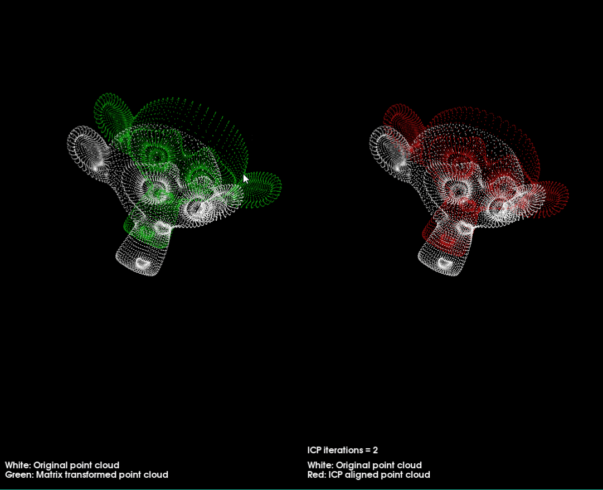
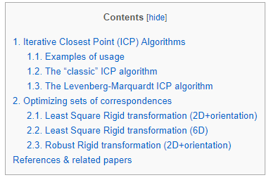

**点云配准之迭代最近点**

<!--more-->

**A.配准的意义：**

两个几何数据集的刚性配准在机器人导航、曲面重建和形状匹配等许多应用中都是必不可少的。最常见的方法是使用迭代最接近点(ICP)算法及其变体来完成这项任务。这些方法在最近点计算之间交替，以建立两个数据集之间的对应关系，并求解使这些对应关系对齐的最优转换。

[求解刚体旋转平移关系--配准](https://zhuanlan.zhihu.com/p/35901184)

**B.ICP及其变种**

**1.最开始的3D icp**

Besl, Paul J., and Neil D. McKay. "A method for registration of 3-D shapes." IEEE Transactions on pattern analysis and machine intelligence 14.2 (1992): 239-256.

可以使用PCL进行测试

**2.Fast icp（Soft Outlier Rejection）**

Rusinkiewicz, Szymon, and Marc Levoy. "Efficient variants of the ICP algorithm." 3-D Digital Imaging and Modeling, 2001. Proceedings. Third International Conference on. IEEE, 2001.

该文章被引用次数极高，文章分析了影响icp的各种因素，对几种icp变体进行比较，并且提出了fast icp。能够在几十毫秒内对齐两张深度图（range images）

工程：http://gfx.cs.princeton.edu/proj/trimesh2/

该工程更新了收敛非常快的“对称ICP”。

**3.广义ICP/plane-to-plane ICP：Generalized-icp（GICP）**

Segal, Aleksandr, Dirk Haehnel, and Sebastian Thrun. "Generalized-ICP." Robotics: science and systems. Vol. 2. No. 4. 2009.

作者主页：http://www.robots.ox.ac.uk/~avsegal/

工程：https://github.com/avsegal/gicp

**4.sparse icp**

稀疏ICP方法采用稀疏诱导准则对该问题进行求解，显著提高了配准过程对大量噪声和离群值的恢复能力，但引入了显著的性能退化。

Efficent Sparse icp：结合模拟退火搜索和Sparse ICP

https://github.com/opengp/sparseicp

**5.全局优化ICP：Go-ICP**
Yang, Jiaolong, et al. "Go-ICP: a globally optimal solution to 3D ICP point-set registration." IEEE transactions on pattern analysis and machine intelligence 38.11 (2016): 2241-2254.

**C.基于CUDA加速**

**1.em-icp**

[cuda_emicp_softassign](<https://github.com/tttamaki/cuda_emicp_softassign>)

 **2.cudaICP**

**应用**

 [KinectFusion 中的 ICP 算法 GPU 代码解读 ](http://blog.csdn.net/fuxingyin/article/details/51505854)

**D.使用pcl来实现ICP**

简单的程序：迭代猴子

**E.给出其他参考：**

[Iterative Closest Point (ICP) and other matching algorithms](https://www.mrpt.org/Iterative_Closest_Point_%28ICP%29_and_other_matching_algorithms)

后台回复“icp”自动回复论文和代码（完）

