ICP变种之一 --- FastICP

超级详细分析配准步骤与影响ICP的因素，FastICP的由来与论文解读。

<!--more-->

建议下载下来用Typora软件阅读markdown文件

# 点云配准流程

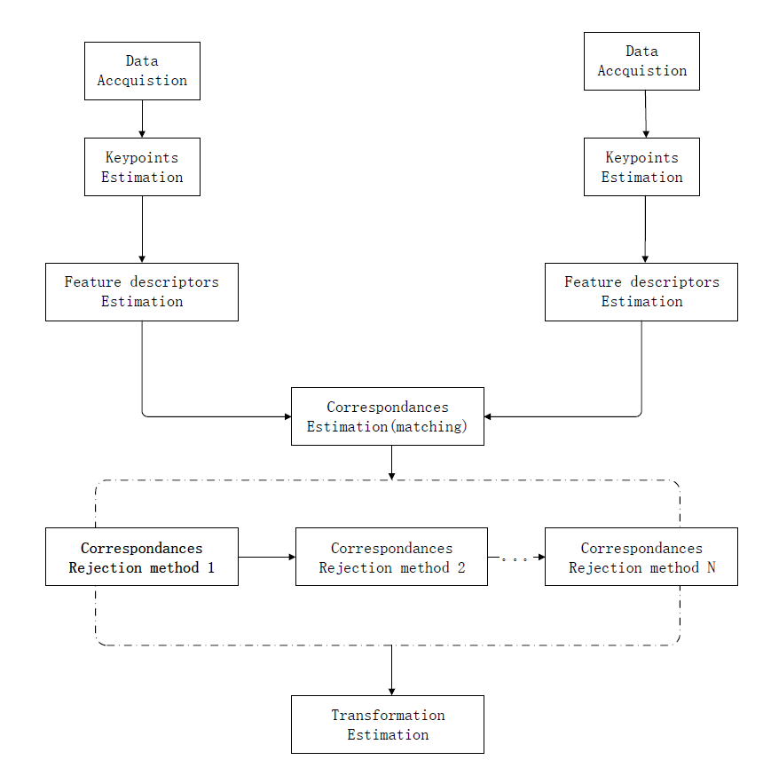

# 对应估计

1. 穷举配准(brute force matching)
2. kd-tree最近邻查询(第三方库FLANN)
3. 在有序点云数据的图像空间中查找
4. 在无序点云数据的索引空间中查找

# 对应关系去除

由于噪声的影响，通常不是所有估计的对应关系都是正确的。由于错误的对应关系对于最终的刚体变换矩阵的估算会产生负面影响，所以必须去它们。

**采用随机采样一致性估计(RANSAC,random sample consensus)**或者其他方法提出错误对应关系，**最终使用的对应关系数量只使用一定比例的对应关系**，这样既可以提高变换矩阵的精度，也可以提高匹配速度。

# 计算变换矩阵

[compute-transform](https://littlebearsama.github.io/2019/05/24/Registration/0.compute-transformation/)

# ICP

1. 寻找点集P在中点集Q的近邻点，将近邻点作为对应点。**确定一组对应点**。

   如何寻找近邻点？

   * 一般通过kdtree数据结构来查找，找到另外一个点集的最近邻点；（PCL中是通过快速近邻算法FLANN库来进行查找）

   * 也有通过octree来查找的。

   * 有通过互相确认两个点集之间的最近邻点（互为最近邻点），来确定对应关系。

2. 通过上一步骤计算出来的一组对应关系计算**两个对应关系点集**之间的**变换矩阵**；

   计算变换矩阵的方法有[compute-transform](https://littlebearsama.github.io/2019/05/24/Registration/0.compute-transformation/)

   在ICP中采用了SVD来解算变换矩阵。

   

   a. 计算两个点集（对应点集）的质心

   b. 将两个点集通过刚刚计算出来的中心移动到原点。（计算每个点的去质心坐标）

   c. 将移动了的两个点集计算三乘三协方差矩阵

   d. 奇异值分解协方差矩阵得到，[四元数](<https://baike.sogou.com/v113161.htm?ch=ch.bk.innerlink>)，四元数转旋转矩阵。

   e. 通过旋转矩阵和中心计算平移向量。旋转矩阵和平移向量组成了本次迭代的变换矩阵
   
3. 将点集通过新计算出来的变换矩阵**变换到新的位置**。

4. 判断是否收敛。

   如何判断是否收敛？

   **重新计算对应点，新计算的对应点之间欧式距离的平方和小于某个设定值则判定为收敛**。

5. 判断是否达到迭代次数，或者达到收敛条件，达到条件则停止迭代。没有达到条件就从第二步**SVD计算变换矩阵**开始执行，直至达到收敛标准。

# FastICP

Fast ICP是对ICP的改进与扩展。

论文"Efficient Variants of the ICPalgorithm"**详细给出了影响ICP算法的各种因素，且每种因素都哪些算法，其结果与性能如何。**

下面内容参考了[应用Fast ICP进行点集或曲面配准 算法解析](<https://blog.csdn.net/viewcode/article/details/8426846>)

## Fast ICP根据这些因素将ICP算法分为6个步骤：

a. 筛选：点集或曲面的筛选（滤波）

b. 匹配：两个点集之间的点进行配对

c. 权重：给每个匹配的点对分配权重

d. 去除：去除不符合条件的点对

e. 误差度量：基于以上点对，给出每个点对的误差计算方法

f. 最小化：最小化误差度量

为测试以上阶段中不同算法的性能和结果，论文提供了三个测试场景，并在这些点集（曲面）上加上噪声：

比较平滑的波纹： 比较简单的场景，几何尺度变换不是很大

较复杂的不规则的草原地形： 相对复杂的，包含不同尺度的细节

仅含有突出一个十字形雕刻面的平面： 对匹配而言，最困难的场景，因为特征太少

下面是每个阶段的算法的比较：

### a. 测试点对的选择对ICP收敛的影响

筛选也有以下几种策略：

* 应用点集内所有可用的点[Besl 92]：  无疑是性能最差的方法
* 对可用的点进行等间距下采样筛选[Turk 94]
* 随机筛选法（每次迭代的采样点都不同）[Masuda 96]
* 根据点的密度，颜色来筛选[Weik 97]
* 用上面的方法对一个面进行采样或者两个面都进行采样[Godin 94]
* **(本文提出(normal-space-sampling))**:法线在所选点之间的分布尽可能地大,(筛选哪些能使点的向量的分布尽量大的点 )这样的目的是突出 特征很少的 点集的特征。

如下图 a  随机采用法“random sampling”，  图b是"normal-space sampling"策略  

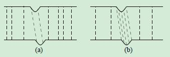

#### 分析：

1. 对一个点集进行筛选，或者两个点集都进行筛选：对于一般的点集，**两种方法收敛率和结果基本相同**，但仅对一个点集筛选的算法，**数据运算量相对比较大。**
2. 对于单个mesh面采样和两个mesh面都采样的策略，使用“normal shooting”作为匹配方法，两面采样的收敛率只是比单面的高一点点（真的只是一点点）。

3. 由图ab可以明显看出，normal-space sampling策略对点集的较少的特征有着比较好的提取能力。随机采样会对稀疏的特征造成覆盖，导致ICP算法不会收敛到一个正确值。而normal-space sampling策略确保了在特征中放置足够的样本点以使表面对齐

4. 三种采样方法对于在**wave数据**中的比较，uniform、random、normal-space sampling，表现相似。

   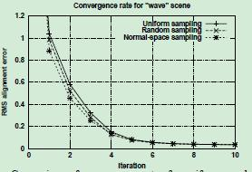

5. 三种采样方法对于在**incised plane数据**中的比较，uniform、random、normal-space sampling。

   * 对于incised plane数据只有normal-space sampling收敛，其他方法不收敛。
   * 在低曲率数据中，误差又短暂的迭代增加。这说明实际误差（ground truth error）和算法中用于估计的误差（algorithm‘s estimate of its own error）是有区别的。

   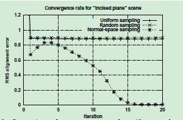

#### Sampling Direction：

对于数据wave：由于使用了下面提出的匹配方法（对称的symmetric）**（the closest compatible point matching algorithm）**，采样方法对收敛速率没什么大影响。如果我们使用更“非对称”的匹配算法，如projection或Normal shooting(参见3.2节)，对两个mesh下采样会给出稍微更好的结果。

### b. 匹配：两个点集之间的点进行配对

匹配的策略有以下几种：

* **最邻近点法**：此方法还可以**应用k-d树或最邻近点缓存进行加速**[Besl 92]

* **Normal shooting**：source中取一点，沿其点法向量，到destination（曲面的）的交点，形成一个点对。[Chen 91]

* **投影法（projection）**：沿destination mesh的深度相机的视角方向，将source的点投射到destination mesh上。该方法又称“reverse calibration”。

  将source点投影到destination mesh，然后在destination 深度图像中执行搜索；搜索度量:

  * point-to-point distance[Benjemaa 97],点对点距离
  * point-to-ray distance [Dorai 98], 点对线距离
  * or compatibility of intensity [Weik 97] or color [Pulli 97]。密度，颜色

* 基于法线夹角[Pulli 99]或颜色[Godin 94]的兼容度量方法（Compatibility metric）

Fast ICP中不考虑颜色，密度信息。

#### 分析：

1. **收敛速率**，场景：fractal

   对于这一场景，Normal shooting的效果最好，其次是投影（projection）算法。相比之下，最接近点算法的性能相对较差。

   我们假设这是因为最接近点算法对噪声更敏感，并且比其他算法更容易产生大量不正确的配对(下图)。

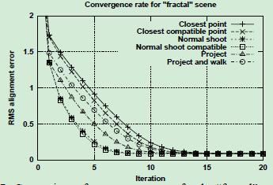

在存在噪声和异常值（图ab中的凸起为干扰）的情况下，当网格距离较远时，最接近点匹配算法可能会产生大量不正确的配对，从而减缓收敛速度。(b)“投影”匹配策略对噪音较不敏感。

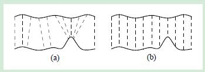

从图上看，可以看出**最邻近点法容易受到噪声的干扰，而投影法不受噪声的干扰。**

2. **收敛速度和时间**，场景：fractal

   比较各种匹配算法的“fractal” meshes的**收敛速度和时间**(参见图7)。

注意，这些时间不包括预计算(特别是前四种算法使用的k-d树的计算需要0.64秒)

下面匹配算法使用了kd-tree：

* closest-point
* closest compatible point
* Normal shooting
* Normal shoot compatibile

下面没有使用匹配算法kdtree

* project
* project and walk

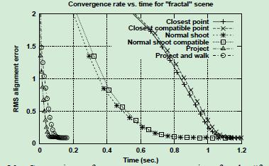

**从上图来看（没有包含kdtree计算时间，如果包含了对比起来投影算法更加有利），投影法的计算速度非常快，这是因为不仅投影法的收敛速度快，而且其算法复杂度为O(1),而其他的算法复杂度为O(logN)。**

2. 在雕刻十字面的场景下：（closest-point algorithms是唯一收敛的方法）

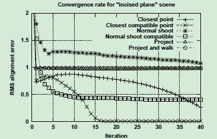

(上图)在这里，最接近点算法是唯一收敛到正确解的算法。因此，我们的结论是，尽管对于“简单”场景，最接近点算法可能没有最快的收敛速度，**但对于“简单”场景，它们是最健壮的**。

#### 匹配方法选择：

1. 对于非常简单的场景使用：closest-point algorithms
2. 其他场景使用：project

### c. 权重：给每个匹配的点对分配权重

权重分配的策略有以下几种：

* **Constant weight**：均匀分配，即常数加权。

* 根据点对距离加权，点对间距大，权重就小，反之，权重就大。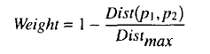

* 根据向量的一致性（compability）进行加权，weight = n1 * n2

* 不确定性

这几种方法的收敛速度和效果都差别大。总体上来讲，向量一致（兼容）的方法 适应性和速度比其他方法好点。

#### 分析：

1. 对于场景wave

   下图，比较wave meshes的收敛速率，为几种加权函数的选择。为了增加变量之间的差异，我们在网格中增加了一倍的噪声和异常值。

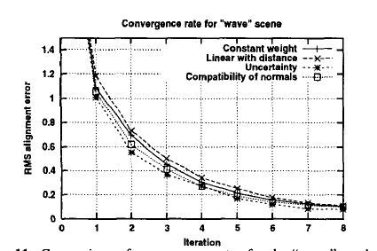
        我们发现，即使添加额外的噪声，所有的加权策略都具有相似的性能，

 uncertainty 和 compatibility of normals  性能稍好

2. 对于场景 incised plane scene
   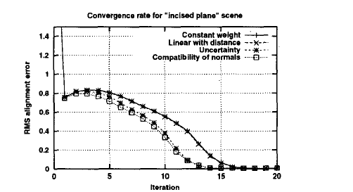

结果是与wave相似的，尽管在性能上有较大的差异。然而，我们在解释这个结果时必须谨慎，因为基于uncertainty 的权重会给模型中法线指向距离扫描器以外的点分配更高的权重。因此，对于这一场景，uncertainty 权重给切口内的点赋予了更高的权重，提高了收敛速度。

#### 结论：

**我们的结论是，加权对收敛速度的影响一般较小，且高度依赖于数据，加权函数的选择应基于其他因素，如最终结果的准确性;**

### d. 去除：去除不符合条件的点对

这样做的目的通常是为了消除异常值，当执行最小二乘最小化时，这些异常值可能会产生很大的影响。

这个阶段的策略包括：
* 固定阈值法：当间距大于一个值时，就去除这个点对

* 固定比例法：每次迭代，去除最差的%n的点对

* 标准差法：将阈值设置为所有点对间距的标准差*2.5

* 去除曲面边界的点对，如下图，曲面边界点的点对是不合理的，在两个点集做部分匹配的时候。

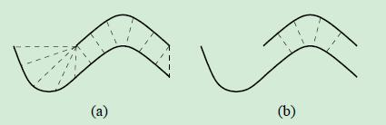

这几种方法的收敛速度差别不大，而且收敛效果也差别不大。**但是去除outlier点对这个步骤 对收敛结果 的作用还是明显的。**

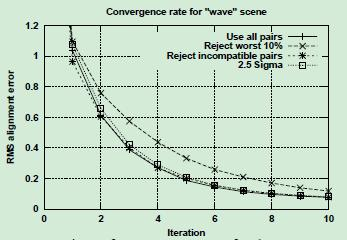

### ef. 误差度量和最小化：基于以上点对，给出每个点对的误差计算方法

#### 误差度量的策略：

1. 对应点之间距离的平方之和

   最小化：

   based on singular value decomposition [Arun 87], quaternions [Horn 87], orthonormal matrices [Horn 88], and dual quaternions [Walker 91] have been proposed

2. 点到面的距离平方和：从每个源点到包含目标点且方向垂直于目标法线的平面距离的平方和[Chen 911]

   最小化：

   在这种“点对平面”的情况下，没有可用的封闭形式的解决方案。最小二乘方程可以用一般的非线性方法(如Levenberg-Marquardt)求解。

3. 点到点和点到面的外推法

### 为对齐（alignment）规划五种搜索方案

1. 使用当前变换反复生成一组对应的点，并找到一个最小化误差度量的新变换[Chen 91]。（简单来说就是在所有对应点对中随机采样，采样出多组子集，选出一个误差度量最小的变换）
2. 上述迭代最小化，结合变换空间的外推（extrapolation in transform space ），加速收敛[Besl 92]
3. 在初始条件下，从多个扰动开始进行迭代最小化，然后选择最佳结果[Simon 96]。这避免了误差函数中的伪局部极小值，特别是在使用点对点误差度量时。
4. 使用随机选择的点子集进行迭代最小化，然后使用鲁棒(最小二乘)度量选择最优结果[Masuda 96]。
5. 采用模拟退火随机搜索最佳变换[Blais 95]。

由于我们的重点是收敛速度，而后三种方法往往比较慢，所以我们的比较将集中在上面描述的前两种方法(即，“经典”ICP '迭代，包括或不包括外推)。我们使用的外推算法是基于Besl和McKay所描述的算法，算法有两个小的变化，以提高效率和减少超调:

1. **当尝试二次外推时，抛物线向下开口，我们使用最大的x截距，而不是抛物线的极值。**

2. **我们将外推量乘以一个阻尼因子，在实现中任意设置为/2。我们发现，虽然这偶尔会降低外推的好处，但它也增加了稳定性，消除了许多超调的问题。**

   

  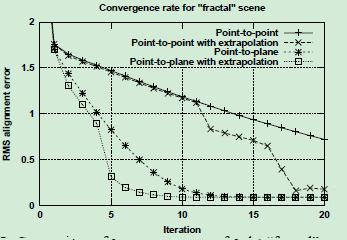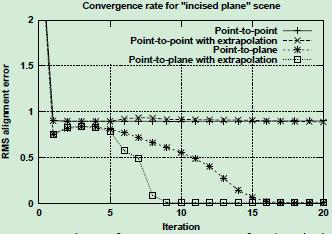

比较其收敛速率和效果：

1. 在fractal scene中，我们可以看到**点对面误差度量的性能明显优于点对点度量**，即使添加了外推

2. 在 incised plane中：点对点算法不能达到正确的解决方案，因为使用点对点误差度量不允许平面彼此容易滑动。

结论：**点到面和点到面外推法的度量方式效果更好。**

Fast ICP分析了不同阶段里，各种因素或策略对算法性能和结果的影响。应可以根据不同的需求，来选取不同的算法对点集或曲面进行配准。

**在算法效果差别不大的情况下，尽量选择简单的算法，来提高运行速度，如随机采样，常数加权，固定阈值等。**

## 结论：

### 文章内容：

上述实验对几种icp变种进行了对比，着重于**对收敛速度的影响**。

1. 介绍了一种新的采样方法：normal-space-sampling

   有助于在小和稀疏特征曲面的场景收敛。

2. 用投影法做对应点匹配收敛速度和运行速度都快

3. 给出了一种等时变体（constant-time variant）的找对应点的方法，只用几十毫秒就能对齐两个meshes。

4. 去除outliers作用还是明显的，各种方法区别不大

5. 在误差度量和最小化中，点到面和点到面外推法的度量方式效果更好

6. 本文并没有测试ICP变体的稳定性和鲁棒性。

### 结论：

提出了一种基于投影的点对应生成算法。与Neugebauer类似，我们将这种匹配算法与点对面误差度量和标准的选择匹配最小化ICP迭代相结合。(30毫秒完成两幅大象扫描的融合)

0. 由于没有kdtree（时间复杂度O log(N)）的预处理步骤，系统快了很多。

1. **correspondences matching**：提出了一种基于投影的点对应生成算法。（projection-based algorithm）
2. **error metric**:点对面误差度量(point-to-plane error metric)

2. ICP过程的其他阶段似乎对收敛速度影响不大，因此我们选择了最简单的阶段，即**随机抽样**、**恒定权重**和**距离阈值用于剔除outliers**

# ICP开源软件：

## Implementations

- [MeshLab](https://en.wikipedia.org/wiki/MeshLab) an open source mesh processing tool that includes a GNU General Public License implementation of the ICP algorithm.
- [CloudCompare](https://en.wikipedia.org/wiki/CloudCompare) an open source point and model processing tool that includes an implementation of the ICP algorithm. Released under the GNU General Public License.
- [PCL (Point Cloud Library)](https://en.wikipedia.org/wiki/PCL_(Point_Cloud_Library)) is an open-source framework for n-dimensional point clouds and 3D geometry processing. It includes several variants of the ICP algorithm.[[8\]](https://en.wikipedia.org/wiki/Iterative_closest_point#cite_note-PCL-Tutorial-8)
- Open source C++ implementations of the ICP algorithm are available in [VTK](https://en.wikipedia.org/wiki/VTK), [ITK](https://en.wikipedia.org/wiki/Insight_Segmentation_and_Registration_Toolkit) and [Open3D](http://www.open3d.org/) libraries.
- [libpointmatcher](https://github.com/ethz-asl/libpointmatcher) is an implementation of point-to-point and point-to-plane ICP released under a BSD license.