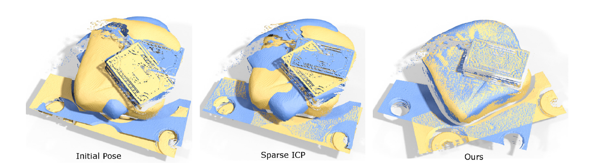
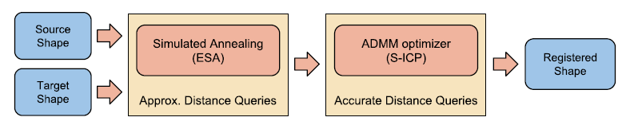

稀疏ICP方法采用稀疏诱导准则对该问题进行求解，显著提高了配准过程对大量噪声和离群值的恢复能力，但引入了显著的性能退化。

本文首先分析了性能下降的原因，提出了一种**结合模拟退火搜索**和**标准稀疏ICP**的混合优化系统，以更有效地解决底层优化问题。

<!--more-->

# Efficient Sparse ICP

稀疏ICP方法使用稀疏诱导规范来解决这一问题，显著提高了配准过程对大量噪声和异常值的恢复能力，但引入了显著的性能下降。

本文首先分析了性能下降的原因，提出了一种**结合模拟退火搜索**和**标准稀疏ICP**的混合优化系统，以更有效地解决底层优化问题。

我们还提供了一些关于如何通过结合使用近似距离查询、并行执行和统一子抽样进一步提高总体效率的见解。所得到的方法提供了超过一个数量级的累积性能增益，通过注册具有不同程度噪声和异常值的部分重叠扫描可以证明这一点。

结合**模拟退火**，可以快速接近解决方案，使用**ADMM优化器**，用于确保收敛到最优解决方案，为了进一步提高效率，我们的混合**粗到细**的方法在第一阶段使用了**近似的距离查询**。

Bouaziz在论文**"Sparse iterative closest point."**中证明了：配准问题可以表示为残差向量的p范数最小化。

