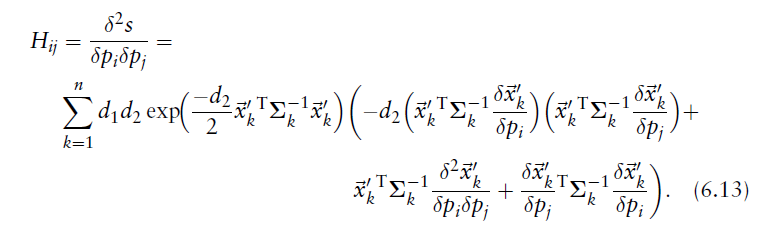

配准算法之 --- NDT

超级详细介绍NDT

<!--more-->

建议下载下来用Typora软件阅读markdown文件

# NDT配准算法详解

论文：

The Three-Dimensional Normal-Distributions Transform
– an Efficient Representation for Registration, Surface Analysis, and Loop Detection

作者：

Martin Magnusson

## 用于表示表面的概率密度函数

- 点云由深度传感器等获取的一组来自表面的空间采样点。**使用点云来表示表面有许多限制**。例如，**点云不包含关于表面特征(如方向、平滑度或孔)的明确信息**。1.根据传感器的配置，点云也可能是低效的，需要不必要的大量存储。2.为了在远离传感器位置的地方获得足够的样本分辨率，通常有必要对传感器进行配置，以便从传感器附近的表面产生大量冗余数据。（离传感器远的地方单位体积内点云密度小，离传感器近的地方单位体积内点云冗余）
- **正态分布变换可以描述为一种紧表示曲面的方法。**首被Biber和Straßer在2003年作为二维扫描注册方法而提出。
- 该变换**将点云映射到光滑的表面表示**，该表面表示为一组局部概率密度函数(PDFs)，每一个PDFs都描述了表面的一段形状。

## PDFs：

### PDF的几何意义

**正态分布给出了具有连续导数的点云的分段光滑表示。每个PDF都可以看作是局部表面的近似，描述了表面的位置以及它的方向和平滑度**。二维激光扫描及其对应的正态分布如图6.1所示。图6.2展示了矿井巷道扫描的三维正态分布。

> 一个二维激光扫描从一个矿井隧道(显示为点)和PDFs描述的表面形状。在这种情况下，每个单元格都是一个边长为2米的正方形。较亮的区域表示较高的概率。PDFs只计算了五点以上的单元格

> 上图为隧道断面的3D-NDT表面表示。
>
> 更亮、更密集的部分表示更高的概率。cell的边长为1米。

### 单变量和多变量正态分布的特征

1. 在一维情况下,对于一个正态分布随机变量x来说，有确定的期望值:μ

​                                                                                    和还不确定方差的值:σ。

在式子6.1中的多元概率函数，在一维情况下(D = 1)降为上面的p(x)。

在多维的情况下，**均值μ和方差σ**取而代之的是**均值向量和协方差矩阵**。

协方差矩阵的对角线元素表示每个变量的方差，非对角元素表示变量的协方差。图6.3说明了一维、二维和三维的正态分布。

在二维和三维的情况下，可以通过**协方差矩阵的特征向量和特征值**来判断曲面的**方向和光滑度**,也就是说，一组正交向量对应于各变量协方差的主方向。取决于方差的比例，二维正态分布可以是点形(如果方差相似)，也可以是线形(如果一个比另一个大得多)，或者介于两者之间。

在三维情况下如图6.4所示

1. **正态分布可以描述点或球**(如果方差的大小在各个方向上是相似的)，
2. **一条直线**(如果一个方向的方差远大于另两个方向的方差)，
3. 或者**一个平面**(如果一个方向的方差比另两个方向的方差小得多)。

### 计算每个网格里面的PDF

- 该算法的第一步是将扫描占用的空间细**分为单元格网格**（a grid of cells）(二维情况下为正方形case，三维情况下为立方体cubes)。
- 根据单元内的点分布，**每个单元计算一个PDF**。（probability density functions）概率密度函数

> 每个单元中的PDF可以解释为单元内表面点的生成过程(generative process)。换句话说，我们假设的位置是由这个分布生成的。

假设参考扫描表面点的位置是**由d维正态随机过程产生的**，则该cell中的，的概率为

- ：该cell中的均值向量(mean vector)和协方差矩阵(covariance matrix)

是在cell中的参考表面点集(reference scan points)的位置(positions)

- 分母作用：缩放函数使其积分为1，在实际应用中，可以用常数c0替换它。

## NDT配准算法

当你使用NDT算法用于点云配准时，目的是为了找到一个位姿pose（要最优化的对象）--->**可以最大化current scan的点位于reference scan表面的可能性。**--->maximises the likelihood（目标函数）.

### a.要优化的参数：

**要优化的参数:**R, t。即对the current scan的位姿估计的旋转和平移，可以用向量来表示这个参数。

### b.输入

1. **current scan's points**:被表示为一个点云。假设存在一个空间变换函数，通过位姿来移动
2. 给定的一些**scan points的PDF**，应该找到一个最好的位姿使得下面的似然函数（极大似然函数）最大。

### c.两种目标函数

#### 1.极大似然估计（最大化）

- **对点云通过变换函数变换后，对新的点云中每个点的概率累乘**

#### 2.负对数似然估计（最小化）

或者可以找到一个最好的位姿使得化负对数似然函数最小

- **对点云通过变换函数变换后，对新的点云中每个点的概率的负对数累加**

### d.改进PDF

如图6.5所示比较正态分布和混合模型。

> 负对数似然是进行NDT扫描配准时的“目标函数”。
>
> 它的导数描述了特定测量对解的偏置。（Its derivative characterises the bias that a particular measurement has on the solution.）
>
> 对于，对于较大的，影响是没有边界的，而对于，影响是有边界的。

#### 1.使用正态分布和均匀分布的混合模型的PDF：

**PDF(概率密度函数)不一定限于正态分布，任何局部捕获表面点结构并对异常值具有鲁棒性的PDF都是合适的。**

“正态分布的负对数”可能性在**远离均值的点上无限增长**。

因此，扫描数据中的异常值可能对结果有很大的影响。

在这项工作中(Biber，Fleck,和Straßer 的论文中）采用的是**正态分布和均匀分布的混合模型**:

- po是异常值的期望比率，**利用这个函数，异常值的影响是有界的**。

- 常量c1和c2可以通过”**在一个单元格所张成的空间内，让的“概率质量等于1**”来确定。

  > 概率质量函数：
  > mass强调的是一个聚集在一起的物体，就是它一个块一块的。这和离散型数据很像，就是一
  > 数据属于某个类。他们是聚集一块一块的。所以用mass这个词来描述他们的概率。翻译成中
  > 就变成了概率质量函数。你可以这么记忆：离散型数据是块状物体，物体是有质量，所以叫
  > 概率质量函数。
  >
  > 概率密度函数(Probability Density Function）
  > 这个是描述连续性数据。就是落在某个区间内的概率多大。这个就像液体，液体是连续的。同等体积有些液体重有些液体轻，用密度这个词描述会更合适。*它的缩写很意思，叫做PDF*，哈哈哈

- 要优化的**对数似然能量函数的和**由具有这种形式的项组成（要优化的对数似然估计由这样的项相加）它们没有简单的一阶和二阶导数。下面提供解决思路。

#### 2.将目标函数近似为高斯函数（负对数似然函数拟合成高斯函数）

由于“要优化的对数似然函数”没有简单的一阶和二阶导数，这样子目标函数优化起来很难，将改进的正态分布和均匀分布的混合近似看作高斯分布，然而,图6.5 b表明对改进的数似然函数（目标函数）可以近似为一个**高斯函数**。

一个这样的函数:

，

可以近似为**高斯函数**：

- 拟合参数通过
  分别让 应该像
  
  中还有来获得。

 

#### 3.最终的目标函数：

**对多维的"混合模型的分布“构造的负对数似然函数（目标函数）用高斯函数来近似，来作为目标函数，来对参数(位姿)进行优化。**

#### a.目标函数的项：

利用这种高斯近似，得到了**一个current scan point**对**NDT score function **的影响

> 分别代表网格中在网格中所在位置的均值和协方差
>
> **这个NDT score function的导数**比**6.7式正态分布和均匀分布的混合的导数**要简单（优化起来更简单），但在优化时仍然具有相同的一般性质（功能相同但是更加简单）。

> d3项在公式6.9中被省略了。当使用NDT进行扫描配准时，这不是必需的，因为它只向score函数添加一个常量偏移量，并且不改变其形状或优化参数。

#### b.score function（目标函数）：

给定一组点和一个变换函数用来通过一个位姿变换每个点。

**the current parameter vector**的NDT**评分函数为**:

* **该函数表示通过位姿变换点集（k=1～n）到the reference scan上对应的新的点集计算出的似然值(the likelihood)。**

>  似然函数需要求协方差矩阵的逆矩阵。如果网格中的点是完全共面或共线的，协方差矩阵是奇异的，不可逆。在三维情况下，由三个或更少的点计算的协方差矩阵总是奇异的，
>
>  **因此，PDFs只计算包含5个以上点的单元格。**
>
>  此外，作为对数值问题的预防，当被发现几乎是奇异时，它就会轻微地膨胀。如果最大的特征值比还要大100被以上，然后是较小的特征值被设成

然后**更新矩阵为**:

- 中包含的特征向量，
- 

### e.使用牛顿法对目标函数进行优化

牛顿算法可以用来求使评分（目标）函数最优化的参数

牛顿法迭代地解等式

- 是海森矩阵
- 是的梯度向量
- 在每次迭代中，将增量（牛顿方向）添加到当前的位姿估计中以计算出下一次迭代的参数

#### 1.计算点云变换后在该cell中的去质心坐标

#### 

是“通过位姿参数变换后得到的新的坐标”减去”所在网格的测点的均值“。

#### 2.梯度向量的元素（分量）可以写成

#### 3.海森矩阵中的元素

海森矩阵中的元素这样计算：

NDT 的score function中的“式子6.12的梯度”，和“式子6.13中的海森矩阵”，无论配准是在2D还是3D(或任何其他维度)中执行，函数都以相同的方式表示。它们同样独立于正在使用的转换表示。

对于在式子6.12和6.13中的一阶和二阶偏导数来说，它依赖于变换函数T。T可以是2D变换也可以是3D变换

### f.以前文章使用的目标函数也可行

在之前的几篇关于NDT扫描配准的文章中[7,48,57,64,67,89]，

**score function（ 目标函数）是直接使用高斯形式的正态分布的PDFs之和来定义的！！！**，虽然从概率的角度来看，这样的公式不太令人满意，但是最终的结果与使用混合模型的对数似然的高斯近似(6.9)的结果非常相似(6.7)。

### 算法流程

**算法2描述了如何使用NDT注册(配准)两个点云X和Y。**

初始化工作：

1. 划分网格，找出**参考点云Y**的所有点对应的网格
2. 对于每个网格计算网格中的参数
   * 计算网格中分布的**参考点云**的点的去质心坐标
   * 计算网格中**参考点云**的去质心坐标的平均值
   * 计算网格中**参考点云**的去质心点的协方差

配准工作：

第一步判断是否收敛

当还没有收敛时，将目标函数，梯度，海森矩阵设为0

第二步对源点集进行相关计算

1. 对于**源点集**中的所有点应用变换矩阵后，这些点坐落在“找到之前划分的网格”的位置
2. 计算每个点的高斯近似目标函数的分数，将每个网格中的分数加起来
3. 使用公式6.12更新梯度
4. 使用公式6.13更新Hessian矩阵

第三步，计算牛顿方向，然后计算出下一个优化矩阵，然后跳到第一步。

