Generalized-ICP-论文解读

<!--more-->

建议下载下来用Typora软件阅读markdown文件

## 一、Generalized-ICP简介

作者：Aleksandr V. Segal

工程：https://github.com/avsegal/gicp

论文：Generalized-ICP

1. **提出一个单一的概率框架**：将"ICP"和"point-to-plane ICP"结合起来到一个单一的概率框架(single probabilistic framework)
2. **对两个扫描都建模**然后，我们使用这个框架从两个扫描(both scan)中对局部平面表面结构建模(model)，而不是像"point-to-plane"方法那样只对模型的scan进行建模。------>**可以看作是plane-to-plane**
3. 结果表明该方法优于“标准ICP”和"点对面"方法
4. **容易调整maxdistance**：此外，新方法对不正确的对应关系具有更强的鲁棒性，从而**更容易调整大多数ICP变体中存在的最大匹配距离参数**
5. **可以选择添加其他概率模型**：除了已证明的性能改进之外，该模型还允许将更有表现力的概率模型集成到ICP框架中
6. 在保持ICP的速度和简单性的同时，通用ICP还允许**添加异常项、测量噪声和其他概率技术**来增强鲁棒性。

## 二、求解变换矩阵

1. 利用标准正交矩阵求绝对定向的闭型解：论文[10]**Closed-form solution of absolute orientation using orthonormal matrices**；

   大多数ICP变体使用封闭形式的解迭代计算对应的对齐。

2. 使用一般的非线性优化技术来代替更具体的封闭形式方法：论文[9]**Robust registration of 2D and 3D point sets**；

   这些技术的优势在于，它们允许"更加generic的 minimization functions"，而不仅仅是欧氏距离的和；上面的论文显示使用非线性优化与鲁棒统计显示更广泛的收敛盆地。

   * 论文[2]**"A Probabilistic Framework for Robust and Accurate Matching of Point Clouds"**

     通过假设第二次扫描是通过一个随机过程从第一次扫描生成的，从而应用概率模型。

   * 论文[4]**"Probabilistic Matching for 3D Scan Registration"**

     应用射线跟踪技术来最大化对齐的概率。

   * 论文[8]**"Probabilistic Scan Matching for Motion Estimation in Unstructured Environments"**构建一组兼容的对应关系，然后在此分布上最大化对齐的概率

   * 论文[17]**"Scan matching in a probabilistic framework"**

     引入了一个完全概率框架，该框架考虑了运动模型，并允许估计注册的不确定性。该方法的一个有趣的方面是，在没有显式对应关系的情况下，使用广义霍夫变换的采样模拟来计算对齐，同时考虑了二维数据集的两个表面法线。

3. 全局对齐：论文[18]**"Mutliview Registration for Large Data Sets"**;

   大量的文献致力于解决多扫描的全局对齐问题([该]和许多其他)。许多方法(尤其是[该])使用成对匹配算法作为基本组件。这使得成对匹配的改进也适用于全局对齐问题。

## 三、基本ICP和point-toplane方法

GeneralizedICP在总结ICP和Point-to-plane算法的基础上，介绍了这两种标准方法的自然推广。然后给出了实验结果，突出了广义icp的优点。

广义在总结ICP和Point-to-plane算法的基础上，介绍了这两种标准方法的自然推广。然后给出了实验结果，突出了广义icp的优点。

### a.基本ICP的伪代码

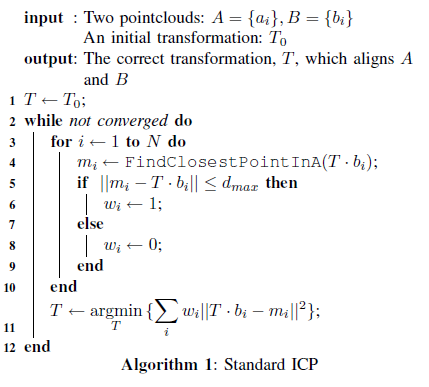

### b.Point-to-plane

ICP point-to-plane 变体通过利用表面法线信息来提高性能。

最初由陈和Medioni在论文[7]**"Object Modeling by Registration of Multiple Range Images"**介绍，在2.5D range data下，该技术作为标准ICP的一种更可靠、更精确的变体得到了广泛的应用。

#### 1.标准ICP是使得下面目标函数最小化

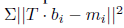

#### 2.Point-to-plane

而该算法优化的是：**point-to-plane算法使曲面法向误差最小化**例如：向量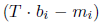在曲面法向量张成的子空间上的投影，

代替第11行新的目标函数为

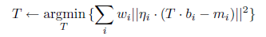

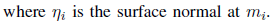

## 四、Generalized-ICP

### 0.MLE最(极)大似然估计

MLE（Maximum Likelihood Estimation）。

最大似然估计，就是**利用已知的样本结果**，**反推最有可能（最大概率）导致这样结果的参数值。**

### 1.简介

Generalized-ICP介于标准ICP和完全概率模型之间。基于MLE(最大似然估计)作为非线性优化步骤，并利用kd树计算离散对应关系。它的独特之处在于它提供了对称性，并结合了论文[7]**"Object Modeling by Registration of Multiple Range Images"**的结构假设。但是，由于最近的点查找是使用欧氏距离完成的，因此可以使用kd-tree在大型点云上实现快速性能。

对于完全概率的方法，这通常是不可能的，**因为这些方法需要通过分配计算MAP估计值。**相对于论文[8]**"Probabilistic Scan Matching for Motion Estimation in Unstructured Environments"**，我们认为数据应该被假定为局部平面，因为大多数为范围数据采样的环境是分段光滑表面。通过给最小化过程一个概率解释，我们展示了将技术扩展到包含来自两个扫描的结构信息是很容易的，而不是像通常在“点对面”ICP中所做的那样只包含一个扫描。结果表明，引入这种对称性提高了精度，减少了对参数的依赖。

我们的方法和论文[17]**"”Scan matching in a probabilistic framework"**之间的一个关键区别是所涉及的计算复杂性。论文[17]被设计用来处理平面扫描数据-建议的广义霍夫变换需要比较一个扫描中的每一点与另一个扫描中的每一点(或者在采样的情况下，按比例进行比较)。我们的方法使用kd树来查找最近的点，因此需要O(n log(n))显式的点比较。

目前还不清楚如何将[17]中的方法有效地推广到本文所考虑的数据集。此外，这些模型还存在着哲学上的差异

### 2.推导广义ICP的目标函数

广义icp是建立在将概率模型附加到Alg. 1第11行（最小化）步骤的基础上的。该技术保持算法的其余部分不变，以降低复杂度和保持速度。值得注意的是，**对应关系的计算仍然使用标准欧氏距离，而不是概率测度**。这样做是为了允许在最近点的查找中使用kd-tree，从而保持ICP相对于其他“完全概率技术（fully probabilistic  techniques）”的主要优势---**速度和简单**

* 这里说的是“kdtree查找近邻”比“完全概率技术”的速度快。

* 没有说kdtree查找近邻的计算速度和收敛速率是最快的。

> 在fasticp中，作者比较了配准步骤中的几种ICP的因素，在两个点集之间的点进行配对的步骤中：
>
> 1. 收敛速率：投影（projection）算法效果较好。相比之下，最接近点算法的性能相对较差
> 2. **收敛速度和时间**：**投影法的计算速度非常快，这是因为不仅投影法的收敛速度快，而且其算法复杂度为O(1),而其他的算法(用了kdtree查找最近邻的算法)复杂度为O(logN)**

#### 推导过程：

因为只有第11行是相关的，我们将推导的范围限制在此上下文中。

已知有对应点集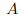,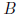,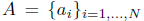和=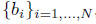是按照他们的通过计算最近点作为对应来排的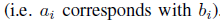,a1对b1，a2对应b2......

假设上述的点对都在距离阈值范围内。

1. 在概率模型中，我们假设存在一个潜在的点集：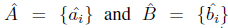他们分别由正态分布（高斯分布）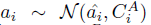和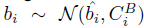生成的。在这里，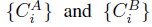是与测点相关的**协方差矩阵**。（a^i和b^i为两个点集的均值？）

   `这不是NDT的思路吗？NDT其中一个思路是：把点集描述成正态分布，由于正态分布曲线是光滑的曲线，可以将离散的点计算出连续的PDF函数，更好的描述了scan surface。`

   如果我们假设完美的对应关系(几何上一致，没有由于遮挡或采样造成的误差)，以及正确的变换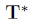，我们知道有

   .png)

2. 对于任意刚性变换，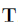，我们定义(变换后的对应点**误差向量**)=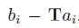

   然后考虑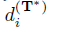所在的分布。

   **误差向量也和数据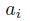和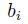一样，服从正太分布**

   **它的协方差为：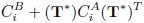**

   因为和被认为是来自独立的高斯函数，所以也服从高斯分布，通过公式（1）

   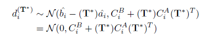

   (因为假设了是完美的，所以分布中的均值为0)

   上述步骤得到了以变换矩阵为变量的，误差向量的正态分布的概率密度函数。那么可以通过MLE来作为目标函数。

3. 现在我们使用MLE(极大似然估计)通过设置

   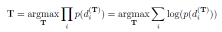

   来迭代计算（最优化）。
   
   * 极大似然估计作为目标函数由于乘积求导不易处理，将极大似然估计转为对数极大估计，取负号变成极小对数估计目标函数。
   
   * 这个一个不带约束的问题，可以用梯度下降法和牛顿法求解？
   
   * 梯度下降法要求一阶泰勒展开，牛顿法要求二阶泰勒展开
   
     

#### 推导结果：

4. 以上可以简化为（我也不知道怎么简化的）

   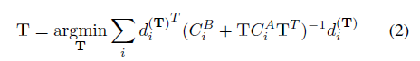

   这定义了通用icp算法的关键步骤。

### a.point-to-point是广义ICP的一种特殊情况

   通过设置，可以将标准ICP算法视为一个特例

   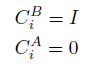

   在这种情况下，(2)变成

   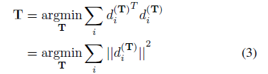

   这正是标准的ICP更新公式。--->**把标准的ICP视为特殊情况，把公式2视为一般情况，所以才有了广义ICP的说法！！！**

5. 我们可以自由地为选择任何一组协方差。作为一个激励（motivating）的例子，我们注意到点对面算法也可以被认为是概率的。

### b.point-to-plane是广义ICP的一种特殊情况
   有了上面的推导，同理我们也可以认为point-to-plane 作为ICP的目标函数的方法也可以看成是概率的：

   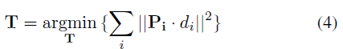

   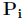是“表面法线张成的空间”在处的投影

* 公式4 这使得  ”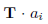“  与  ”定义的平面及其表面法线“  之间的距离最小化。

* 由于是一个正交投影矩阵

  有：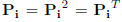

  这意味着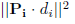可以写成一个二次形式：

  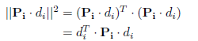
  
* 代入到公式4我们有
  
  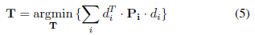

通过与(2)的相似性，可以看出point-to-planeICP是广义ICP的一种极限情况。在这种情况下

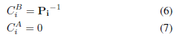

严格来说是不可逆的，因为它是秩亏的。然而，如果我们用一个可逆的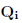近似，当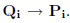时广义ICP接近point-to-plane。

我们可以直观地将这种极限行为解释为沿着平面法向量受到约束，而不知道它在平面内的位置。

--------------------

下面内容未完待续

### c.应用广义ICP到plane-to-plane

为了提高相对于点对面模型的性能，增加模型的对称性，广义icp可以同时考虑两种扫描的表面信息。将这种附加结构合并到(7)中最自然的方法是包含关于第二次扫描的局部表面的信息。这捕获了这种情况的直观本质，但在数学上是不可行的，因为所涉及的矩阵是奇异的。相反，我们使用点对平面的直觉来激发概率模型。

点对面算法的本质是点云的结构比三维空间中的任意点集都要多;它实际上是由距离测量传感器采样的表面集合。这意味着我们处理的是一个采样的2-manifold（流形）在3-space（空间）

由于现实世界的曲面至少是分段可微的，我们可以假设我们的数据集是局部平面的。此外，由于我们从两个不同的角度对流形进行采样，所以我们一般不会对同一点进行采样(即对应关系永远不会是精确的)。从本质上讲，每个测量点只提供一个沿其表面法线的约束。为了建立这种结构的模型，我们认为每个采样点在其局部平面上具有高协方差，而在表面法线方向上协方差很小。对于e1为a的点协方差矩阵为

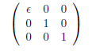

在这里是一个小常数表示沿着法线的协方差。这相当于知道法线上的位置(该位置有很高的置信度)，但不确定它在平面上的位置。我们把ai和bi模型都从这种分布中提取出来。

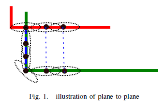

图1给出了算法在极端情况下的效果。在这种情况下，沿绿色扫描垂直部分的所有点都与红色扫描中的单个点不正确地关联。由于曲面方向不一致，平面对平面会自动折现这些匹配项:每个对应项的最终求和协方差矩阵是各向同性的，相对于精细定义的对应协方差矩阵，对目标函数的贡献很小。这种行为的另一种观点是作为每个通信的软约束.不一致的匹配允许红色扫描点沿着x轴移动，而绿色扫描点可以自由地沿着y轴移动。因此，不正确的对应关系对整体对齐形成了非常弱的、没有信息的约束。

计算表面协方差矩阵需要与两个扫描中的每个点相关联的表面法线。从点云中恢复地表法线的方法很多，法线的精度自然对算法的性能起着重要的作用。在我们的实现中，我们对每个扫描点最近的20个点的协方差矩阵使用PCA。在这种情况下，与最小特征值相关的特征向量对应于表面法线。该方法用于计算点对平面和广义icp的法线。Generalized-ICP,旋转矩阵构造这样的ǫ分量方差和表面normal.1

## 五、RESULTS

我们比较了这三种算法，以测试该技术的性能。虽然标准ICP中存在有效的T封闭形式解，但为了简化比较，我们采用共轭梯度最小化方法(Conjugate Gradient)。

> **共轭梯度法是介于最速下降法与牛顿法之间的一个方法，它仅需利用一阶导数信息，但克服了最速下降法收敛慢的缺点，又避免了牛顿法需要存储和计算海塞矩阵并求逆的缺点，共轭梯度法不仅是解决大型线性方程组最有用的方法之一，也是解大型非线性最优化最有效的算法之一**

在两次扫描之间引入一个已知的偏移量后，分析性能收敛到正确的解决方案。我们将标准ICP的测试次数限制在250次以内，其他两种算法的测试次数限制在50次以内，因为通常在此之前就已经实现了收敛(如果有的话)。

模拟(图3)和真实(图4)数据均被用于演示理论和实际性能。模拟数据集还允许在更大范围的环境中进行测试，并且完全了解地面真实情况。室外模拟环境与收集到的数据的主要区别在于遮挡的数量，以及地面更多的丘陵特征。真实世界的户外测试也展示了性能与更详细的特点和更具代表性的测量噪声。

模拟数据是由安装在旋转接头上的病态扫描仪进行光线跟踪而得到的。创建了两个3D环境，分别在室内(图2(a))和室外(图2(b))场景中测试性能。

室内环境以办公室走廊为基础，而室外环境则反映了建筑周围的典型景观。在这两种情况下，我们模拟了一个装备激光扫描仪的机器人沿着轨迹移动，并在轨迹上的定点进行测量。为了使测试更加真实，加入了高斯噪声。

还对来自一辆仪表车的日志的真实数据进行了测试。这些日志包括安装在车顶上的Velodyne测距仪记录的数据，当时这辆车在郊区环境中作了一个循环，并使用GPS和IMU数据进行了标注。这使得应用基于成对约束的SLAM技术生成地面真值定位成为可能

