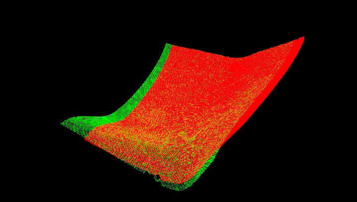

**点云配准之正态分布变换**

<!--more-->

精细配准，除了ICP，我用得比较多的就是ndt了。

- ndt也可以粗配准。

- ndt表现比icp要好。

  

**A.NDT算法介绍：**

**详细请参考**：

**1.博主博文**

[Detailed Notes to NDT](<http://localhost:4000/2019/06/04/registration/Detailed_Notes_to_NDT/>)

**2.以及AdamShan的博客**

[无人驾驶汽车系统入门（十三）——正态分布变换（NDT）配准与无人车定位](https://blog.csdn.net/adamshan/article/details/79230612)


**B.开源项目：**

自动驾驶开源项目中Autoware **https://github.com/CPFL/Autoware**

利用 fast_pcl package实现了对NDT优化过程的并行加速


**C.PCL中的NDT:**

**pcl中的接口在官网和其他博客有详细描述这里不再细说。**

调参是主要是设置分别率和步长，分辨率越大考虑的的范围越多，当分辨率很小（对比数据）的时候，会出现内存错误。步长越大，曲面移动A(位姿变换)得越快。

```C++
	pcl::NormalDistributionsTransform<pcl::PointXYZ, pcl::PointXYZ> ndt;

​	Setting scale dependent NDT parameters

​	ndt.setTransformationEpsilon(0.00001);

​	ndt.setStepSize(5);

​	ndt.setResolution(5);

​	ndt.setMaximumIterations(50);//200

​	ndt.setInputSource(filtered_cloud);

​	ndt.setInputTarget(target_cloud);

​	pcl::PointCloud<pcl::PointXYZ>::Ptr output_cloud(new                  pcl::PointCloud<pcl::PointXYZ>);

​	ndt.align(*output_cloud);	
```



**D.ndt算法和icp比较**

**http://ghx0x0.github.io/2014/12/30/NDT-match/**

<div align=center>


<div align=center>后台回复“ndt”自动回复论文和代码(完）

