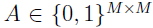

---

title: Multiview Levenberg-Marquardt ICP
subtitle: Multiview Levenberg-Marquardt ICP
date: 2019-04-09 22:16:32
tags: [Generalized-ICP,ICP,mv-LM-ICP]
categories: [Registration,6.mv-LM-ICP]
---

mv-LM-ICP论文解读

<!--more-->

# Multiview Levenberg-Marquardt ICP

## 0 简介

ICP在多视图场景中的应用

作者：Adrian Haarbach

工程：https://github.com/adrelino/mv-lm-icp

论文:mv-lm-icp

- 使用了**nanflann**库，实现了kdtree
- 使用了**Ceres Solver**库，非线性最小二乘算法（如Levenberg Marquardt）轻松地将点到点和点到面的度量最小化。

背景：ICP的变种

1. 点到点ICP：(最开始的3DICP的论文)

   Besl, Paul J., and Neil D. McKay. **"Method for registration of 3-D shapes."**Robotics-DL tentative (1992): 586-606.

2. 点到面ICP：

   Chen, Yang, and Gérard Medioni. **"Object modelling by registration of multiple range images."**image and vision computing 10.3 (1992): 145-155.

相关的工作：

- Fitzgibbon, Andrew W. **"Robust registration of 2D and 3D point sets."**Image and Vision Computing 21.13 (2003): 1145-1153.
- Brown, Benedict J., and Szymon Rusinkiewicz. **"Global non-rigid alignment of 3-D scans."**ACM Transactions on Graphics (TOG). Vol. 26. No. 3. ACM, 2007.
- Pulli, Kari. **"Multiview registration for large data sets."** 3-D Digital Imaging and Modeling, 1999. Proceedings. Second International Conference on. IEEE, 1999.

## 1 ICP是什么

icp使用两个步骤进行迭代直至收敛，来实现刚性对齐两个点云

1. 寻找两个点集中的对应点对
2. 通过最小化”通过对应点对定义的代价函数“来估计一个变换矩阵

**mv-lm-icp主要是在第二步，如何通过代价函数估算出变换矩阵上面上做改进**

## 2 两个点云之间对齐（Pairwise registration）

>**损失函数**（Loss Function ）是定义在单个样本上的，**算的是一个样本的误差**。
>**代价函数**（Cost Function ）是定义在整个训练集上的，是所有样本误差的平均，也就是**损失函数的平均**。
>**目标函数**（Object Function）定义为：最终需要优化的函数。等于经验风险+结构风险（也就是Cost Function + 正则化项）。
>关于目标函数和代价函数的区别还有一种通俗的区别：
>目标函数是最大化或者最小化，而代价函数是最小化

**在两个点云对齐的情景中：**

对应点集，为模型点云，为场景点云。
有变换矩阵，来运动模型点云pi，其中为**代价函数**，为**损失函数**。
对应的**误差函数**(目标函数)为

**通过最小化误差函数来获得最优的刚体变换**

## 3 多个点云之间对齐（Multiview registration）

**在多视角的情景中，**

上面的方法不再适合，因为一个视角的点云，既可以充当场景点云可以充当也可以是

**让代表一组用来对齐的点云：而为了表示哪个点云配准到哪个点云，我们将这些关系用有向图的邻接矩阵表示。**

### 1.两个点云之间的误差函数：

如果有M个点云，该邻接矩阵为M×M大小。举个例子，矩阵值表示点云可以配准到点云
代表相机在全球坐标系下的绝对位姿，那么两个点云到的配准误差为：

其中是两个点云之间的第最近对应点。
可以通过设置将公式（2）变成公式（1）

### 2.多个点云之间的误差函数：

通过对每一对重叠视图的贡献求和得到
最小化的整体对齐误差可以表示为：

我们要求解使得M个点云之间的最小二乘误差函数值最小化。
对比与公式（1）的两个点云之间的误差函数中有闭合解，而多视图中没有闭合解。然而，刚性点云配准只是非线性最小二乘优化的一个实例，可以通过[“Ceres Solver”](http://ceres-solver.org/nnls_tutorial.html)来求解。

### 3.1 一般ICP的代价函数

#### 3.1.1Pairwise(两个点云)

在论文**Method for registration of 3-d shapes**，以及论文**Iterative point matching for registration of free-form curves and surfaces** 中使用的代价函数是：

在论文**Object modeling by registration of multiple range images**中使用的代价函数是：

在这些情况下，损失函数就是恒等式，代价函数是

两个点云配准的情景中，虽然上述代价函数(4)(5)的存在闭合形式解，但也可以使用Ceres来求解。代价函数的计算被称为残差（residuals），残差不一定在空间中。

#### 3.1.2多视角

多视角点云配准的代价函数只是在两个点云配准的代价函数上做了些许修改。

在pairwise中，代价函数依赖于相对位姿。

在multiview中，代价函数d依赖于两个绝对位姿和。

## 4 参数化刚体运动

## 4.1 Angle Axis旋转向量

### 4.1.1 Cost function

### 4.1.2 Jacobian

依靠**Ceres AutoDiCostFunction**功能自动计算我们的代价函数的必要的导数参数化的角度轴表示和一个平移向量

## 4.2 Unit Quaternions 四元数

### 4.2.1 Local Parametrization

### 4.2.2 Cost function

### 4.2.3 Jacobian

## 4.3 Lie Algebra of Twists 李代数

###　4.3.1 Cost function

### 4.3.2 Jacobian

