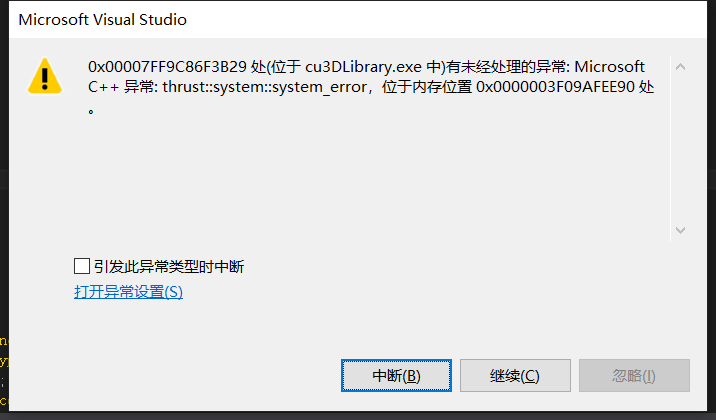

<!--more-->

# thrust

[thrust::system::system_error]

```C++
cudaMalloc((void**)&nanFlags_dev, N*sizeof(int));
getNANpts << <fullBlocksPerGrid, blockSize >> >(N, z_dev, nanFlags_dev);
cudaDeviceSynchronize();
thrust::device_ptr<int> thrust_nanflags(nanFlags_dev);
//int num_of_nan = thrust::reduce(thrust_nanflags, thrust_nanflags + N, (int)0, thrust::plus <int >());  //统计有多少个NAN点
int num_of_nan = thrust::count(thrust_nanflags, thrust_nanflags + N, 1);  //统计有多少个NAN点
cudaDeviceSynchronize();
```


出现错误：




原因：核函数getNANpts写错了。只对nanFlags_dev中的一个位置进行初始化，其他位置没有赋值，所以进行计算时会错误。