张也冬视频笔记

内存上的优化

计算上的优化

<!--more-->

[B站视频](https://www.bilibili.com/video/av6060299?t=1811)

# CUDA代码优化

### 代码（转置矩阵）

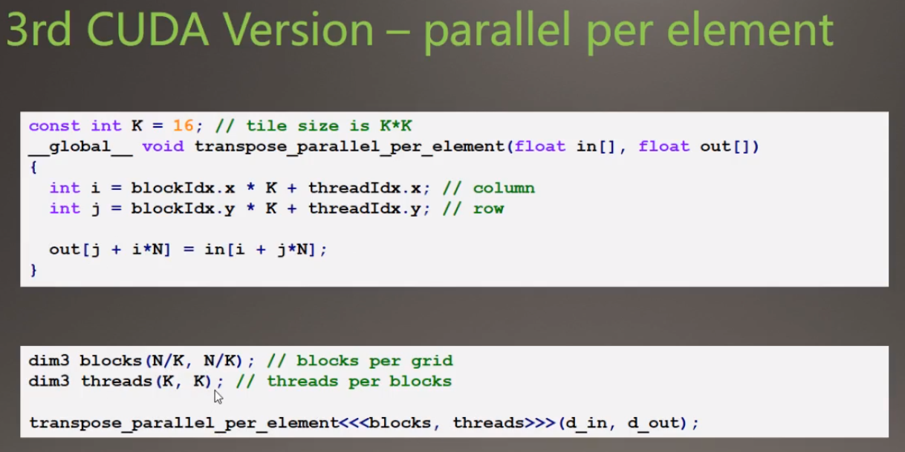

* 输入/输出数据：N×N（1024 * 1024） 维度的矩阵
* 每个block的线程数目为16X16=256
* 运行时间0.46ms

### 影响代码性能的2个方面的因素

1. **内存的存取耗时**---可能是制约性能的主要原因，进入优化阶段
2. 运算耗时---几乎没有运算

## 一、内存上的优化

### Memory Optimization

1. deviceQuery查询得到;
   * Memory clock rate(MHz)---每秒内存周期clock/second （每秒内存跑多少次）
   * Memory Bus Width(bit)---每秒周期传输的比特数bits/clock （每次跑多少数据量）
2. 可以计算内存峰值带宽(Theoretical peak bandwidth)
   * Memory clock rate * Memory Bus Width （每秒跑多少数据量）
3. Titan X的参数为：
   * Memory clock rate =3505 MHz =3.42 GHz
   * Memory Bus Width =384 bit
   * Bus Type GDDR5(double data rate)
   * 得理论峰值带宽为3.42 x (384/8) x 2 =328.31GB/s

### 经验法则Rule of Thumb

接上面

1. 一条经验法则是，如果实际内存带宽达到理想理论峰值内存带宽的：

   * 40%~60%->okay
   * 60%~75%->good
   * 大于75%->excellent

2. 本代码中世纪内存带宽表现如何？

   1024 * 1024 * 4(4字节数据) * 2（2次读写内存）/0.67e-3=18.24GB/s <<328.31GB/s

3. 并行化元素级别后，DRAM利用率还是那么低，思考解决方法

### 解决方法

合并Coalesce和跨步Strided

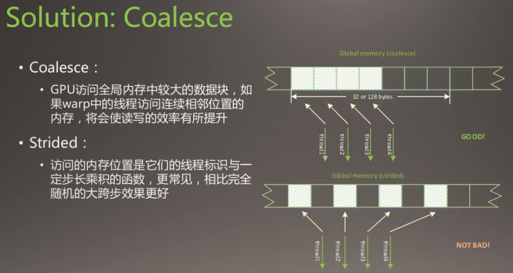

存储到**全局内存时，线程数据的复制方式**：合并形式与跨步形式，合并方式比跨步方式好，小跨步比大跨步好。

1. 目前代码问题：

   Coalesced reads,scattered writes

2. 修改的目标是：

   Coalesced reads,Coalesced writes

#### 1.使用共享内存

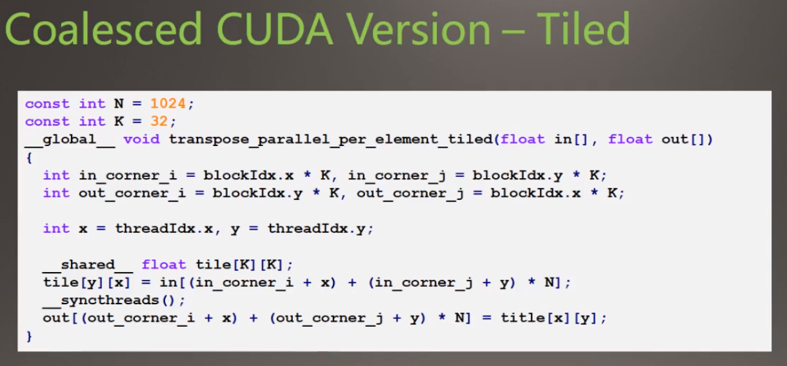

* 声明了一个**共享内存**的空间tile，把**全局内存in**里面的数据转置后复制到tile中
* 同步线程块里面的线程（线程之间互相等待，同步好之后再执行下一步）
* 一次性将tile中的数据复制到**全局内存out中**

由于之前复制到全局内存的时候是以32×32=1024个

现在使用共享内存之后的步长为32个，但是没有带到完全Coalesced的方式，但是减少了步长。

#### 2.Another Point:Useful memory bandwith

* 问题：如果内存不能及时将数据传递到处理器中，或及时存储运算结果，GPU工作的效率会大打折扣
* 目标：对于内存带宽受限的kernel函数，存在优化的子目标---**充分利用有效的内存带宽**

> Little's Law
>
> 1. 什么是有效的内存带宽？---由排队论的Little's Law
>    * Number of useful bytes delivered = average latency of each transaction*bandwidth
>    * 传送的字节数为**每个内存事物的平均延迟与带宽的乘积**
>    * 类似于在星巴克排队等待购买咖啡
> 2. 由此，改善代码内存带宽还可以有以下出发点：
>    * 增加传送的字节数---有很多服务员同时提供咖啡 
>    * 减少食物见的延迟---服务员更快地提供服务 

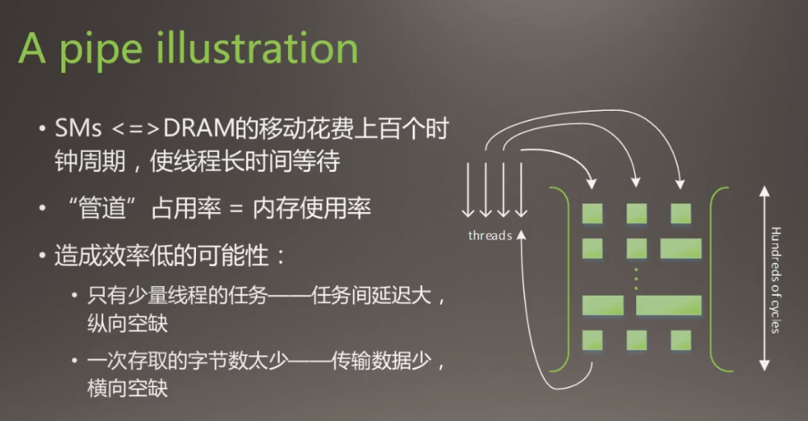

#### 3.Locate low efficiency

1. 反观代码
   * 每个tile完成转置后，执行`__syncthreads()`同步
   * 32×32=1024个线程执行少量任务后，互相等待，再把这1024个数据存到内存当中，造成**平局延迟较大**

2. 改进：reduce Average Delay

   解决方法：

   * 减少每个线程块中的线程束
   * 增加使用每个SM中的线程块数

   尝试结果：

   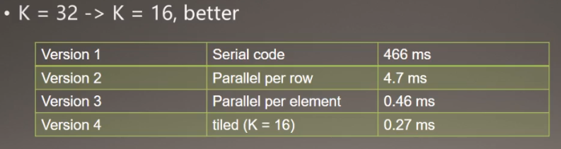

   

### 占用率Occupancy

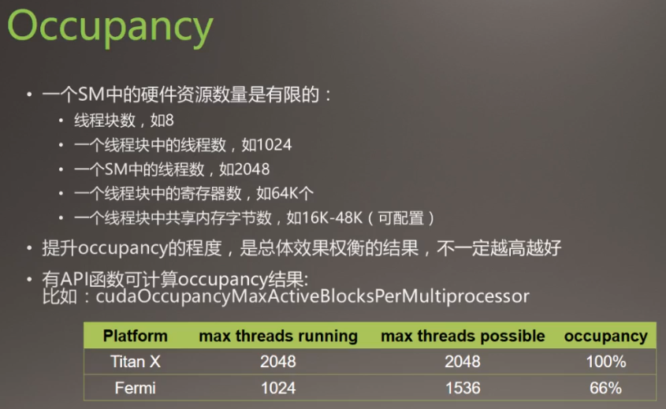

### 共享内存的架构

1. 没有bank conflicts

   各个线程同时分别访问对应的Bank（线程0访问Bank0，线程1访问Bank1。。。，大家同时进行Bank访问时没有冲突）

   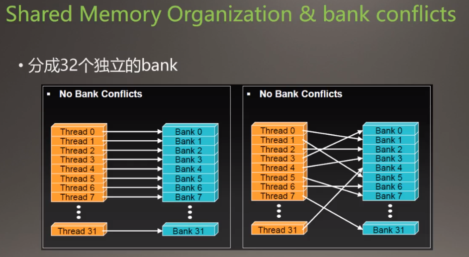

2. 有bank conflicts

   * 两个线程同时访问同一个Bank，造成Bank Conficts
   * 八个线程同时访问同一个Bank，造成Bank Conficts，八个比两个更加严重

   不能多个线程同时访问同一个内存位置（cache），否则会造成等待（延迟）。**就把本来是一个并行的事变成串行的事**。

   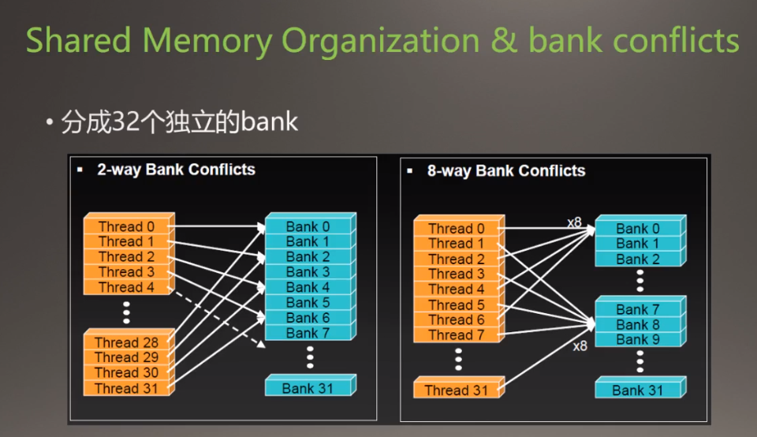

#### bank conflict in code

在上面改进后的代码(使用了共享内存的代码)中也存在这样的问题(bank conflicts)。是下面的图1中的情况。

1. 下图中对应线程每次都访问同一个bank，比如线程0每次访问的都是绿色的bank0。线程1每次访问的都是橙色的bank1。

   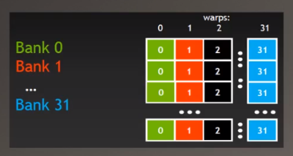

2. 下图中，线程1第一次访问的是bank0，第二次访问的是bank1，不会每次都在等候同一个bank。下面的图2中加了个**padding（填充）**，使得线程0访问的是Bank1，线程1访问的是Bank2了，**这样子使得线程不会一直占用着同一个bank进行等候**。 

   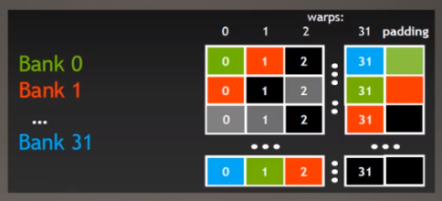

   

## 二、计算上的优化

1. 优化内存访问通常是GPU优化的瓶颈
2. 优化内存访问之余，优化运算性能也很重要
   * 最小化线程发散程度
   * 选择效率更高的数学计算---提升“最后一点性能”

### 减少线程发散：

Minimize Threads DIvergence

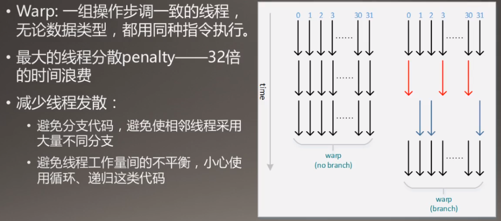

线程束内线程会进行等待，避免有的线程计算时间长有的线程计算时间短。

### 更有效果的方法

More efficiency,less accuracy---save the amount of time

1. 仅在必要时使用双精度浮点运算

   快速的数学近似算法：牺牲精度追求效率。

2. 内部函数（intrinsic functions）

   cuda的内部函数，比如sin，cos，指数运算
   
   **在Thrust库里面有reduce函数**

## 三、CPU-GPU Interaction

1. GPU通过DMA方式访问CPU的锁叶内存(pinned memory)
2. cudaMemcpy()是一种阻塞传输；而cudaMemcpyAsync()非阻塞
3. cudaHostMalloc()+cudaMemcoyAsync()实现异步传输和计算

## 四、Stream

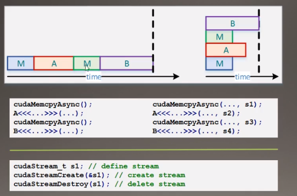

保证流之间不相关。

# 基本算法

## 一、Reduce（规约）

自带库中已经有很好的接口。下图中，第二个和第三个都是四步，但是第二个没有第三个好。

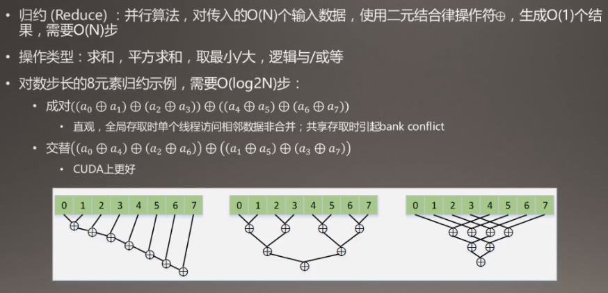

1. 规约版本1(不是指上图的第一个版本的计算)，线程的执行在下面表示

   执行线程流程

   遍历0～14

   遍历0～12

   遍历0～8

   最后一个执行线程0

   * 存在一些没有意义的遍历，线程分散度比较高，
   * 使用求余运算符占用时间大

   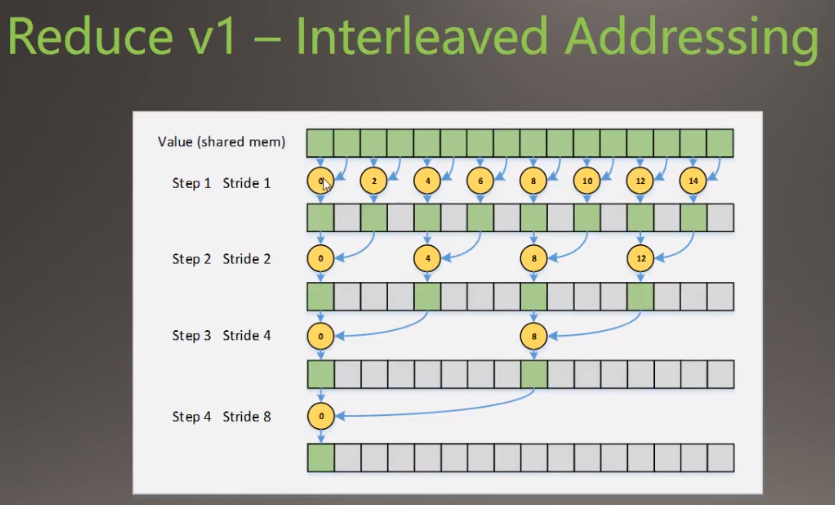

2. 在线程号上面改动，线程的执行在下面表示，

   * 遍历个数在减少第一次遍历8个，第二次遍历4个，第三次2个

   * 但是引起bank conflicts（格子表示bank）下图中bank4（第5个格子）对应了两个线程，线程2和1，会引起多对1问题。

   

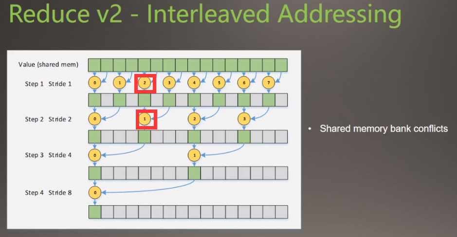

3. 线程的执行在下面表示，

   * 保证了对应线程的对应bank一直是一样的，那么每个bank就不会被其他线程索引，除去了线程冲突。
   * 但是后面大量的线程没有被利用，是空着的。
   
   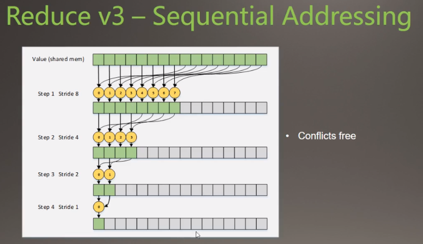

4. 改进4

   在把数据移到共享内存的过程中实现一部分规约操作
   
   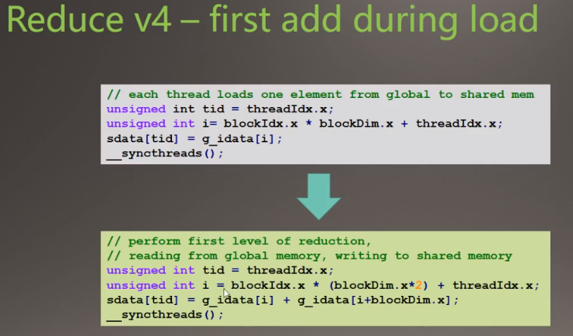

#### 其他优化手段

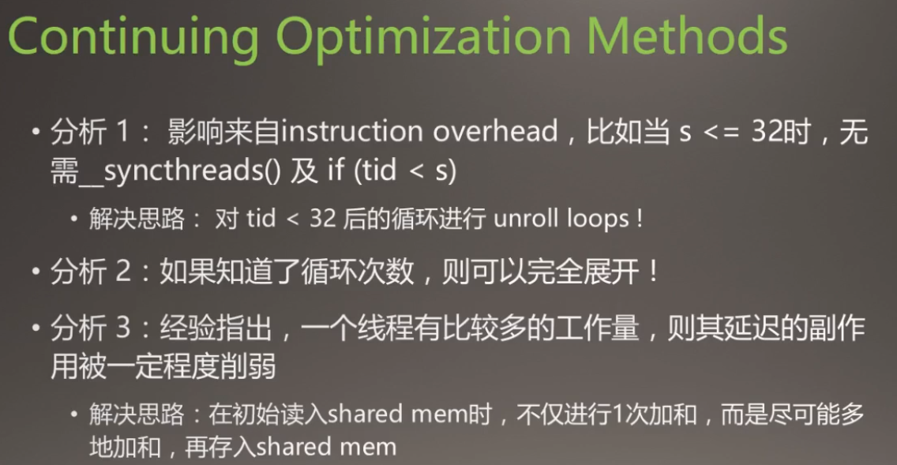

#### TIPs

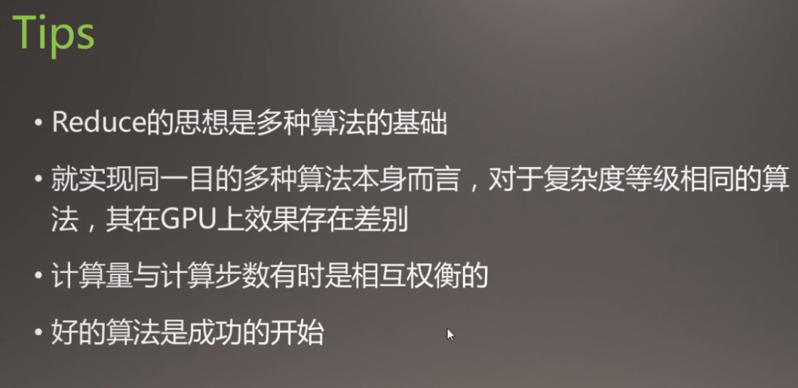

# 书籍推荐

不推荐买书，因为CUDA更新得快，看文档就好了

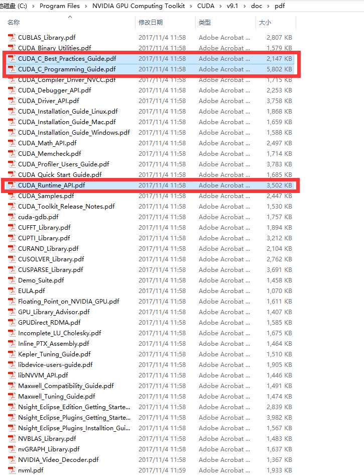

