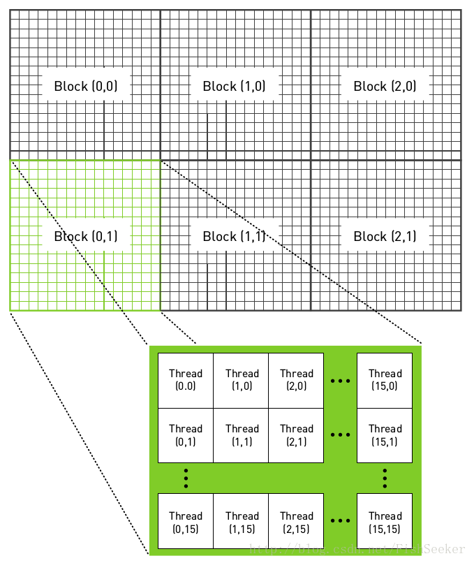
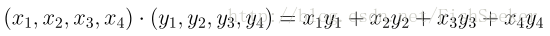
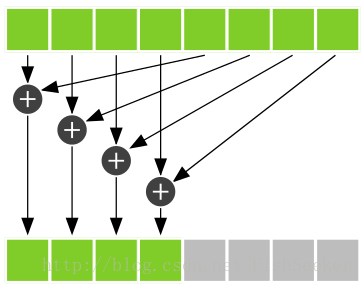

**第四章 CUDA C 并行编程、第五章线程协作**

CUDA C并行编程、线程协作、GPU逻辑结构、配置线程、共享内存与同步、二维线程块实现波纹、共享内存实现点积

[GitHub](<https://github.com/littlebearsama/CUDA-notes>)

建议下载下来用Typora软件阅读markdown文件

<!--more-->

作者github:littlebearsama [原文链接](https://github.com/littlebearsama/CUDA-notes/tree/master/1.CUDA_by-example)

**(建议下载Typora来浏览markdown文件)**

# 第四章 CUDA C 并行编程

```C++
#include<stdio.h>

#define N   10

__global__ void add( int *a, int *b, int *c ) {
    int tid = blockIdx.x;    // this thread handles the data at its thread id
    if (tid < N)
        c[tid] = a[tid] + b[tid];
}

int main( void ) {
    int a[N], b[N], c[N];
    int *dev_a, *dev_b, *dev_c;

    // allocate the memory on the GPU
    cudaMalloc( (void**)&dev_a, N * sizeof(int) );
    cudaMalloc( (void**)&dev_b, N * sizeof(int) );
    cudaMalloc( (void**)&dev_c, N * sizeof(int) );

    // fill the arrays 'a' and 'b' on the CPU
    for (int i=0; i<N; i++) {
        a[i] = -i;
        b[i] = i * i;
    }

    // copy the arrays 'a' and 'b' to the GPU
    cudaMemcpy( dev_a, a, N * sizeof(int),
                              cudaMemcpyHostToDevice );
    cudaMemcpy( dev_b, b, N * sizeof(int),
                              cudaMemcpyHostToDevice );

    add<<<N,1>>>( dev_a, dev_b, dev_c );

    // copy the array 'c' back from the GPU to the CPU
    cudaMemcpy( c, dev_c, N * sizeof(int),
                              cudaMemcpyDeviceToHost );

    // display the results
    for (int i=0; i<N; i++) {
        printf( "%d + %d = %d\n", a[i], b[i], c[i] );
    }

    // free the memory allocated on the GPU
    cudaFree( dev_a );
    cudaFree( dev_b );
    cudaFree( dev_c );
    return 0;
}
```

- 调用cudaMalloc()在**设备上**为三个数组分配内存。
- 使用完GPU后调用cudaFree()来释放他们。
- 通过cudaMemcpy()进行主机与设备之间复制数据。


# 第五章 线程协作

## 1.GPU逻辑结构

- CUDA的**软件架构**由网格（Grid）、线程块（Block）和线程（Thread）组成，

  相当于把GPU上的计算单元分为若干（2~3）个网格，

  每个网格内包含若干（65535）个线程块，

  每个线程块包含若干（512）个线程，

  三者的关系如下图：

  


## 2.线程索引（ID）定位

**作用：**

线程ID用来定位线程，根据线程ID来给各个线程分配数据以及其他操作。

计算线程ID需要通过本线程的各个内建变量来计算被调用核函数所进入的线程ID.

**内建变量：**

1. **threadIdx(.x/.y/.z代表几维索引)**：线程所在block中各个维度上的线程号

2. **blockIdx(.x/.y/.z代表几维索引)**：块所在grid中各个维度上的块号

3. **blockDim(.x/.y/.z代表各维度上block的大小)**：

   block的大小即block中线程的数量，

   blockDim.x代表块中x轴上的线程数量，

   blockDim.y代表块中y轴上的线程数量，

   blockDim.z代表块中z轴上的线程数量

4. **gridDim(.x/.y/.z代表个维度上grid的大小)**：

   grid的大小即grid中block的数量，

   gridDim.x代表grid中x轴上块的数量，

   gridDim.y代表grid中y轴上块的数量，

   gridDim.z代表grid中z轴上块的数量

  **定义grid、block大小：**
  dim3 numBlock(m,n)
  dim3 threadPerBlock(i,j)
  则blockDim.x=i; blockDim.y=j; gridDim.x=m; gridDim.y=n

  **kernel调用：**
  kernel<<<numBlock,threadPerBlock>>>(a,b)
  这是调用kernel时的参数，尖括号<<<>>>中第一个参数代表启动的线程块的数量，第二个参数代表每个线程块中线程的数量。

  **总的线程号：**
  设线程号为tid,以下讨论几种调用情况下的tid的值，这里只讨论一维／二维的情况

  **一维：**
  １．kernel<<<1,N>>>()
  block和thread都是一维的，启动一个block，里面有N个thread，１维的。**tid=threadIdx.x**

  ２．kernel<<<N,1>>>()
  启动N个一维的block，每个block里面１个thread。**tid=blockIdx.x**

  ３．kernel<<<M,N>>>()
  启动Ｍ个一维的block，每个block里面N个一维的thread。**tid=threadIdx.x+blockIdx.x * blockDim.x**

### 一般如何配置线程？

1. kernel<<<M,N>>>() M，N为1维度

   输入数据numbers，设定每个线程块有N=128或256或512个线程，一般设为128。

   计算应该设置的线程块M=（numbers+N-1）/N，向上取整；线程块是数量不能超过65535，这是一种硬件限制，如果启动的线程块数量超过了这一限值，那么程序将运行失败。

 [ **二维：**](https://blog.csdn.net/u011426016/article/details/103119169)
dim3 grid(4, 4, 1), block(4, 4, 1);

一维索引：

```C++
__global__ void vector_add(float* vec1, float* vec2, float* vecres, int length) {
    // 在第几个块中 * 块的大小 + 块中的x, y维度（几行几列）
    int tid = (blockIdx.y * gridDim.x + blockIdx.x) * (blockDim.x * blockDim.y) + threadIdx.y * blockDim.y + threadIdx.x;
    if (tid < length) {
        vecres[tid] = vec1[tid] + vec2[tid];
    }
}
```

二维索引：

```C++
__global__ void vector_add(float** mat1, float** mat2, float** matres, int width) {
    int x = blockIdx.x * blockDim.x + threadIdx.x;
    int y = blockIdx.y * blockDim.y + threadIdx.y;
    if (x < width && y < width) {
        matres[x][y] = mat1[x][y] + mat2[x][y];
    }
}
```


### tid<N

公式M=（numbers+N-1）/N保证了启动了足够多的线程,当输入数据numbers不是线程块里面线程数N的整数倍时,将启动过多线程。

为了防止启动过多线程：**在核函数中，在访问输入数组和输出数组之前，必须检查线程的偏移（索引）tid是否位于0到N之间**

```C++
if(tid<N)
	c[tid]=a[tid]+b[tid];
```

**因此，当索引越过数组边界时**，例如当启动并行线程数量不是线程块中线程的数目N（128）就会出现这种情况，那么核函数将自动停止执行计算。**更重要的是，核函数不会对越过数组边界的内存进行读取或写入。**

- 简单来说就是启动了充足的线程，而有的线程不用工作，为了防止核函数不会出现越界读取等错误，我们使用了条件判断if（tid<N）。

### 当数据大于运行线程时

因为数据数目大于线程数目，所以正在运行的所有线程都可能会再被执行，直到所有数据处理完毕。所以`while(tid<N)`不仅仅用于判断线程ID tid，是否执行线程。也用于循环。

添加语句`tid+=blockDim.x*gridDim.x;`增加的值等于**每个线程块中的线程数量乘以线程网格中线程块的数量**，在上面的线程分配(一维的线程格，一维的线程块)中为`blockDim.x*gridDim.x`

故核函数被改写为

```C++
__global__ void add( int *a, int *b, int *c ) {
    int tid = threadIdx.x+blockIdx.x*blockDim.x;    // this thread handles the data at its thread id
    while (tid < N)
        c[tid] = a[tid] + b[tid];
    	tid+=blockDim.x*gridDim.x;//新增的
}
```

## 3.二维的线程格，二维的线程块（实现波纹效果）



```C++
__global__ void kernel( unsigned char *ptr, int ticks ) {
    // map from threadIdx/BlockIdx to pixel position
    int x = threadIdx.x + blockIdx.x * blockDim.x;
    int y = threadIdx.y + blockIdx.y * blockDim.y;
    int offset = x + y * blockDim.x * gridDim.x;

    // now calculate the value at that position
    float fx = x - DIM/2;
    float fy = y - DIM/2;
    float d = sqrtf( fx * fx + fy * fy );
    unsigned char grey = (unsigned char)(128.0f + 127.0f *
                                         cos(d/10.0f - ticks/7.0f) /
                                         (d/10.0f + 1.0f));    
    ptr[offset*4 + 0] = grey;
    ptr[offset*4 + 1] = grey;
    ptr[offset*4 + 2] = grey;
    ptr[offset*4 + 3] = 255;
}


dim3    blocks(DIM/16,DIM/16);
dim3    threads(16,16);
kernel<<<blocks,threads>>>( data.dev_bitmap, ticks );


```

- blocks和threads是两个二维变量
- 由于生成的是一幅图像，因此使用二维索引，并且每个线程都有唯一的索引`(x,y)`，这样可以很容易与输出图像中的像素一一对应起来。就是输出图像的像素索引`(x,y)`
- offset是数据的线程索引（被称为全局偏置）,该线程对应图像像素索引(x,y)也对应数据索引offset
- `(fx,fy)`=像素点`(x,y)`相对于图像中心点（DIM/2，DIM/2）位置，即把图像原点移到图像中心
- 加入线程块是一个16X16的线程数组，图像有DIMXDIM个像素，那么就需要启动DIM/16 x DIM/16个线程块，从而使每一个像素对应一个线程。
- GPU优势在于处理图像时比如1920X1080需要创建200万个线程，CPU无法完成这样的工作。

## 4.共享内存和同步

- 共享内存术语Shared Memory，是位于SM（流多处理器）中的特殊存储器。还记得SM吗，就是流多处理器，大核是也。
- 将关键字**`__share__`**添加到变量声明中，这将是这个变量**驻留**在**共享内存**中。
- block与block的线程无法通信
- 共享内存缓存区驻留在物理GPU上，而不是驻留在GPU以外的系统内存中。因此，**在访问共享内存时的延迟要远远低于访问普通缓存区的延迟**，使得共享内存像**每个线程块的高速缓存**或中间结果暂存器那样高效。
- **想要在线程之间通信，那么还需要一种机制来实现线程之间的同步**，例如，如果**线程A**将一个值写入到共享内存，并且我们希望**线程B**对这个值进行一些操作，那么只有当线程A写入操作完成后，线程B才能开始执行它的操作。**如果没有同步，那么将发生竞态条件**。

这里的例子是点积的例子，就是：


代码：

```C++
__global__ void dot(float *a, float *b, float *c) {
    __shared__ float cache[threadsPerBlock];
    int tid = threadIdx.x + blockIdx.x * blockDim.x;//全局偏移用来索引数据
    int cacheIndex = threadIdx.x;                   //共享内存缓存中的偏移就等于线程索引
    float temp = 0;
    while (tid < N) {
        temp += a[tid] * b[tid];                    //线程被执行的次数是未知的，数据最终被保存成temp并                                         
        tid += blockDim.x * gridDim.x;              //存入到threadsPerBlock维的cache中
    }
    cache[cacheIndex] = temp;
    __syncthreads();
    //归约运算
    int i = blockDim.x / 2;//取threadsPerBlock的一半作为i值
    while (i != 0) {
        if (cacheIndex < i)
            cache[cacheIndex] += cache[cacheIndex + i];
        
        __syncthreads();
        i /= 2;
    }
    //结束while()循环后，每个线程块都得到一个值。这个值位于cache[]的第一个元素中，并且就等于该线程中两两元素乘积的加和。然后，我们将这个值保存到全局内存并结束核函数。
    if (cacheIndex == 0)
        c[blockIdx.x] = cache[0];
}
```


1. `__shared__` float cache[threadsPerBlock];在共享内存中申请浮点数组，数组大小和线程块中线程数目相同**每个线程块都拥有该共享内存的私有副本。**
2. 共享内存缓存区cache将保存该block内每个线程计算的加和值。
3. **`__syncthreads();`**等待线程块里面的所有线程执行完毕，简称线程同步。确保线程块中的每个线程都执行完**`__syncthreads();`**前面的语句后才会执行下一语句。
4. 用规约运算，我们取threadsPerBlock的一半作为i值，只有索引小于这个值的线程才会执行。只有当线程索引小于i时，才可以把cache[]的两个数据项相加起来。**`__syncthreads()`**作用如下图（下图中是等待4个线程中的相加操作完成）。

​                            **假设cache[]中有8个元素，因此i的值为4。规约运算的其中一个步骤如下图所示**



5. **由于线程块之间无法通信**。只能将每个线程块算出来的值存出来,存到数组c中，最后会返回block数量个c，然后由cpu执行最后的加法。

- 当某些线程需要执行一条指令，而其他线程不需要执行时，**这种情况就称为线程发散（Thread Divergence）**。在正常环境中，发散的分支只会使得某些线程处于空闲状态，而其他线程将执行分支中的代码。但是在**`__syncthreads()`**情况中，线程发散造成的结果有些糟糕。CUDA架构将确保，除非线程块中的每个线程都执行了**`__syncthreads()`**，否则没有任何线程能执行**`__syncthreads()`**之后的指令。如果**`__syncthreads()`**位于发散分支中，一些线程将永远无法执行**`__syncthreads()`**。硬件将一直保持等待。
- 下面代码将使处理器挂起，因为GPU在等待某个永远无法发生的事件。

```C++
        if (cacheIndex < i){
            cache[cacheIndex] += cache[cacheIndex + i];
          __syncthreads();
          }
```


- 例子2（二维线程布置）基于共享内存的位图（略）                            