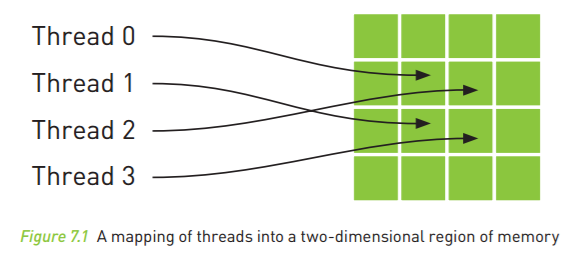
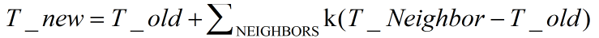
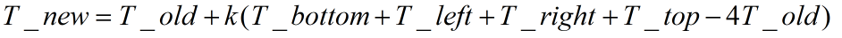

**第七章 纹理内存**

纹理内存、纹理内存实现热传导模拟

[GitHub](<https://github.com/littlebearsama/CUDA-notes>)

建议下载下来用Typora软件阅读markdown文件

<!--more-->

作者github:littlebearsama [原文链接](https://github.com/littlebearsama/CUDA-notes/tree/master/1.CUDA_by-example)

**(建议下载Typora来浏览markdown文件)**

# 第七章 纹理内存

- **纹理内存(Texture Memory)**和常量内存一样，纹理内存是另外一种类型的**只读内存**，在特定的访问模式中，纹理内存同样能够提升性能并减少内存流量。
- 虽然纹理内存最初是针对传统的图形处理应用程序而设计的，但在某些GPU计算应用程序中同样非常有用。
- 与常量内存类似的是，**纹理内存同样缓存在芯片上（利用了芯片上的缓存加速）！！！**，因此在某些情况中，它能够减少对内存的请求并提供更高效的内存带宽。
- **纹理缓存**是专门为那些**在内存访问模式中存在大量空间局部性（Spatial Locality）**的图形应用程序而设计的。在某个计算应用程序中，这意味着一个线程**读取的位置**可能与**邻近**的线程的**读取位置**非常接近



上图中，从数学角度来看，图中的四个地址并非连续的，在一般的CPU缓存模式中，这些地址将不会缓存。但由于GPU纹理内存是专门为了加速这种访问模式而设计的，因此如果在这种情况中使用纹理内存而不是全局内存，那么将获得性能提升。

## 使用纹理内存实现热传导模拟

### 1.算法描述：

1. 环境是一个矩形网格，在网格中随机散布一些”热源“，热源有着不同的固定温度（该点处的温度不会变）
2. 在随时间递进的每个步骤中，我们假设热量在某个单元机器邻接单元之间”流动“/如果某个单元的温度比邻接单元的温度更高，那么热量将从邻接单元传导到该单元。
3. 我们对新单元中心温度的计算方法为，将单元与邻接单元的温差相加起来，加上原有温度：



4. 常量k表示模拟过程中热量的流动速率。k值越大，表示系统会更快地达到稳定温度，而k值越小，则温度梯度将存在更长时间。
5. 只考虑上下左右四个邻域的话讲上述式子展开有




### 2.实现流程：

1. 给定一个包含**初始输入温度的网格**，将其中作为热源的单元温度值复制到网格的相应单元中。这将覆盖这些单元之前计算出的温度，因此也就确保了”加热单元将保持恒温“这个条件。用下面代码中的`copy_const_kernel()`实现；
2. 给定一个**输入网格**，用上面公式计算出**输出网格**。用下面代码中的`blend_kernel()`实现；
3. 将输入网格和输出网格交换，为下一个计算步骤做好准备。当模拟下一个时间步时，在步骤2中计算得到的输出温度网格将成为步骤1中的输入温度网格。

### 3.代码：（使用的是二维纹理内存）

```C++
#include "cuda.h"
#include "../common/book.h"
#include "../common/image.h"

#define DIM 1024
#define PI 3.1415926535897932f
#define MAX_TEMP 1.0f
#define MIN_TEMP 0.0001f
#define SPEED   0.25f

// these exist on the GPU side
texture<float,2>  texConstSrc;
texture<float,2>  texIn;
texture<float,2>  texOut;

__global__ void blend_kernel( float *dst,
                              bool dstOut ) {
    // map from threadIdx/BlockIdx to pixel position
    //线程布置是二维线程格，二维线程块时的像素坐标索引，以及数据偏置
    int x = threadIdx.x + blockIdx.x * blockDim.x;
    int y = threadIdx.y + blockIdx.y * blockDim.y;
    int offset = x + y * blockDim.x * gridDim.x;

    float   t, l, c, r, b;
    //根据dstOut标志来看读取的输出部分的内存还是输出部分的内存
    if (dstOut) {              
        t = tex2D(texIn,x,y-1);
        l = tex2D(texIn,x-1,y);
        c = tex2D(texIn,x,y);
        r = tex2D(texIn,x+1,y);
        b = tex2D(texIn,x,y+1);
    } else {
        t = tex2D(texOut,x,y-1);
        l = tex2D(texOut,x-1,y);
        c = tex2D(texOut,x,y);
        r = tex2D(texOut,x+1,y);
        b = tex2D(texOut,x,y+1);
    }
    dst[offset] = c + SPEED * (t + b + r + l - 4 * c);
}

__global__ void copy_const_kernel( float *iptr ) {
    // map from threadIdx/BlockIdx to pixel position
    int x = threadIdx.x + blockIdx.x * blockDim.x;//将线程中的内部线程索引变量变成图像坐标
    int y = threadIdx.y + blockIdx.y * blockDim.y;
    int offset = x + y * blockDim.x * gridDim.x;//计算偏移

    float c = tex2D(texConstSrc,x,y);
    if (c != 0)
        iptr[offset] = c;//把热源温度复制到图像中(替换成原来的热源温度)
}

// globals needed by the update routine
struct DataBlock {
    unsigned char   *output_bitmap;
    float           *dev_inSrc;
    float           *dev_outSrc;
    float           *dev_constSrc;
    IMAGE           *bitmap;

    cudaEvent_t     start, stop;
    float           totalTime;
    float           frames;
};


// clean up memory allocated on the GPU
void cleanup( DataBlock *d ) 
{
    cudaUnbindTexture( texIn );
    cudaUnbindTexture( texOut );
    cudaUnbindTexture( texConstSrc );
    HANDLE_ERROR( cudaFree( d->dev_inSrc ) );
    HANDLE_ERROR( cudaFree( d->dev_outSrc ) );
    HANDLE_ERROR( cudaFree( d->dev_constSrc ) );

    HANDLE_ERROR( cudaEventDestroy( d->start ) );
    HANDLE_ERROR( cudaEventDestroy( d->stop ) );
}


int main( void ) {
    DataBlock   data;
    IMAGE bitmap_image( DIM, DIM );
    data.bitmap = &bitmap_image;
    data.totalTime = 0;
    data.frames = 0;
    HANDLE_ERROR( cudaEventCreate( &data.start ) );
    HANDLE_ERROR( cudaEventCreate( &data.stop ) );

    int imageSize = bitmap_image.image_size();

    HANDLE_ERROR( cudaMalloc( (void**)&data.output_bitmap,
                               imageSize ) );

    // assume float == 4 chars in size (ie rgba)
    HANDLE_ERROR( cudaMalloc( (void**)&data.dev_inSrc,
                              imageSize ) );
    HANDLE_ERROR( cudaMalloc( (void**)&data.dev_outSrc,
                              imageSize ) );
    HANDLE_ERROR( cudaMalloc( (void**)&data.dev_constSrc,
                              imageSize ) );
    //通道格式描述符
    cudaChannelFormatDesc desc = cudaCreateChannelDesc<float>();
    HANDLE_ERROR( cudaBindTexture2D( NULL, texConstSrc,
                                   data.dev_constSrc,
                                   desc, DIM, DIM,
                                   sizeof(float) * DIM ) );

    HANDLE_ERROR( cudaBindTexture2D( NULL, texIn,
                                   data.dev_inSrc,
                                   desc, DIM, DIM,
                                   sizeof(float) * DIM ) );

    HANDLE_ERROR( cudaBindTexture2D( NULL, texOut,
                                   data.dev_outSrc,
                                   desc, DIM, DIM,
                                   sizeof(float) * DIM ) );

    // initialize the constant data
    float *temp = (float*)malloc( imageSize );
    for (int i=0; i<DIM*DIM; i++) {
        temp[i] = 0;
        int x = i % DIM;
        int y = i / DIM;
        if ((x>300) && (x<600) && (y>310) && (y<601))
            temp[i] = MAX_TEMP;
    }
    temp[DIM*100+100] = (MAX_TEMP + MIN_TEMP)/2;
    temp[DIM*700+100] = MIN_TEMP;
    temp[DIM*300+300] = MIN_TEMP;
    temp[DIM*200+700] = MIN_TEMP;
    for (int y=800; y<900; y++) {
        for (int x=400; x<500; x++) {
            temp[x+y*DIM] = MIN_TEMP;
        }
    }
    HANDLE_ERROR( cudaMemcpy( data.dev_constSrc, temp,
                              imageSize,
                              cudaMemcpyHostToDevice ) );    

    // initialize the input data
    for (int y=800; y<DIM; y++) {
        for (int x=0; x<200; x++) {
            temp[x+y*DIM] = MAX_TEMP;
        }
    }
    HANDLE_ERROR( cudaMemcpy( data.dev_inSrc, temp,
                              imageSize,
                              cudaMemcpyHostToDevice ) );
    free( temp );

    int ticks=0;
    bitmap_image.show_image(30);
    while(1)
    {
        HANDLE_ERROR( cudaEventRecord( data.start, 0 ) );
        dim3    blocks(DIM/16,DIM/16);
        dim3    threads(16,16);
        IMAGE  *bitmap = data.bitmap;

        // since tex is global and bound, we have to use a flag to
        // select which is in/out per iteration
        volatile bool dstOut = true;
        for (int i=0; i<90; i++) {
            float   *in, *out;
            if (dstOut) {
                in  = data.dev_inSrc;
                out = data.dev_outSrc;
            } else {
                out = data.dev_inSrc;
                in  = data.dev_outSrc;
            }
            copy_const_kernel<<<blocks,threads>>>( in );
            blend_kernel<<<blocks,threads>>>( out, dstOut );
            dstOut = !dstOut;
        }
        float_to_color<<<blocks,threads>>>( data.output_bitmap,
                                            data.dev_inSrc );

        HANDLE_ERROR( cudaMemcpy( bitmap->get_ptr(),
                                data.output_bitmap,
                                bitmap->image_size(),
                                cudaMemcpyDeviceToHost ) );

        HANDLE_ERROR( cudaEventRecord( data.stop, 0 ) );
        HANDLE_ERROR( cudaEventSynchronize( data.stop ) );
        float   elapsedTime;
        HANDLE_ERROR( cudaEventElapsedTime( &elapsedTime,
                                            data.start, data.stop ) );
        data.totalTime += elapsedTime;
        ++data.frames;
        printf( "Average Time per frame:  %3.1f ms\n",
                data.totalTime/data.frames  );

        ticks++;
        char key = bitmap_image.show_image(30);
        if(key==27)
        {
            break;
        }
    }

    cleanup(&data);
    return 0;
}


```

### 4.代码解析（下面是使用一维纹理内存的解析）

- 1.**申请纹理内存**：使用了浮点类型纹理内存的**引用**；**纹理内存必须声明为文件作用域内的全局变量！**

  ```C++
  //这些变量位于GPU上
  texture<float>  texConstSrc;
  texture<float>  texIn;
  texture<float>  texOut;
  
  ```

- **2.申请GPU全局内存**：下面代码为这三个缓存区分配了**GPU内存（全局内存）**,data.dev_inSrc等三个指针已经在结构对象data中声明了。

```C++
    HANDLE_ERROR( cudaMalloc( (void**)&data.dev_inSrc,
                              imageSize ) );
    HANDLE_ERROR( cudaMalloc( (void**)&data.dev_outSrc,
                              imageSize ) );
    HANDLE_ERROR( cudaMalloc( (void**)&data.dev_constSrc,
                              imageSize ) );

```

- **3.纹理内存与GPU全局内存绑定**：需要通过`cudaBindTexture()`将这些变量（上面的**纹理内存引用**）绑定到**内存缓冲区**。相当于告诉CUDA运行时两件事情：

  a. **指定的缓冲区**作为**纹理**来使用

  b.**纹理引用**作为纹理的"名字"

```C++
    HANDLE_ERROR( cudaBindTexture( NULL, texConstSrc,
                                   data.dev_constSrc,
                                   imageSize ) );
    HANDLE_ERROR( cudaBindTexture( NULL, texIn,
                                   data.dev_inSrc,
                                   imageSize ) );
    HANDLE_ERROR( cudaBindTexture( NULL, texOut,
                                   data.dev_outSrc,
                                   imageSize ) );

```

- **4.使用内置函数tex1Dfetch()**：当读取**核函数中**的纹理时，需要通过特殊的**函数**来告诉GPU**将读取请求转发到纹理内存而不是标准的全局内存**。`tex1Dfetch()`它是一个**编译器内置函数（Instrinsic）**。
- **5.使用二维纹理内存**：性能与一维的基本相同，但代码更简单。在使用内置函数**tex2Dfetch()**，读取缓存区中的数据时，不用计算缓存区中的线性偏置，而是可以直接用计算的像素索引x，y，**这样使得代码更为简洁，并且能自动处理边界问题**。
- **6.通道格式描述符**：在绑定二维纹理内存时，CUDA运行时要求提供一个**`cudaChanelFormatDesc()`**。在二维纹理内存的代码包含了一个对通道格式描述符的声明(Channel Format Descriptor)。在这里可以使用默认的参数，并且只要指定需要的是一个浮点描述符。然后我们通过1.**`cudaBindTexture2D()`**,2.纹理内存的位数（DIMXDIM）以及3.通道格式描述（desc）将这三个输入缓冲区绑定为二维纹理，main()函数其他部分保持不变。

## 纹理采样器（Texture Sampler），找不到该部分的内容？

如果使用了纹理采样器自动执行某种转换，那么纹理内存还能带来额外的加速。