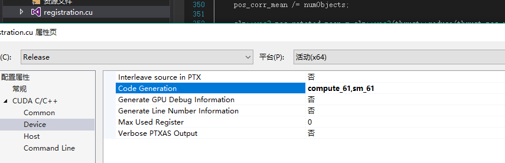

**第九章 原子性**

计算功能集、原子操作、计算直方图

[GitHub](<https://github.com/littlebearsama/CUDA-notes>)

建议下载下来用Typora软件阅读markdown文件

<!--more-->

作者github:littlebearsama [原文链接](https://github.com/littlebearsama/CUDA-notes/tree/master/1.CUDA_by-example)

**(建议下载Typora来浏览markdown文件)**

# 第九章 原子性

## 1.计算功能集

- 不同架构的CPU有着不同的功能和指令集（例如MMX、SSE(70条指令)、SSE2(使用了144个新增指令)等）
- 对于支持CUDA的不同图形处理器来说同样如此。NVIDIA将GPU支持的各种功能统称为**计算功能集（Compute Capability）**。

#### 基于最小功能集的编译

- 要支持全局内存原子操作，**计算功能集的最低版本为1.1**
- 当编译代码时，你需要告诉编译器：如果硬件支持的计算功能集版本低于1.1，那么将无法运行这个核函数。
- 要将这个信息告诉编译器，只需在调用NVCC时增加一个命令行选项：`nvcc -arch=sm_11`
- 当设置的计算能力比硬件本身高比如计算能力是6.1的（1080TI），设置 compute=62，sm=62 会出现错误，kernel不会被执行。
- 在.cu文件设置自己硬件的计算能力，如果不去设置或者去设置比较低的计算能力，比如设置compute_30,sm_30，那么自然地编译出来的程序的性能就会打折扣。



## 2.原子操作

示例：

x++；包含三步操作：a.读取x中的值；b.将步骤1中读到的值增加1；c.将递增后的结果写回到x。

现在考虑线程A和B都需要执行上面三个操作，**如果线程调度方式不正确，那么最终将（可能，因为六个步骤也可能会排出正确的结果）得到错误的结果**；

解决：

- 我们需要通过某种方式**一次性执行完读取-修改-写入这三个操作**，并且在执行过程中不会被其他线程所中断。**我们将满足这些条件限制的操作称为原子操作**。
- CUDA C支持多种原子操作，当有数千个线程在内存访问上发生竞争时，这些操作能够确保在内存上实现安全的操作。

## 3.计算直方图

概念：给定一个包含一组元素的数据集，直方图表示每个元素出现的频率。

在利用cpu实现的程序中，统计函数是：

```C++
	//统计
    for (int i=0; i<SIZE; i++)
        histo[buffer[i]]++;

```

**在GPU计算中，计算输入数组的直方图存在一个问题，即多个线程同时对输出直方图的同一个元素进行递增。在这种情况下，我们需要通过原子的递增操作来避免上面提到的问题**。

### 1.GPU代码：

```C++
//声明变量
 	unsigned int *dev_histo;
    HANDLE_ERROR( cudaMalloc( (void**)&dev_histo,
                              256 * sizeof( int ) ) );
    //代码块内的变量一定要手动初始化
	HANDLE_ERROR( cudaMemset( dev_histo, 0,
                              256 * sizeof( int ) ) );
...............
__global__ void histo_kernel( unsigned char *buffer,
                              long size,
                              unsigned int *histo ) {
    int i = threadIdx.x + blockIdx.x * blockDim.x;
    int stride = blockDim.x * gridDim.x;
    while (i < size) {
        atomicAdd( &histo[buffer[i]], 1 );
        i += stride;
    }
}
..............
    
    // kernel launch - 2x the number of mps gave best timing
    cudaDeviceProp  prop;
    HANDLE_ERROR( cudaGetDeviceProperties( &prop, 0 ) );
    int blocks = prop.multiProcessorCount;
    histo_kernel<<<blocks*2,256>>>( dev_buffer, 
                                    SIZE, 
                                   dev_histo );

```

- 这里的atomicAdd就是同时只能有一个线程操作，防止了其他线程的骚操作。
- 引入了一个新的CUDA运行时函数，**`cudaMemset()`**函数，用于**内存空间初始化**。
- 由于直方图包含了256个元素，因此可以在每个线程块中包含256个线程
- 通过一些性能实验，我们发现当线程块的数量为GPU数量的2倍是，将达到最佳性能。
- 由于核函数中只包含非常少的计算工作，因此很可能是全局内存上的原子操作导致性能的降低，**当数千个线程尝试访问少量的内存位置是，将发生大量的竞争**。

### 2.改进版：

- 使用**共享内存**和**全局内存原子操作**的直方图核函数

```C++
#define SIZE    (100*1024*1024)


__global__ void histo_kernel( unsigned char *buffer,
                              long size,
                              unsigned int *histo ) {

    __shared__  unsigned int temp[256];//声明一个共享缓冲区
    temp[threadIdx.x] = 0;             //将清除内存，每个线程写一次，由于我们在核函数设置启动线程中
    								   //为每个block分配了256个线程，所以很容易清除累计缓冲区temp。
    __syncthreads();

    int i = threadIdx.x + blockIdx.x * blockDim.x;
    int stride = blockDim.x * gridDim.x;//因为线程数没有数据多所以要设定步长（步长为分配的线程数目）
    while (i < size) {
        atomicAdd( &temp[buffer[i]], 1 );
        i += stride;
    }

    __syncthreads();
    atomicAdd( &(histo[threadIdx.x]), temp[threadIdx.x] );
}

·············
    cudaDeviceProp  prop;
    HANDLE_ERROR( cudaGetDeviceProperties( &prop, 0 ) );
    int blocks = prop.multiProcessorCount;
    histo_kernel<<<blocks*2,256>>>( dev_buffer,
                                    SIZE, 
                                   dev_histo );

```

- 在共享内存中计算这些直方图，这将避免每次将写入操作从芯片发送到DRAM，现在只有256个线程在256个地址上发生竞争，这将极大地减少在全局内存中数千个线程之间发生竞争的情况。