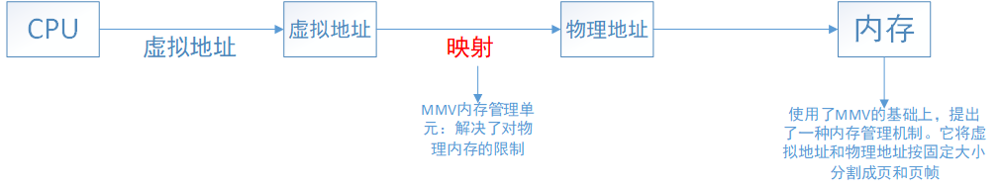
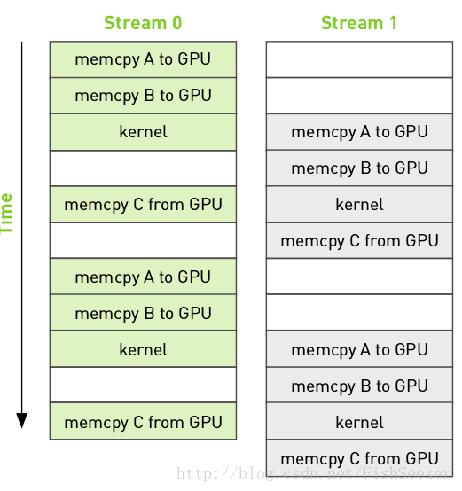
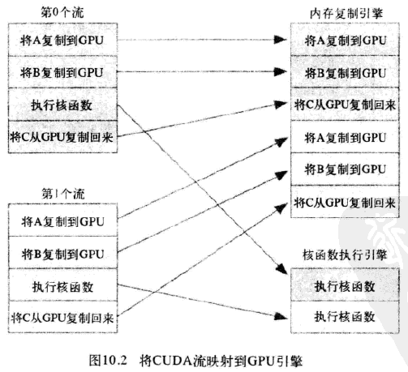
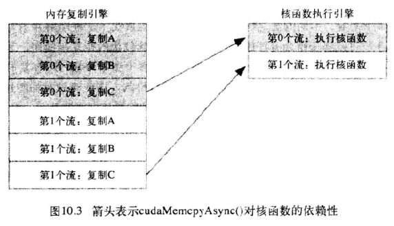
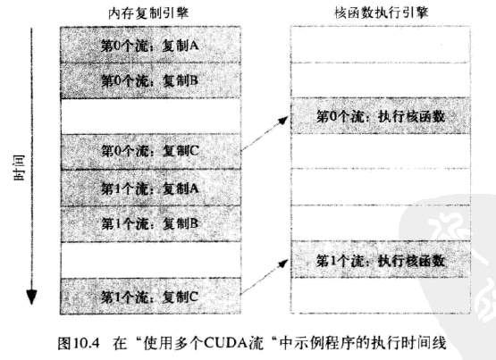
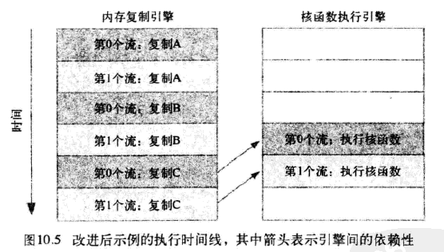

**第十章 流**

页锁定主机内存、CUDA流、GPU工作调度机制

[GitHub](<https://github.com/littlebearsama/CUDA-notes>)

建议下载下来用Typora软件阅读markdown文件

<!--more-->

作者github:littlebearsama [原文链接](https://github.com/littlebearsama/CUDA-notes/tree/master/1.CUDA_by-example)

**(建议下载Typora来浏览markdown文件)**

# 第十章 流

**通过CUDA流在GPU上用任务并行**

## 页锁定主机内存

两个**主机内存**分配函数：

1. **标准C库函数`malloc()`**在主机上分配内存
2. **CUDA运行时**提供自己独有的机制来分配**主机内存**：**`cudaHostAlloc()`**。

两个函数分配的**内存之间的差异**：

1. **`malloc()`**将分配标准的，可分页的（Pagable）主机内存，
2. **`cudaHostAlloc()`**将分配页锁定的主机内存（固定内存）

### 页锁定主机内存

页锁定主机内存也称为**固定内存（Pinned Memory）**或者不可分内存。

1. 对于固定内存，**操作系统将不会对这块内存分页交换到磁盘上，从而确保了该内存始终驻留在物理内存中。因此，操作系统能够安全地使用某个程序访问该内存的物理地址，因为这块内存将不会被破坏或者重新定位。**--->物理地址固定不变。
2. 由于知道内存的物理地址，因此可以通过“**直接内存访问**(Direct Memory Access,DMA)”技术来在GPU和主机之间复制数据。DMA操作在可分页内存中可能会延迟--->DMA复制过程中使用固定内存非常重要，**页锁定主机内存（固定内存）的性能比标准可分页的性能要高大约2倍。**

实际上并不是说使用固定内存就好




3. 固定内存是一把双刃剑。**但是用固定内存时，你将失去虚拟内存的所有功能。**应用程序中使用每个固定内存时都需要**分配物理内存**，因为这些内存不能交换到磁盘上。--->意味着系统更快地耗尽内存。

4. 使用情况：仅对`cudaMemcpy()`调用中的源内存或者目标内存，才使用也锁存内存，并且不再需要他们时立即释放，而不是等到程序关闭才释放。

5. 页锁定内存的作用不仅限于性能的提升，后面章节会看到，在一些特殊情况中也需要使用页锁定内存。

6. 调用：

   ```C++
   	
   	#define SIZE    (64*1024*1024)
   	int             *a；
   	int size = SIZE;
   	//CUDA运行时申请固定内存
       HANDLE_ERROR( cudaHostAlloc( (void**)&a,
                                    size * sizeof( *a ),
                                    cudaHostAllocDefault ) );
   
   ```

   

## 计算带宽

```C++
float           MB = (float)100*SIZE*sizeof(int)/1024/1024;//SIZE=(64*1024*1024)
printf( "\tMB/s during copy up:  %3.1f\n",
            MB/(elapsedTime/1000) );//elapsedTime=用时

```


## CUDA流

- **CUDA流表示一个操作GPU队列**
- 该队列的操作将以指定的顺序执行。我们可以在流中添加一些操作，例如启动核函数，内存复制，以及事件的启动和结束等。
- **可以将流视为GPU上的一个任务，并且这些任务可以并行执行**。

### 设备重叠功能的GPU

支持设别重叠功能的GPU能在**执行一个CUDA C核函数**的同时，还能在**设备与主机之间执行复制操作**。可以使用多个流来实现这种计算与数据传输的重叠。

### 使用流

```C++
#include "../common/book.h"

#define N   (1024*1024)
#define FULL_DATA_SIZE   (N*20)

//核函数N个线程，每次处理N个数
__global__ void kernel( int *a, int *b, int *c ) {
    int idx = threadIdx.x + blockIdx.x * blockDim.x;
    if (idx < N) {
        int idx1 = (idx + 1) % 256;
        int idx2 = (idx + 2) % 256;
        float   as = (a[idx] + a[idx1] + a[idx2]) / 3.0f;
        float   bs = (b[idx] + b[idx1] + b[idx2]) / 3.0f;
        c[idx] = (as + bs) / 2;
    }
}
        

int main( void ) {
    cudaDeviceProp  prop;
    int whichDevice;
    HANDLE_ERROR( cudaGetDevice( &whichDevice ) );
    HANDLE_ERROR( cudaGetDeviceProperties( &prop, whichDevice ) );
    //判断：支持设别重叠功能
    if (!prop.deviceOverlap) {
        printf( "Device will not handle overlaps, so no speed up from streams\n" );
        return 0;
    }
	//创建事件和流
    cudaEvent_t     start, stop;
    float           elapsedTime;

    cudaStream_t    stream;
    int *host_a, *host_b, *host_c;
    int *dev_a, *dev_b, *dev_c;

    // start the timers
    HANDLE_ERROR( cudaEventCreate( &start ) );
    HANDLE_ERROR( cudaEventCreate( &stop ) );

    // initialize the stream
    HANDLE_ERROR( cudaStreamCreate( &stream ) );


    // 分配设备内存，只申请了20分之一的数据量大小的内存
    HANDLE_ERROR( cudaMalloc( (void**)&dev_a,
                              N * sizeof(int) ) );
    HANDLE_ERROR( cudaMalloc( (void**)&dev_b,
                              N * sizeof(int) ) );
    HANDLE_ERROR( cudaMalloc( (void**)&dev_c,
                              N * sizeof(int) ) );


    // 在这里申请固定内存不仅仅是为了让复制操作执行得更快
    // 要以异步的方式在主机和设备之间复制数据必须是固定内存
    // 申请内存大小为数据大小
    HANDLE_ERROR( cudaHostAlloc( (void**)&host_a,
                              FULL_DATA_SIZE * sizeof(int),
                              cudaHostAllocDefault ) );
    HANDLE_ERROR( cudaHostAlloc( (void**)&host_b,
                              FULL_DATA_SIZE * sizeof(int),
                              cudaHostAllocDefault ) );
    HANDLE_ERROR( cudaHostAlloc( (void**)&host_c,
                              FULL_DATA_SIZE * sizeof(int),
                              cudaHostAllocDefault ) );
    // 填充申请的缓冲区host_a，host_b
    for (int i=0; i<FULL_DATA_SIZE; i++) {
        host_a[i] = rand();
        host_b[i] = rand();
    }

    HANDLE_ERROR( cudaEventRecord( start, 0 ) );
    // now loop over full data, in bite-sized chunks

	//我们不将输入缓冲区整体复制到GPU，而是将输入缓冲区划分成更小的块（分成20块），并在每个块上执行一个包含三个步骤的过程：
    //1.将一部分输入缓冲区复制到GPU ；2.在这部分缓冲区上运行核函数；3.然后将一部分输入缓冲区复制到GPU
	
    for (int i=0; i<FULL_DATA_SIZE; i+= N) {
        // copy the locked memory to the device, async
        // 将固定内存以异步的方式复制到设备上
        HANDLE_ERROR( cudaMemcpyAsync( dev_a, host_a+i,
                                       N * sizeof(int),
                                       cudaMemcpyHostToDevice,
                                       stream ) );
        HANDLE_ERROR( cudaMemcpyAsync( dev_b, host_b+i,
                                       N * sizeof(int),
                                       cudaMemcpyHostToDevice,
                                       stream ) );

        // 核函数带有流参数
        // 刚好N个线程N个数据，线程不需要多次工作
        kernel<<<N/256,256,0,stream>>>( dev_a, dev_b, dev_c );

        // 将数据从设备复制到锁定内存
        HANDLE_ERROR( cudaMemcpyAsync( host_c+i, dev_c,
                                       N * sizeof(int),
                                       cudaMemcpyDeviceToHost,
                                       stream ) );

    }
    // copy result chunk from locked to full buffer
    HANDLE_ERROR( cudaStreamSynchronize( stream ) );

    HANDLE_ERROR( cudaEventRecord( stop, 0 ) );

    HANDLE_ERROR( cudaEventSynchronize( stop ) );
    HANDLE_ERROR( cudaEventElapsedTime( &elapsedTime,
                                        start, stop ) );
    printf( "Time taken:  %3.1f ms\n", elapsedTime );

    // cleanup the streams and memory
    HANDLE_ERROR( cudaFreeHost( host_a ) );
    HANDLE_ERROR( cudaFreeHost( host_b ) );
    HANDLE_ERROR( cudaFreeHost( host_c ) );
    HANDLE_ERROR( cudaFree( dev_a ) );
    HANDLE_ERROR( cudaFree( dev_b ) );
    HANDLE_ERROR( cudaFree( dev_c ) );
    HANDLE_ERROR( cudaStreamDestroy( stream ) );
	getchar();
    return 0;
}
//Time taken:  25.4 ms

```

- 创建流和事件
- 分配好设备内存和主机内存
- 分块执行三个步骤
- 当for循环结束时，队列中应该包含了很多等待GPU执行的工作。如果想要确保GPU只能执行完了计算和内存复制等操作。那么就需要将**GPU与主机同步**。也就是说主机在继续执行之前要先等待GPU完成。调用**`cudaStreamSynchronize()`**并指定想要等待的流

### 主机与设备之间复制数据

1. `cudaMemcpy()`同步方式执行：意味着，当函数返回时，复制操作已经完成，并且在输出缓冲区包含了复制进去的内容。
2. 新函数`cudaMemcpyAsync()`异步方式执行：与同步方式相反，在调用该函数时，只是放置一个请求，表示在流中执行一次内存复制操作，这个流是通过函数stream来指定的。**当函数返回时，我们无法确保复制操作是否已经启动，更无法保证它是否已经结束。我们能够保证的是，复制操作肯定会当下一个被放入流中的操作之前执行**。
3. 任何一个传递给`cudaMemcpyAsync()`的主机内存指针都必须已经通过`cudaHostAlloc()`分配好内存。**你只能已异步方式对固定内存进行复制操作。**

### 带有流参数的核函数

此时核函数的调用**是异步的**。

## 使用多个流



改进思想：

1. 分块计算
2. 内存复制和核函数执行的重叠

- 上图中，第0个流执行：核函数时，在第1个流中执行：输入缓冲区复制到GPU......
- 在任何支持内存复制和核函数的执行相互重叠的设备上，当使用多个流是，应用程序的整体性能都会提升。

代码：

```C++
#include "../common/book.h"

#define N   (1024*1024)
#define FULL_DATA_SIZE   (N*20)


__global__ void kernel( int *a, int *b, int *c ) {
    int idx = threadIdx.x + blockIdx.x * blockDim.x;
    if (idx < N) {
        int idx1 = (idx + 1) % 256;
        int idx2 = (idx + 2) % 256;
        float   as = (a[idx] + a[idx1] + a[idx2]) / 3.0f;
        float   bs = (b[idx] + b[idx1] + b[idx2]) / 3.0f;
        c[idx] = (as + bs) / 2;
    }
}


int main( void ) {
    cudaDeviceProp  prop;
    int whichDevice;
    HANDLE_ERROR( cudaGetDevice( &whichDevice ) );
    HANDLE_ERROR( cudaGetDeviceProperties( &prop, whichDevice ) );
    if (!prop.deviceOverlap) {
        printf( "Device will not handle overlaps, so no speed up from streams\n" );
        return 0;
    }
	//事件
    cudaEvent_t     start, stop;
    float           elapsedTime;
	//流
	cudaStream_t    stream0, stream1;

    int *host_a, *host_b, *host_c;
    int *dev_a0, *dev_b0, *dev_c0;
    int *dev_a1, *dev_b1, *dev_c1;


    HANDLE_ERROR( cudaEventCreate( &start ) );
    HANDLE_ERROR( cudaEventCreate( &stop ) );
    HANDLE_ERROR( cudaStreamCreate( &stream0 ) );
    HANDLE_ERROR( cudaStreamCreate( &stream1 ) );

    // 申请内存
    HANDLE_ERROR( cudaMalloc( (void**)&dev_a0,
                              N * sizeof(int) ) );
    HANDLE_ERROR( cudaMalloc( (void**)&dev_b0,
                              N * sizeof(int) ) );
    HANDLE_ERROR( cudaMalloc( (void**)&dev_c0,
                              N * sizeof(int) ) );
    HANDLE_ERROR( cudaMalloc( (void**)&dev_a1,
                              N * sizeof(int) ) );
    HANDLE_ERROR( cudaMalloc( (void**)&dev_b1,
                              N * sizeof(int) ) );
    HANDLE_ERROR( cudaMalloc( (void**)&dev_c1,
                              N * sizeof(int) ) );
	
    //申请页锁定内存
    HANDLE_ERROR( cudaHostAlloc( (void**)&host_a,
                              FULL_DATA_SIZE * sizeof(int),
                              cudaHostAllocDefault ) );
    HANDLE_ERROR( cudaHostAlloc( (void**)&host_b,
                              FULL_DATA_SIZE * sizeof(int),
                              cudaHostAllocDefault ) );
    HANDLE_ERROR( cudaHostAlloc( (void**)&host_c,
                              FULL_DATA_SIZE * sizeof(int),
                              cudaHostAllocDefault ) );

	//初始化页锁定内存
    for (int i=0; i<FULL_DATA_SIZE; i++) {
        host_a[i] = rand();
        host_b[i] = rand();
    }

    HANDLE_ERROR( cudaEventRecord( start, 0 ) );
    // now loop over full data, in bite-sized chunks
    for (int i=0; i<FULL_DATA_SIZE; i+= N*2) {
        // stream0
        HANDLE_ERROR( cudaMemcpyAsync( dev_a0, host_a+i,
                                       N * sizeof(int),
                                       cudaMemcpyHostToDevice,
                                       stream0 ) );
        HANDLE_ERROR( cudaMemcpyAsync( dev_b0, host_b+i,
                                       N * sizeof(int),
                                       cudaMemcpyHostToDevice,
                                       stream0 ) );

        kernel<<<N/256,256,0,stream0>>>( dev_a0, dev_b0, dev_c0 );

        HANDLE_ERROR( cudaMemcpyAsync( host_c+i, dev_c0,
                                       N * sizeof(int),
                                       cudaMemcpyDeviceToHost,
                                       stream0 ) );


        // stream1
        HANDLE_ERROR( cudaMemcpyAsync( dev_a1, host_a+i+N,
                                       N * sizeof(int),
                                       cudaMemcpyHostToDevice,
                                       stream1 ) );
        HANDLE_ERROR( cudaMemcpyAsync( dev_b1, host_b+i+N,
                                       N * sizeof(int),
                                       cudaMemcpyHostToDevice,
                                       stream1 ) );

        kernel<<<N/256,256,0,stream1>>>( dev_a1, dev_b1, dev_c1 );


        HANDLE_ERROR( cudaMemcpyAsync( host_c+i+N, dev_c1,
                                       N * sizeof(int),
                                       cudaMemcpyDeviceToHost,
                                       stream1 ) );

    }
    //两个流都要将CPU与GPI同步。
    HANDLE_ERROR( cudaStreamSynchronize( stream0 ) );
    HANDLE_ERROR( cudaStreamSynchronize( stream1 ) );
	//
    HANDLE_ERROR( cudaEventRecord( stop, 0 ) );

    HANDLE_ERROR( cudaEventSynchronize( stop ) );
    HANDLE_ERROR( cudaEventElapsedTime( &elapsedTime,
                                        start, stop ) );
    printf( "Time taken:  %3.1f ms\n", elapsedTime );

    // cleanup the streams and memory
    HANDLE_ERROR( cudaFreeHost( host_a ) );
    HANDLE_ERROR( cudaFreeHost( host_b ) );
    HANDLE_ERROR( cudaFreeHost( host_c ) );
    HANDLE_ERROR( cudaFree( dev_a0 ) );
    HANDLE_ERROR( cudaFree( dev_b0 ) );
    HANDLE_ERROR( cudaFree( dev_c0 ) );
    HANDLE_ERROR( cudaFree( dev_a1 ) );
    HANDLE_ERROR( cudaFree( dev_b1 ) );
    HANDLE_ERROR( cudaFree( dev_c1 ) );


    HANDLE_ERROR( cudaStreamDestroy( stream0 ) );
    HANDLE_ERROR( cudaStreamDestroy( stream1 ) );


	getchar();
    return 0;
}

```

- 因为使用了两个流，for循环中处理的数据量为原来的两倍，步长为原来的两倍，程序处理的总数据量不变。

- 处理数据量是相同的，结果是一个流与两个流使用的时间差不多。

  一个流使用的时间是24.1ms～25.2ms，

  两个流使用的时间是：23.1～23.9ms，

  修改后代码使用时间为23.9ms～24.9ms

- 使用了流的确改善了执行时间，但是在一个流和多个流之间并没有明显的性能提高。

## GPU工作调度机制

- 程序员可以将流视为有序的操作序列，其中既包含内存复制操作，又包含核函数调用。
- 然而，硬件中并没有流的概念，而是**包含一个或多个引擎来执行内存复制操作**，以及**一个引擎来执行核函数**。这些引擎彼此独立地对操作进行排队。



应用程序首先将第0个流的所有操作放入队列，然后是第一个流的所有操作。CUDA驱动程序负责按照这些操作的顺序把他们调度到硬件上执行，这就维持了流内部的依赖性。图10.3说明了这些依赖性，**箭头表示复制操作要等核函数执行完成之后才能开始**。



于是得到这些操作在硬件上执行的时间线：




- 图中显示，**第0个流复制C**阻塞了**第1个流复制A,第一个流复制B**，导致**第0个流执行完核函数**还要等待内存复制引擎完成流0复制C，流1复制A，流1复制B的三个操作才能执行**流1核函数**

由于第0个流中将c复制回主机的操作要等待核函数执行完成，因此第1个流中将a和b复制到GPU的操作虽然是完全独立的，但却被**阻塞了，这是因为GPU引擎是按照指定的顺序来执行工作**。记住，硬件在处理内存复制和核函数执行时分别采用了不同的引擎，因此我们需要知道，将操作放入流队列中的顺序将影响着CUDA驱动程序调度这些操作以及执行的方式。

## 高效使用多个流

如果同时调度某个流的所有操作，那么很容易在无意中阻塞另一个流的复制操作或者核函数执行。要解决这个问题，在将操作放入流的队列时应采用宽度优先方式，而非深度优先方式。如下代码所示：

```C++
  for (int i=0; i<FULL_DATA_SIZE; i+= N*2) {
        // enqueue copies of a in stream0 and stream1
        HANDLE_ERROR( cudaMemcpyAsync( dev_a0, host_a+i,
                                       N * sizeof(int),
                                       cudaMemcpyHostToDevice,
                                       stream0 ) );
        HANDLE_ERROR( cudaMemcpyAsync( dev_a1, host_a+i+N,
                                       N * sizeof(int),
                                       cudaMemcpyHostToDevice,
                                       stream1 ) );
        // enqueue copies of b in stream0 and stream1
        HANDLE_ERROR( cudaMemcpyAsync( dev_b0, host_b+i,
                                       N * sizeof(int),
                                       cudaMemcpyHostToDevice,
                                       stream0 ) );
        HANDLE_ERROR( cudaMemcpyAsync( dev_b1, host_b+i+N,
                                       N * sizeof(int),
                                       cudaMemcpyHostToDevice,
                                       stream1 ) );

        // enqueue kernels in stream0 and stream1   
        kernel<<<N/256,256,0,stream0>>>( dev_a0, dev_b0, dev_c0 );
        kernel<<<N/256,256,0,stream1>>>( dev_a1, dev_b1, dev_c1 );

        // enqueue copies of c from device to locked memory
        HANDLE_ERROR( cudaMemcpyAsync( host_c+i, dev_c0,
                                       N * sizeof(int),
                                       cudaMemcpyDeviceToHost,
                                       stream0 ) );
        HANDLE_ERROR( cudaMemcpyAsync( host_c+i+N, dev_c1,
                                       N * sizeof(int),
                                       cudaMemcpyDeviceToHost,
                                       stream1 ) );
    }

```

如果内存复制操作的时间与核函数执行的时间大致相当，那么新的执行时间线将如图10.5所示，在新的调度顺序中，依赖性仍然能得到满足：



由于采用了宽度优先方式将操作放入各个流的队列中，因此第0个流对c的复制操作将不会阻塞第1个流对a和b的内存复制操作。这使得GPU能够并行的执行复制操作和核函数，从而使应用程序的运行速度显著加快。

- 实验结果表明，并没有改进性能，可能是**高版本的CUDA运行时已经对流和复制引擎等进行了优化（个人猜想）**