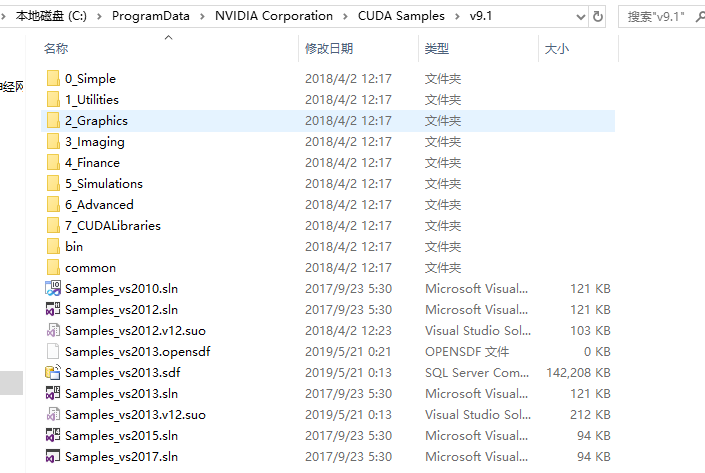

**第十二章 后记**

CUDA 工具

[GitHub](<https://github.com/littlebearsama/CUDA-notes>)

建议下载下来用Typora软件阅读markdown文件

<!--more-->

作者github:littlebearsama [原文链接](https://github.com/littlebearsama/CUDA-notes/tree/master/1.CUDA_by-example)

**(建议下载Typora来浏览markdown文件)**

# 第十二章 后记

## CUDA工具

1. CUFFT：快速傅立叶变换
2. CUBLAS：线性代数函数
3. 实例程序：NVIDIA GPU Computing SDK

4. NVIDIA性能原语（NPP）：高性能图像处理或视频应用程序
5. 调试工具NVIDIA Parallel Nsight

# 其他

## 设备信息

Device: <GeForce GTX 1080 Ti> canMapHostMemory: Yes

CUDA Capable: SM 6.1 hardware

28 Multiprocessor(s) x 128 (Cores/Multiprocessor) = 3584 (Cores)

