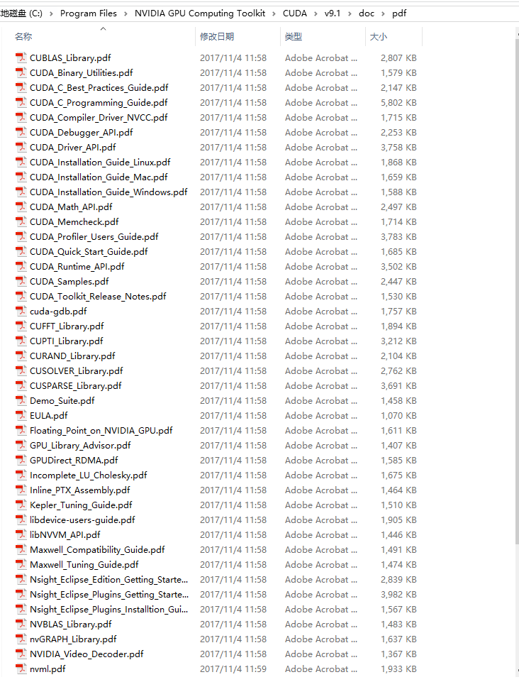
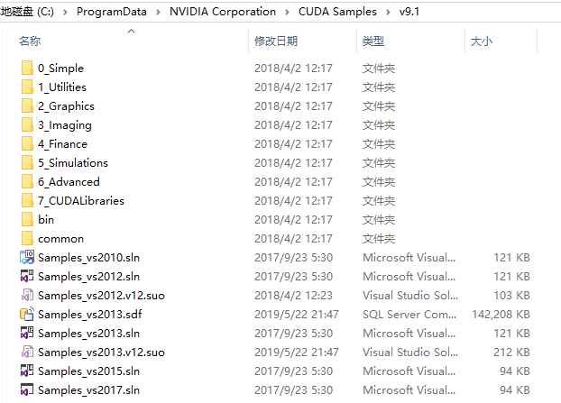
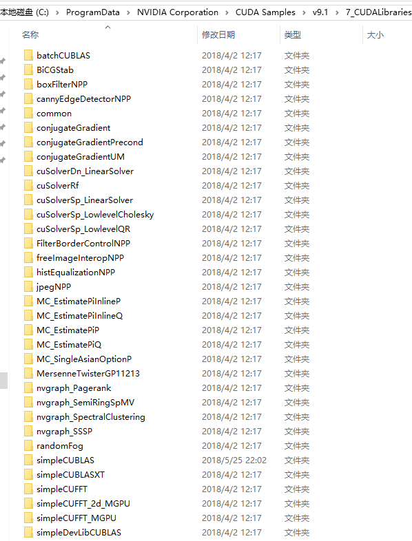

* 学习资源
* 简单总结如何写一个CUDA程序
* CUDA自带的库

<!--more-->

建议下载下来用Typora软件阅读markdown文件

## A.学习资源

1. 官方文档(安装cuda时自带的)

   

2. 自带例程

   例程中文介绍：[CUDA Samples](https://blog.csdn.net/fishseeker/article/details/76708830)

   

3. CUDA书籍与博客

   [书籍](https://github.com/littlebearsama/CUDA-notes)

   [博客](https://littlebearsama.github.io/tags/CUDA/)

## B.CUDA并行计算原理

CUDA程序运行可以简单理解为：主机代码在CPU中运行，在调用`__device__`和`__global__`核函数时，进入GPU运行（此时并不会中断主机代码的运行，除非在等待GPU出结果）。此时在设备中每个线程执行一个核函数。

## C.CUDA程序编写步骤

### 一、编写GPU运行的核函数

1. 根据数据的个数与数据形式（二维图像？三维点云？）来[**考虑线程配置**](<https://littlebearsama.github.io/2019/05/24/cuda/cudanote2/>)。

   在二维中：

   ```C++
   dim3    blocks(DIM/16,DIM/16);
   dim3    threads(16,16);
   ```

2. 核函数参数一般为：

   - 输入数组(指针形式)
   - 数组大小
   - 输出数组(指针形式)

3. 核函数中，根据**线程布置**来**确定线程索引tid**。而在二维线程格和二维线程块中，数据索引根据图像的xy坐标来确定。

   > ```C++
   > int x = threadIdx.x + blockIdx.x * blockDim.x;
   > int y = threadIdx.y + blockIdx.y * blockDim.y;
   > int offset = x + y * blockDim.x * gridDim.x;
   > ```

4. 核函数中，**设置线程索引判断条件,检测当前线程是否要工作**`while (tid < N)`或`if (tid < N)`。

5. 然后添加该线程执行的运算/函数。

6. 当数据大于运行线程时，在核函数中，添加语句`tid+=blockDim.x*gridDim.x;`增加的值等于**每个线程块中的线程数量乘以线程网格中线程块的数量**，在一维的线程格，一维的线程块线程分配中为`blockDim.x*gridDim.x`


### 二、给数据在GPU中分配内存

#### GPU内存类型：

#####  1.全局内存

GPU中用`cudaMalloc()`申请的GPU全局内存

##### 2.[共享内存](<https://littlebearsama.github.io/2019/05/24/cuda/cudanote2/>)

1. 简介

   规约运算是在核函数申请的共享内存。

   通过共享内存实现block内的线程通信，实现通信前要进行线程同步，否则会发生**竞态条件**，但是block和block之间的线程是无法互相通信的。

2. 细节

   * 使用该语句申请共享内存：`__shared__ float cache[threadsPerBlock];`
   * 将关键字**`__share__`**添加到变量声明中，这将是这个变量**驻留**在**共享内存**中。在访问共享内存时的延迟要远远低于访问普通缓存区的延迟**，使得共享内存像**每个线程块的高速缓存或中间结果暂存器那样高效
   * 每次对共享内存的数据进行操作时都要对线程块内的**线程同步**：` __syncthreads();`

3. 例程
   
   * 规约运算

##### 3.[常量内存](<https://littlebearsama.github.io/2019/05/24/cuda/cudanote3/>)-只读内存

1. 简介

   常量内存用于保存在核函数**执行期间不会发生变化的数据**。

   与从全局内存中读取数据相比，从常量内存中读取相同的数据可以节约带宽，原因有二：

   1. 对常量内存的单次读操作可以广播到其他的“邻近”线程，这将节约15次读取操作。
   2. 常量内存的数据将缓存(cache)起来，因此对相同地址的连续读操作将不会产生额外的内存通信量。

2. 细节

   * 在核函数外面，使用该语句申请常量内存：`__constant__ Sphere s[SPHERES];`
   * 常量内存为静态分配空间，所以不需要调用 `cudaMalloc()`, `cudaFree()`

3. 应用

   * 在光线追踪的程序中，将球面数组存入常量内存中。注意，处理图像使用二维的线程块和线程格。

##### 4.[纹理内存](<https://littlebearsama.github.io/2019/05/24/cuda/cudanote4/>)-只读内存

1. 简介

   **纹理内存(Texture Memory)**和常量内存一样，纹理内存是另外一种类型的**只读内存**，在特定的访问模式中，纹理内存同样能够提升性能并减少内存流量。

   **纹理内存同样缓存在芯片上（利用了芯片上的缓存加速）！！！**

   ！重点：**纹理缓存**是专门为那些**在内存访问模式中存在大量空间局部性（Spatial Locality）**的图形应用程序而设计的。在某个计算应用程序中，这意味着一个线程**读取的位置**可能与**邻近**的线程的**读取位置**非常接近。

   比如在模拟热传导，计算温度时`dst[offset] = c + SPEED * (t + b + r + l - 4 * c);`参考了近邻像素的内容，那么这时后使用纹理内存能够加速读取数据。

2. 细节

   * 纹理内存有一维和二维，两者性能基本相同，但是使用二维的代码更简单
   * 在核函数外面申请纹理内存，`texture<float,2>  texConstSrc;`
   * 需要申请**全局内存**用于和**纹理内存进行绑定**

3. 应用

   * 在使用纹理内存实现热传导模拟的程序中，**1.初始的输入温度的网格，2.输入温度网格，3.输出温度网格都使用纹理内存。**

#### 申请GPU内存：

```C++
int a[N], b[N], c[N];
int *dev_a, *dev_b, *dev_c;
// 申请GPU全局内存
cudaMalloc( (void**)&dev_a, N * sizeof(int) );
cudaMalloc( (void**)&dev_b, N * sizeof(int) );
cudaMalloc( (void**)&dev_c, N * sizeof(int) );    

// 申请共享内存
__shared__ float cache[threadsPerBlock];//核函数中

// 申请GPU常量内存
__constant__ Sphere s[SPHERES]

// 申请纹理内存
texture<float,2>  texConstSrc;
texture<float,2>  texIn;
texture<float,2>  texOut;
```


#### 拷贝内存：

情况一：将主机内存拷贝到**GPU全局内存**上

```C++
    cudaMemcpy( dev_a, a, N * sizeof(int),
                              cudaMemcpyHostToDevice );
    cudaMemcpy( dev_b, b, N * sizeof(int),
                              cudaMemcpyHostToDevice );
```

情况二：使用**GPU常量内存**时，将数据拷贝到GPU常量内存上

```C++
// 分配临时内存，对其初始化，并复制到GPU上的常量内存，然后释放临时内存
Sphere *temp_s = (Sphere*)malloc( sizeof(Sphere) * SPHERES );
for (int i=0; i<SPHERES; i++) {
        temp_s[i].r = rnd( 1.0f );
        temp_s[i].g = rnd( 1.0f );
        temp_s[i].b = rnd( 1.0f );
        temp_s[i].x = rnd( 1000.0f ) - 500;
        temp_s[i].y = rnd( 1000.0f ) - 500;
        temp_s[i].z = rnd( 1000.0f ) - 500;
        temp_s[i].radius = rnd( 100.0f ) + 20;
    }
cudaMemcpyToSymbol( s, temp_s, sizeof(Sphere) * SPHERES)；
free( temp_s );
```

情况三：全局内存绑定**纹理内存**

```C++
//申请全局内存用于绑定纹理内存
cudaMalloc( (void**)&data.dev_inSrc,imageSize );
//纹理内存与GPU全局内存绑定
cudaBindTexture( NULL, texConstSrc,data.dev_constSrc,imageSize )
```


### 三、执行核函数、拷贝内存、释放内存

#### 执行核函数
```C++
//一维
add<<<N,1>>>( dev_a, dev_b, dev_c );
//。。。

//处理二维图像
//图像有DIMXDIM个像素
//启动DIM/16 x DIM/16个线程块，使得每个像素对应一个线程
dim3    blocks(DIM/16,DIM/16);
dim3    threads(16,16);
kernel<<<blocks,threads>>>( data.dev_bitmap, ticks );
```
#### 拷贝内存
将存在设备内存的结果拷贝到主机内存中
```C++
cudaMemcpy( c, dev_c, N * sizeof(int),cudaMemcpyDeviceToHost );
```
#### 释放内存
释放申请的主机内存和设备内存
```C++
cudaFree( dev_a );
cudaFree( dev_b );
cudaFree( dev_c );
```

## D.利用好CUDA自带的库以及性能原语

