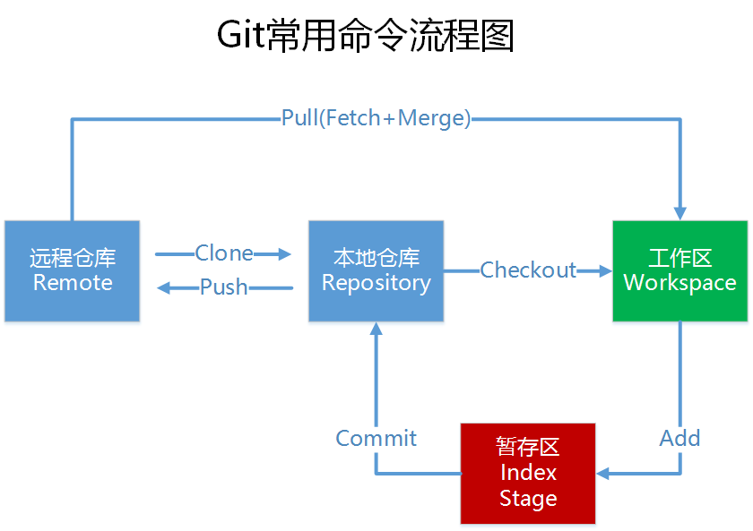

[TOC]

<!--more-->

# GIT---版本管理器

[参考](https://www.bilibili.com/video/BV1fK4y1b7XL?from=search&seid=12481552048146612510)

## 一、基本概念

git---饭桶

git和svn同为版本管理工具，区别是什么

>svn是集中式版本管理工具，必须装一个svn服务器，通过svn服务器集中管理代码。每个客户端通过svn服务器来提交，下载代码，每个客户端都是和服务器直接进行交互的。缺点是服务器单点故障（也不算缺点），容错性差。
>
>git是分布式版本控制系统，那么它就没有中央服务器的，每个人的电脑就是一个完整的版本库，这样，工作的时候就不需要联网了，因为版本都是在自己的电脑上。既然每个人的电脑都有一个完整的版本库，那多个人如何协作呢？比如说自己在电脑上改了文件A，其他人也在电脑上改了文件A，这时，你们两之间只需把各自的修改推送给对方，就可以互相看到对方的修改了。

## 二、Git工作流程

一般工作流程如下：

1．git clone，从远程仓库中克隆 Git 资源作为本地仓库。

2．git checkout，从本地仓库中checkout代码然后进行代码修改

3．git add，在提交前先将代码提交到暂存区。

4．git commit，提交修改。提交到本地仓库。本地仓库中保存修改的各个历史版本。**git和svn最大的区别是，Git有一个本地仓库的概念**。

5．git push，在修改完成后，需要和团队成员共享代码时，可以将代码push到远程仓库。

下图展示了 Git 的工作流程：




##  三、使用Git管理文件版本

### 0. 安装git

* [下载git](https://git-scm.com/download)，安装

* 安装tortoisegit（GUI），勾选使用OpenSS，Git default Client。指定git.exe所在的目录。

### 1. 创建版本库

有目录D:\codes\repositories，在该路径下创建文件夹repo1

创建**本地仓库**：git init

### 2. 添加文件

* 向本地版本库添加文件，在git文件夹同等级上面添加文件。

>本地仓库：包含git文件夹的文件夹，即D:\codes\repositories\repo1
>
>版本库：**.git**隐藏文件夹，将来文件都需要保存到版本库中。Git的版本库里存了很多东西，其中最重要的就是称为stage（或者叫index）的暂存区，还有Git为我们自动创建的第一个分支master，以及指向master的一个指针叫HEAD。
>
>工作目录（仓库目上一级）：D:\codes\repositories
>
>工作区：repositories文件夹就是一个工作区。

* 然后用乌龟**添加**（相当于git add），相当于将这个文件加入到**暂存区**了。创建了一个本地仓库一定会有一个主分支master，

* 向本地仓库提交（git commit），一定要写日志，实际上就是把暂存区的所有内容提交到当前分支。

### 3. 修改文件

1. 可以通过“显示日志“来查看修改。


2. 差异比较

   当文件内容修改后，需要和修改之前对比一下修改了哪些内容此时可以使用“比较差异功能”来确认文件的最终版本。

3. 还原修改

   当文件修改后不想把修改的内容提交，还想还原到未修改之前的状态。此时可以使用“还原”功能，**此操作会撤销所有未提交的修改，所以当做还原操作是需要慎重慎重**。

   使用乌龟或者visual stdio右下角的还原都会将选中修改的文件还原成未修改前的样子。


### 4. 删除本地仓库中的文件

1. 通过版本库浏览器可以知道本地仓库有什么

2. 可以将删除的文件通过对比版本库还原回来

3. 删除并保留本地副本，然后提交：从本地版本库删除文件，但是本地还将文件保留下来了。----用于提交工程的时候不提交无关的文件。

### 5. 忽略提交的文件

* 忽略文件或文件夹

  并不是所有文件都需要保存到版本库中的例如“bin”目录及目录下的文件就可以忽略。好在Git考虑到了大家的感受，这个问题解决起来也很简单，在Git工作区的根目录下创建一个特殊的.gitignore文件，然后把要忽略的文件名填进去，Git就会自动忽略这些文件。

* 忽略文件语法规范

  > 1. 空行或是以 # 开头的行即注释行将被忽略。
  >
  > 2. 可以在前面添加正斜杠 / 来避免递归,下面的例子中可以很明白的看出来与下一条的区别。
  >
  > 3. 可以在后面添加正斜杠 / 来忽略文件夹，例如 build/ 即忽略build文件夹。
  >
  > 4. 可以使用 ! 来否定忽略，即比如在前面用了 *.apk ，然后使用 !a.apk ，则这个a.apk不会被忽略。
  >
  > 4. \* 用来匹配零个或多个字符，如 *.[oa] 忽略所有以".o"或".a"结尾， *~ 忽略所有以 ~ 结尾的文件（这种文件通常被许多编辑器标记为临时文件）； [] 用来匹配括号内的任一字符，如 [abc] ，也可以在括号内加连接符，如 [0-9] 匹配0至9的数； ? 用来匹配单个字符。 
  >
  > ----------
  >
  > 看了这么多，还是应该来个栗子：
  >
  > \# 忽略 .a 文件:  `*.a`
  >
  > \# 但否定忽略 lib.a, 尽管已经在前面忽略了 .a 文件: `!lib.a`
  >
  > \# 仅在当前目录下忽略 TODO 文件， 但不包括子目录下的 subdir/TODO: `/TODO`
  >
  > \# 忽略 build/ 文件夹下的所有文件: `build/`
  >
  > \# 忽略 doc/notes.txt, 不包括 doc/server/arch.txt: `doc/*.txt`
  >
  > \# 忽略所有的 .pdf 文件 在 doc/ directory 下的: `doc/**/*.pdf`
### 6. 提交代码

将代码添加到master分支上，其中.gitignore文件也需要添加到暂存区，然后提交到版本库。

## 四、远程仓库

现在我们已经在本地创建了一个Git仓库，又想让其他人来协作开发，此时就可以把本地仓库同步到远程仓库，同时还增加了本地仓库的一个备份。

常用的远程仓库就是github：https://github.com/，接下来我们演示如何将本地代码同步到github。

### 1. github/码云创建远程仓库

* 在github上面创建账号并且新建一个仓库

* github支持两种同步方式“https”“ssh”，https每次提交代码和下载代码都需要输入用户名和密码

  使用ssh只需要在客户端先生成一个密钥对，及一个公钥“id_rsa”和一个私钥"id_rsa.pub"。

先生成密钥对，没有后缀的是私钥，不要告诉任何人，有后缀的是公钥，可以告诉其他人（github服务器），在服务器中添加公钥。

```
ssh-keygen -t rsa
```

### 2. 同步本地仓库到远程

将本地仓库与远程仓库建立联系，并将本地仓库代码推送到远程仓库。

```

jhluo@laptop-xiaoxiong MINGW64 /d/codes/repositories/repo1 (master)
$ git remote add origin git@github.com:littlebearsama/repo1.git

jhluo@laptop-xiaoxiong MINGW64 /d/codes/repositories/repo1 (master)
$ git push -u origin master

```

* origin 指的就是远程仓库，非本地仓库，在命令行命令中出现的 origin ，指操作是对远程仓库操作
* origin指向的是repository，master只是这个repository中默认创建的第一个branch。(git push origin master )当你git push的时候因为origin和master都是默认创建的。

如果出现如下错误：


可以先执行命令 `git remote rm origin`，然后再执行上面的命令。

### 3. 从远程仓库克隆

克隆远程仓库也就是从远程把仓库复制一份到本地，克隆后会创建一个新的本地仓库。选择一个任意部署仓库的目录，然后克隆远程仓库。

`git clone git@github.com:littlebearsama/repo1.git`

### 4. 从远程仓库取代码

1. git fetch :获取。相当于是从远程获取最新版本到本地，不会自动merge（合并代码）
2. git pull：拉取。相当于是从远程获取最新版本并merge到本地

### 5. 搭建私有git服务器

#### 5.1  服务器搭建

远程仓库实际上和本地仓库没啥不同，纯粹为了7x24小时开机并交换大家的修改。GitHub就是一个免费托管开源代码的远程仓库。但是对于某些视源代码如生命的商业公司来说，既不想公开源代码，又舍不得给GitHub交保护费，那就只能自己搭建一台Git服务器作为私有仓库使用。（现在仓库可以免费设为私有了），搭建Git服务器需要准备一台运行Linux的机器，在此我们使用CentOS。以下为安装步骤：

1、安装git服务环境准备

yum -y install curl curl-devel zlib-devel openssl-devel perl cpio expat-devel gettext-devel gcc cc

2、下载git-2.5.0.tar.gz

1）解压缩

2）cd git-2.5.0

3）autoconf

4）./configure

5）make

6）make install

3、添加用户

adduser -r -c 'git version control' -d /home/git -m git

此命令执行后会创建/home/git目录作为git用户的主目录。

5、设置密码

passwd git

输入两次密码

6、切换到git用户

su git

7、创建git仓库

git --bare init /home/git/first

注意：如果不使用“--bare”参数，初始化仓库后，提交master分支时报错。这是由于git默认拒绝了push操作，需要.git/config添加如下代码：

[receive]

   denyCurrentBranch = ignore

推荐使用：git --bare init初始化仓库。

#### 5.2 连接服务器

私有git服务器搭建完成后就可以向连接github一样连接使用了，但是我们的git服务器并没有配置密钥登录，所以每次连接时需要输入密码。

使用命令连接：

$ git remote add origin ssh://git@192.168.25.156/home/git/first

这种形式和刚才使用的形式好像不一样，前面有ssh://前缀，好吧你也可以这样写：

$ git remote add origin git@192.168.25.156:first

使用TortoiseGit同步的话参考上面的使用方法。

## 五、分支管理

#### 1. 创建并合并分支

在我们每次的提交，Git都把它们串成一条时间线，这条时间线就是一个分支。截止到目前，只有一条时间线，在Git里，这个分支叫主分支，即master分支。HEAD指针严格来说不是指向提交，而是指向master，master才是指向提交的，所以，HEAD指向的就是当前分支。

一开始的时候，master分支是一条线，Git用master指向最新的提交，再用HEAD指向master，就能确定当前分支，以及当前分支的提交点：


每次提交，master分支都会向前移动一步，这样，随着你不断提交，master分支的线也越来越长。

当我们创建新的分支，例如dev时，Git新建了一个指针叫dev，指向master相同的提交，再把HEAD指向dev，就表示当前分支在dev上：


你看，Git创建一个分支很快，因为除了增加一个dev指针，改改HEAD的指向，工作区的文件都没有任何变化！不过，从现在开始，对工作区的修改和提交就是针对dev分支了，比如新提交一次后，dev指针往前移动一步，而master指针不变：


假如我们在dev上的工作完成了，就可以把dev合并到master上。Git怎么合并呢？最简单的方法，就是直接把master指向dev的当前提交，就完成了合并：


所以Git合并分支也很快！就改改指针，工作区内容也不变！

 

合并完分支后，甚至可以删除dev分支。删除dev分支就是把dev指针给删掉，删掉后，我们就剩下了一条master分支：


#### 2. 使用tortoisegit实现分支管理

1. 创建分支

   使用TortoiseGit管理分支就很简单了。在本地仓库文件夹中点击右键，然后从菜单中选择“创建分支”：


如果想创建完毕后直接切换到新分支可以勾选“切换到新分支”选项或者从菜单中选择“切换/检出”来切换分支：


2. 合并分支

   分支切换到dev后就可以对工作区的文件进行修改，然后提交到dev分支原理的master分支不受影响。例如我们修改mytest.txt中的内容，然后提交到dev分支。

   切换回master分支后，master分支还是原来的内容。

   将dev分支的内容合并到master分支，当前分支为master。从右键菜单中选择“合并”：

   

   相当于`git merge xiaoxiong`

#### 3. 解决冲突

两个分支中编辑的内容都是相互独立互不干扰的，那么如果在两个分支中都对同一个文件进行编辑，然后再合并，就有可能会出现冲突。冲突需要手动解决。使用乌龟选择文件冲突部分的要保留的代码。

## 六、命令与基本操作流程

### 1. 命令查表

1. git clone 

   克隆整个仓库

2. 将本地仓库和远程仓库关联

   > git remote add origin "ssh:........git"

3. git checkout

   * 建立远端分支

     > git checkout -b xiaoxiong 在当前分之下（一般是master分支），创建xiaoxiong本地分支

     >  git push origin  xiaoxiong::xiaoxiong 将本地分支推送到远程

   * 创建本地分支AAA并且与远端分支关联起来

     > git checkout -b xiaoxiongorigin/xiaoxiong

   * 啊

4. git branch

   * 查看所有分支（包括远端分支）

     > git branch -a

   * 删除远端分支

     > git branch -r -d origin/AAA

   * 删除本地分支

     > git branch -D AAA

   * 将本地分支xiaoxiong和远端分支xiaoxiong关联起来

     > git branch ---track xiaoxiong origin/xiaoxiong

   * 啊啊

5. git add 

6. git commit

7. git reset

   * 撤销上一步的git add添加的文件filename

     > git reset HEAD filename

   * 撤销上一步的git commit

     >git reset --hard HEAD^

   * 撤销】】

8. git list

   查看当前仓库当前目录下的所有文件

   > git ls-files

9. git pull

10. git merge 

11. git push，[参考](https://www.cnblogs.com/qianqiannian/p/6008140.html)

     git push的一般形式为 git push <远程主机名> <本地分支名>  <远程分支名> ，例如

    ` git push origin master：refs/for/master` ，

    即是将本地的master分支推送到远程主机origin上的对应master分支， origin 是远程主机名， 第一个master是本地分支名，第二个master是远程分支名。

    * 与远程分支建立连接 ` git push --set-upstream origin xiaoxiong`
    * 

12. git remote，[参考](https://www.cnblogs.com/fengff/p/11225711.html)

    * git remote 不带参数，列出已经存在的远程分支
    * git remote -v | --verbose 列出详细信息，在每一个名字后面列出其远程url，此时， -v 选项(译注:此为 –verbose 的简写,取首字母),显示对应的克隆地址。
    * git remote add url  添加一个远程仓库

### 2. 基本操作流程

