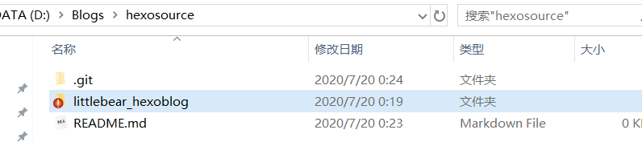

在两台电脑上面更新hexo博客

<!--more-->

## 在两台电脑上面更新hexo博客

实现思路：hexo d上传部署到github的其实是hexo编译后的文件，用来生成网页的，不包含源文件，上传的是.depoly_git里面的东西。

利用git分支实现，将整个hexo博客文件夹内容push到新建分支（本博客新分支名字为hexosource）。

我们现在将源文件（source、配置文件、主题文件）上传到仓库的新的分支。

步骤：

1. 在GitHub中创建一个私有仓库hexoblog_source，设为私有。

2. 在本地中新建文件夹hexosource，创建一个仓库

   ```
   git init
   git add README.md
   git commit -m "first commit"
   git remote add origin git@github.com:littlebearsama/hexoblog_source.git
   git push -u origin master
   ```

3. 创建一个新的分支xiaoxiong

   $ git checkout -b xiaoxiong

4. 将hexo的文件夹整个复制过来，将所有文件添加到暂存区

   

   > git add littlebear_hexoblog/
   >
   > git ls-files 显示暂存区内容
   >
   > git commit -m "add  littlebear_hexoblog"

   >  git push --set-upstream origin xiaoxiong

   

5. 在github的xxx.github.io仓库上新建一个hexo分支，并切换到改分支，并在仓库-->setting--->Branches--->Default中将默认分支设为hexo（之前默认分支为master）,update保存。

   这样每次同步的时候就不用指定分支，比较方便。

   

6. 新建hexosource分支

   > git checkout -b hexosource

7. 使用git branch 可以看到当前已经在hexosource分支上

   > git checkout hexosource

8. 文件夹下面的内容全部添加到

9. 

10. 

11. 

12. q

## 手贱将**GitHub Page**仓库转成私有

   将github静态博客网站转成私有后不能访问，再转回公有后还是不能访问。

解决：

1. 随便·改一下gitpage仓库的名字，rename，保存。这样静态博客仓库名字就变了。

   如原本是AAA.github.io改成了BBB.github.io

2. 将仓库名字再改回来，AAA.github.io，并且将仓库改成公有。

3. 改了一些源文件（不知道是否起作用）

4. hexo g （不知道是否起作用）

5. hexo d（不知道是否起作用）

